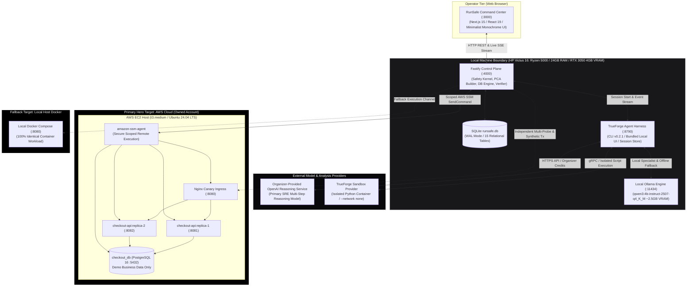
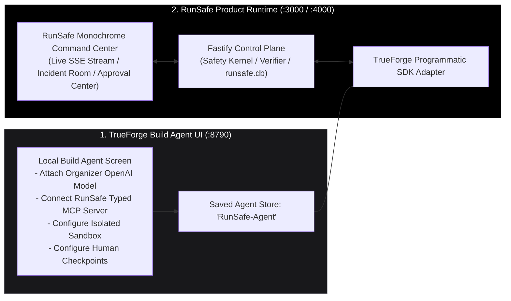
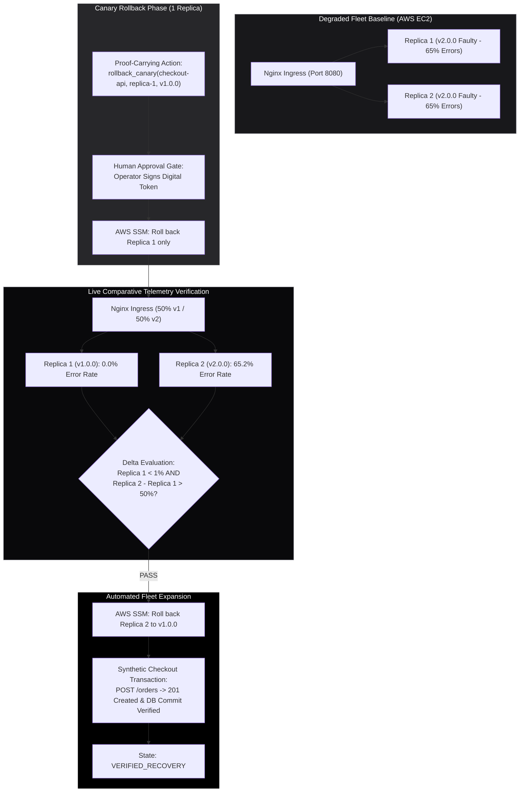
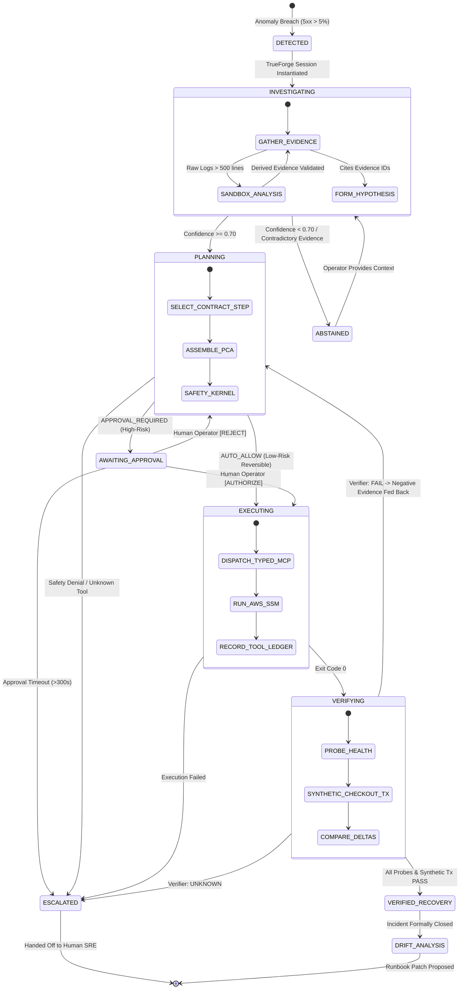

# RunSafe — Verified Autonomous Incident Recovery / AI SRE Control Plane

[](https://truefoundry.com)
[](https://github.com/truefoundry/trueforge)
[](docs/architecture/09_SYSTEM_INFRASTRUCTURE_ARCHITECTURE.md)
[](docs/06_UI_UX_SPECIFICATION.md)

> **RunSafe** is an industry-grade, autonomous incident recovery and AI SRE control plane engineered for the **"Agents That Act: TrueFoundry × Polaris Hackathon"** (Bengaluru, 26 September 2026).
> 
> Unlike conversational chatbots, generic DevOps copilots, or unrestricted infrastructure shell scripts, RunSafe is a **closed-loop autonomous system** that executes real operational runbooks on real cloud infrastructure with provable, deterministic safety guarantees.

---

## The Core Architectural Law

$$\mathbf{AI\ provides\ intelligence.\ Safety\ Kernel\ provides\ authority.\ Verifier\ provides\ truth.}$$

RunSafe enforces an inviolable separation of authority:
* **The AI Model** (Organizer-Provided OpenAI Model via TrueForge, with local Qwen3 4B fallback) forms diagnostic hypotheses, selects recovery steps, and generates sandboxed diagnostic scripts. It **never** authorizes actions or declares recovery.
* **The Deterministic Safety Kernel** (pure TypeScript outside the LLM) validates preconditions, checks invariant rules, verifies blast radius, and mandates human approval for high-risk mutations.
* **The Independent Objective Verifier** executes multi-metric health probes and end-to-end synthetic business transactions (`POST /orders`). It holds exclusive authority over incident resolution.

---

## System & Infrastructure Architecture

RunSafe operates a **Cloud-Primary, Local-Resilient** deployment topology. The primary evaluation target is a real AWS EC2 instance running a multi-container Docker Compose workload (controlled via scoped **AWS Systems Manager / SSM**). An identical Docker Compose stack runs on the developer laptop as an air-gapped offline fallback.



---

## The Dual Execution Pipeline

RunSafe strictly enforces two mutually isolated trust paths to prevent unconstrained agent execution:

```mermaid
flowchart TD
    subgraph Path1["1. Real-System Mutation Chain (Zero Unrestricted Shell Access)"]
        direction LR
        A1["Telemetry / Evidence"] --> A2["TrueForge Reasoning"]
        A2 --> A3["Proof-Carrying Action (PCA)"]
        A3 --> A4["Safety Kernel Evaluation"]
        A4 -->|High-Risk| A5["Human Approval Gate"]
        A4 -->|Low-Risk| A6["Typed MCP Tool Dispatch"]
        A5 -->|Signed Approval| A6
        A6 --> A7["Infrastructure Adapter (SSM)"]
        A7 --> A8["Real Target Mutation"]
        A8 --> A9["Independent Objective Verifier"]
        A9 --> A10["State Transition in SQLite"]
    end

    subgraph Path2["2. Generated-Code Diagnostic Sandbox Chain (Zero Mutation Privilege)"]
        direction LR
        B1["Raw Telemetry / 50k Logs"] --> B2["Sanitization Gate"]
        B2 --> B3["Agent Generates analyze_logs.py"]
        B3 --> B4["TrueForge Sandbox (--network none)"]
        B4 --> B5["Bounded JSON Stdout"]
        B5 --> B6["Zod Schema Validator"]
        B6 --> B7["Derived Evidence Record"]
    end

    classDef p1 fill:#000000,stroke:#ffffff,stroke-width:2px,color:#fff;
    classDef p2 fill:#18181b,stroke:#a1a1aa,stroke-width:1px,color:#fff;

    class Path1 p1;
    class Path2 p2;
```



---

## TrueForge Dual-Surface Strategy ("Show the Engine, Run the Cockpit")

In accordance with official TrueForge architecture, RunSafe uses a dual-surface presentation model:

1. **TrueForge Local Build Agent UI (`http://localhost:8790`):** Used during setup and live evaluation to prove to judges that TrueForge is the genuine runtime hosting the saved `RunSafe-Agent`, organizer OpenAI model provider, attached RunSafe typed MCP server, isolated sandbox provider, and human checkpoint configuration.
2. **RunSafe Command Center (`http://localhost:3000`):** A custom, high-performance Next.js 15 operational interface that programmatically drives the saved TrueForge agent via TrueForge's HTTP API / TypeScript SDK.



---

## Progressive Canary Remediation on Live AWS

To eliminate the catastrophic risk of fleet-wide rollback failures, RunSafe mandates single-replica canary remediation with live comparative verification:



---

## Canonical Incident State Machine



---

## Three Frozen Demo Scenarios

| Attribute | Scenario 1: Process Crash | Scenario 2: Bad Deployment (Hero Demo) | Scenario 3: Ambiguous Failure |
| :--- | :--- | :--- | :--- |
| **Target Infrastructure** | AWS EC2 (or Local Docker fallback) | **Real AWS EC2 Host (Ubuntu / Docker Compose)** | AWS EC2 (or Local Docker fallback) |
| **Injected Fault** | `checkout-api-1` SIGKILL | Faulty `checkout-api:v2.0.0` (NullPointer + 65% 5xx) | Flapping network latency & packet drop |
| **Primary Model** | Local Qwen3 4B or OpenAI | **Organizer OpenAI Model (via TrueForge)** | Organizer OpenAI Model (via TrueForge) |
| **Sandbox Execution** | None (Direct metric triage) | **Yes (`analyze_logs.py` in TrueForge Sandbox)** | Optional log correlation |
| **Initial Remediation** | `restart_service(replica-1)` | `restart_service(replica-1)` (Fails Verification) | None (Prohibited by Confidence Gate) |
| **High-Risk Action** | None (Auto-authorized low-risk) | **`rollback_canary(replica-1, v1.0.0)`** | None |
| **Human Approval** | Auto-approved by Safety Kernel | **Yes: Mandatory Interactive SRE Approval Modal** | None |
| **Canary Rollback** | N/A | **Yes: 1 Replica Rolled Back; Traffic Split Tested** | N/A |
| **Verification Check** | HTTP 200 Probe PASS | **Synthetic Checkout Tx (`POST /orders`) PASS** | Inconclusive Probes |
| **Terminal State** | `VERIFIED_RECOVERY` (<15s) | **`VERIFIED_RECOVERY` (<90s) + Drift Proposal** | `ABSTAINED_ESCALATED` |
| **Judges Takeaway** | Autonomous low-risk recovery | **End-to-end real AWS action, sandbox, approval, verifier** | **Agent knows when not to act** |

---

## Comprehensive Documentation Index

The complete, authoritative engineering specifications for RunSafe are fully finalized and frozen in the repository:

1. **[`docs/RUNSAFE_PROJECT_CONTEXT.md`](docs/RUNSAFE_PROJECT_CONTEXT.md)** — Canonical Master Product Context & Source of Truth.
2. **[`docs/03_PRD.md`](docs/03_PRD.md)** — Product Requirements Document (49 Functional Requirements `FR-001`–`FR-049`, 12 NFRs).
3. **[`docs/04_TRD.md`](docs/04_TRD.md)** — Technical Requirements Document (16 Technical Requirements `TR-001`–`TR-016`, pipeline specs).
4. **[`docs/05_WORKFLOW_AND_DATA_FLOW.md`](docs/05_WORKFLOW_AND_DATA_FLOW.md)** — Behavioral Flow Specification (Workflows `WF-INC-001`–`WF-SSE-001`, sequence diagrams).
5. **[`docs/06_UI_UX_SPECIFICATION.md`](docs/06_UI_UX_SPECIFICATION.md)** — Minimalist Monochrome Design System, controlled rounded corners, 7 core wireframes.
6. **[`docs/07_DATA_DATABASE_API_DESIGN.md`](docs/07_DATA_DATABASE_API_DESIGN.md)** — Dual-Database boundary (SQLite `runsafe.db` vs PostgreSQL `checkout_db`), REST matrix, SSE streaming.
7. **[`docs/architecture/09_SYSTEM_INFRASTRUCTURE_ARCHITECTURE.md`](docs/architecture/09_SYSTEM_INFRASTRUCTURE_ARCHITECTURE.md)** — System Context, physical deployment, AWS SSM topology, local fallback, trust perimeters.
8. **[`docs/architecture/10_AGENT_TRUEFORGE_SAFETY_ARCHITECTURE.md`](docs/architecture/10_AGENT_TRUEFORGE_SAFETY_ARCHITECTURE.md)** — TrueForge runtime harness, model routing, typed MCP server, isolated sandbox, Safety Kernel, PCAs.
9. **[`docs/architecture/11_INCIDENT_RECOVERY_RELIABILITY_ARCHITECTURE.md`](docs/architecture/11_INCIDENT_RECOVERY_RELIABILITY_ARCHITECTURE.md)** — Incident & Action lifecycles, canary remediation, independent verifier, Runbook CI, failure containment.
10. **[`docs/RUNSAFE_PROJECT_MEMORY.md`](docs/RUNSAFE_PROJECT_MEMORY.md)** — Living implementation state, completed milestones, and execution ledger.

---

## Technology Stack

| Layer | Chosen Technology | Version / Specification | Rationale & Frozen Boundaries |
| :--- | :--- | :--- | :--- |
| **Agent Runtime** | `@truefoundry/trueforge` CLI & Core | v0.2.1 | Mandatory hackathon harness. Runs agent turns, tool routing, and sandboxes on `:8790`. |
| **Primary Reasoning Model** | Organizer-Provided OpenAI Model | TrueForge Model Provider | Complex multi-step incident diagnosis, hypothesis ranking, and PCA proposal synthesis. |
| **Local Specialist Model** | Qwen3 4B Instruct (`qwen3:4b-instruct-2507-q4_K_M`) | Quantized GGUF (~2.5GB) | Runs on Ollama (`:11434`) on NVIDIA RTX 3050. Runbook extraction, log compression, offline fallback. |
| **Primary Cloud Target** | AWS EC2 (t3.medium) | Ubuntu 24.04 LTS | Controlled real-world Docker Compose workload (Nginx, Replicas, Postgres) managed via AWS SSM. |
| **Fallback Target** | Local Docker Engine | Docker 29.7.2 / Compose v2.29+ | 100% identical multi-container workload on laptop for air-gapped demo resilience. |
| **Control Plane API** | Fastify | v4.28+ | High-throughput TypeScript API and real-time Server-Sent Events (SSE) hub on `:4000`. |
| **Control Plane DB** | SQLite (`better-sqlite3`) | v11.0+ (WAL Mode) | Authoritative, tamper-evident ledger for incidents, evidence, PCAs, approvals, and audit logs. |
| **Demo Business DB** | PostgreSQL | v16 Alpine | Dedicated database for checkout workload (`:5432`). Strictly separated from RunSafe SQLite. |
| **Frontend UI** | Next.js 15 (React 19 / Tailwind CSS) | App Router (`:3000`) | Minimalist Monochrome operational command center with zero drop shadows and controlled radii. |
| **Tool Protocol** | Model Context Protocol (`@modelcontextprotocol/sdk`)| v1.30+ | Typed, schema-validated operational tools over HTTP/JSON-RPC. Zero raw shell access. |
| **Schema Validation** | Zod | v3.23+ | Universal runtime validation across API requests, MCP tools, PCAs, and Recovery Contracts. |

---

## AI Coding Assistants Disclosure

In compliance with the hackathon rules, AI coding assistants (including Antigravity, Google Gemini, and Claude) were utilized during the architecture, design, and code generation phases under strict human engineering supervision and verification.

---

## Repository & Development Quickstart

```bash
# Clone the repository
git clone https://github.com/sharancode3/RunSafe.git
cd RunSafe

# Verify local toolchain
node -v      # Expected: v24+
docker -v    # Expected: 29+
ollama -v    # Expected: 0.34+

# Start TrueForge local daemon on port 8790
npx @truefoundry/trueforge@latest

# Reset demo workload to healthy baseline
npm run demo:reset
```
