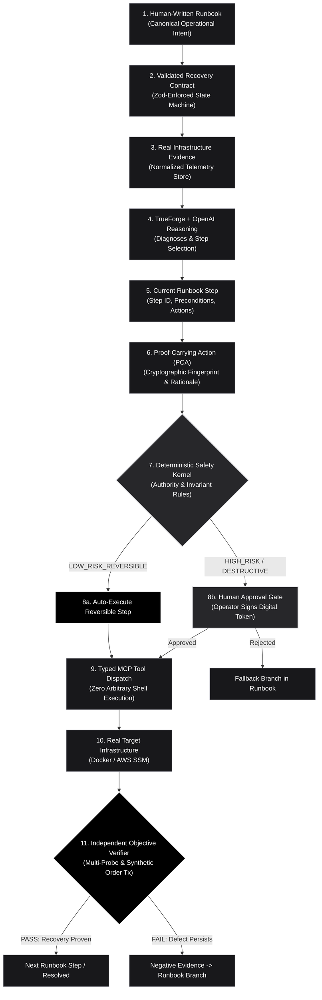
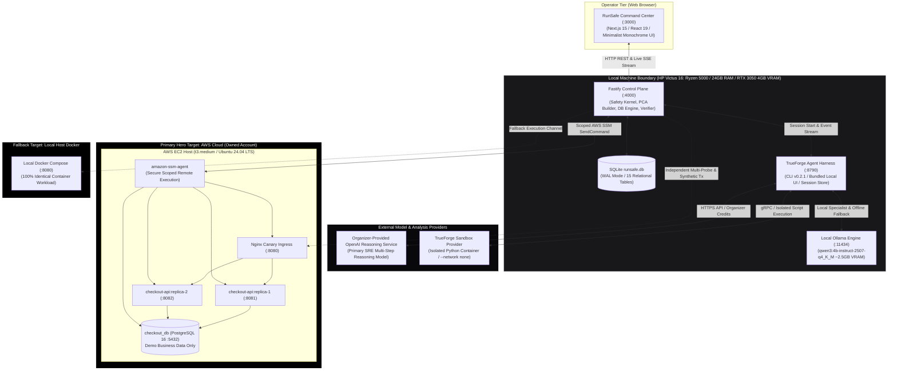
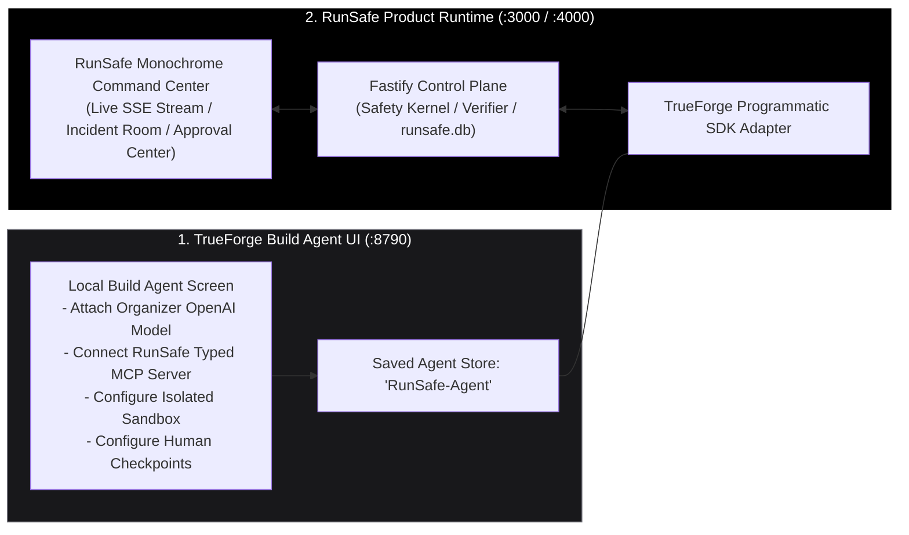
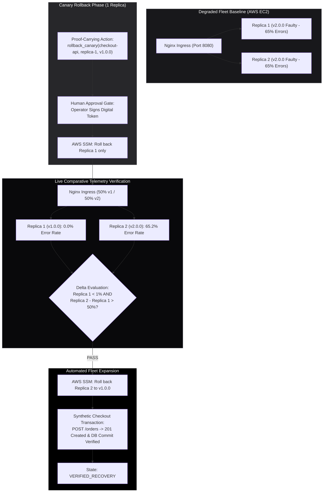
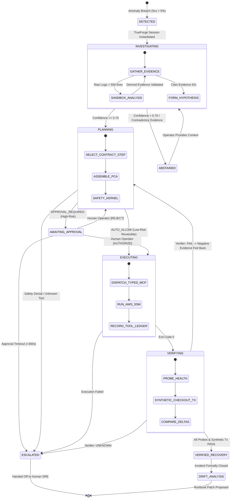

# RunSafe — Verified Autonomous Runbook Executor for Safe Incident Recovery

[](https://truefoundry.com)
[-black?style=for-the-badge)](docs/RUNSAFE_PROJECT_CONTEXT.md)
[](https://github.com/truefoundry/trueforge)
[](docs/architecture/09_SYSTEM_INFRASTRUCTURE_ARCHITECTURE.md)
[](docs/06_UI_UX_SPECIFICATION.md)

> **RunSafe** is a TrueForge-powered autonomous **Runbook Executor** built for the **"Agents That Act: TrueFoundry × Polaris Hackathon"** (Bengaluru, 26 September 2026).
> 
> It executes human-written operational recovery runbooks step by step against real controlled infrastructure, automatically performs permitted reversible actions, pauses before destructive/high-risk actions for human approval, and independently verifies whether recovery actually succeeded.
> 
> *Engineered as an industry-grade AI SRE Control Plane with provable, deterministic safety guarantees.*

---

## Official Challenge Alignment: Runbook Executor (Agents That Act)

RunSafe directly answers the official hackathon challenge: **Runbook Executor** under the theme **"Agents That Act: Build agents that act, not ones that just answer."**

| Official Requirement | How RunSafe Fulfills It | Architectural Enforcement |
| :--- | :--- | :--- |
| **"Execute a human-written runbook"** | Converts human-authored Markdown operational runbooks into versioned, machine-enforceable **Recovery Contracts** | Human Markdown in `runbooks/` → SQLite `runbook_versions` → Zod-validated `RecoveryContract` |
| **"step by step"** | Progresses deterministically through explicit runbook steps, preconditions, branches, and fallbacks | Each step defines tool, arguments, target resource, required evidence, success/failure transitions |
| **"handling reversible steps automatically"** | Automatically executes safe, reversible recovery actions without waiting for human sign-off | Pure TypeScript **Safety Kernel** marks `LOW_RISK_REVERSIBLE` actions (e.g. process restart) as `AUTO_ALLOW` |
| **"Reaches: Your infrastructure"** | Dispatches actions to real multi-replica container infrastructure with live PostgreSQL transactions | Typed MCP tools → Infrastructure Adapter (`LocalDockerAdapter` / `AwsInfrastructureAdapter`) |
| **"Approval required: Every destructive step"** | Halts execution before high-risk or destructive actions to demand explicit human authorization | Mandatory human approval checkpoint on `HIGH_RISK` and `DESTRUCTIVE` tools (`rollback_canary`, `rollback_full`) |

### The Runbook Execution Conceptual Hierarchy



### Architectural Innovations as Runbook Executor Enhancements

RunSafe’s advanced subsystems are innovations that make the **Runbook Executor** safer, smarter, verifiable, and genuinely production-grade:

* **Recovery Contracts:** Convert human runbooks into machine-executable graphs without sacrificing human intent or introducing ambiguity.
* **Evidence Engine:** Grounds runbook step selection in real, normalized telemetry ($\le 120\text{s}$ freshness) before mutations are proposed.
* **Proof-Carrying Actions (PCAs):** Make every mutation self-justifying by explicitly declaring runbook step ID, justification, target resource, blast radius, rollback procedure, and verification criteria.
* **Deterministic Safety Kernel:** Provides an immutable, fail-closed authority gate outside the LLM that decides whether a runbook step may auto-execute or must wait for human sign-off.
* **TrueForge Diagnostic Sandbox:** Executes generated Python diagnostic scripts (`analyze_logs.py`) in isolated, zero-network environments without granting the LLM arbitrary shell access to infrastructure.
* **Progressive Canary Remediation:** Implements fine-grained runbook rollback steps on single replicas with comparative traffic splitting to minimize blast radius.
* **Independent Objective Verifier:** Refuses to trust command exit codes, demanding multi-probe telemetry checks and real synthetic business transactions (`POST /orders`) to prove recovery.
* **Runbook CI:** Rehearses the exact same recovery runbooks in pre-production by injecting controlled faults, validating that the runbook remains effective before real incidents occur.
* **Confidence Abstention:** When evidence is conflicting or preconditions cannot be established, RunSafe safely pauses and escalates rather than taking reckless blind action.
* **Runbook Drift Proposals:** Synthesizes evidence-backed improvements to the runbook after verified recoveries, presenting pull-request proposals for human SRE review.

---

## The Core Architectural Law

$$\mathbf{AI\ provides\ intelligence.\ Safety\ Kernel\ provides\ authority.\ Verifier\ provides\ truth.}$$

RunSafe enforces an inviolable separation of authority:
* **The AI Model** (Organizer-Provided OpenAI Model via TrueForge, with local Qwen3 4B fallback) forms diagnostic hypotheses, selects recovery steps, and generates sandboxed diagnostic scripts. It **never** authorizes actions or declares recovery.
* **The Deterministic Safety Kernel** (pure TypeScript outside the LLM) validates preconditions, checks invariant rules, verifies blast radius, and mandates human approval for high-risk mutations.
* **The Independent Objective Verifier** executes multi-metric health probes and end-to-end synthetic business transactions (`POST /orders`). It holds exclusive authority over incident resolution.

---

## System & Infrastructure Architecture

RunSafe operates a **Cloud-Primary, Local-Resilient** deployment topology. The primary evaluation target is a real AWS EC2 instance running a multi-container Docker Compose workload (controlled via scoped **AWS Systems Manager / SSM**). An identical Docker Compose stack runs on the developer laptop as an air-gapped offline fallback.



---

## The Dual Execution Pipeline

RunSafe strictly enforces two mutually isolated trust paths to prevent unconstrained agent execution:

```mermaid
flowchart TD
    subgraph Path1["1. Real-System Mutation Chain (Zero Unrestricted Shell Access)"]
        direction LR
        A1["Telemetry / Evidence"] --> A2["TrueForge Reasoning"]
        A2 --> A3["Proof-Carrying Action (PCA)"]
        A3 --> A4["Safety Kernel Evaluation"]
        A4 -->|High-Risk| A5["Human Approval Gate"]
        A4 -->|Low-Risk| A6["Typed MCP Tool Dispatch"]
        A5 -->|Signed Approval| A6
        A6 --> A7["Infrastructure Adapter (SSM)"]
        A7 --> A8["Real Target Mutation"]
        A8 --> A9["Independent Objective Verifier"]
        A9 --> A10["State Transition in SQLite"]
    end

    subgraph Path2["2. Generated-Code Diagnostic Sandbox Chain (Zero Mutation Privilege)"]
        direction LR
        B1["Raw Telemetry / 50k Logs"] --> B2["Sanitization Gate"]
        B2 --> B3["Agent Generates analyze_logs.py"]
        B3 --> B4["TrueForge Sandbox (--network none)"]
        B4 --> B5["Bounded JSON Stdout"]
        B5 --> B6["Zod Schema Validator"]
        B6 --> B7["Derived Evidence Record"]
    end

    classDef p1 fill:#000000,stroke:#ffffff,stroke-width:2px,color:#fff;
    classDef p2 fill:#18181b,stroke:#a1a1aa,stroke-width:1px,color:#fff;

    class Path1 p1;
    class Path2 p2;
```



---

## TrueForge Dual-Surface Strategy ("Show the Engine, Run the Cockpit")

In accordance with official TrueForge architecture, RunSafe uses a dual-surface presentation model:

1. **TrueForge Local Build Agent UI (`http://localhost:8790`):** Used during setup and live evaluation to prove to judges that TrueForge is the genuine runtime hosting the saved `RunSafe-Agent`, organizer OpenAI model provider, attached RunSafe typed MCP server, isolated sandbox provider, and human checkpoint configuration.
2. **RunSafe Command Center (`http://localhost:3000`):** A custom, high-performance Next.js 15 operational interface that programmatically drives the saved TrueForge agent via TrueForge's HTTP API / TypeScript SDK.



---

## Progressive Canary Remediation on Live AWS

To eliminate the catastrophic risk of fleet-wide rollback failures, RunSafe mandates single-replica canary remediation with live comparative verification:



---

## Canonical Incident State Machine



---

## Three Frozen Demo Scenarios

| Attribute | Scenario 1: Process Crash | Scenario 2: Bad Deployment (Hero Demo) | Scenario 3: Ambiguous Failure |
| :--- | :--- | :--- | :--- |
| **Target Infrastructure** | AWS EC2 (or Local Docker fallback) | **Real AWS EC2 Host (Ubuntu / Docker Compose)** | AWS EC2 (or Local Docker fallback) |
| **Injected Fault** | `checkout-api-1` SIGKILL | Faulty `checkout-api:v2.0.0` (NullPointer + 65% 5xx) | Flapping network latency & packet drop |
| **Primary Model** | Local Qwen3 4B or OpenAI | **Organizer OpenAI Model (via TrueForge)** | Organizer OpenAI Model (via TrueForge) |
| **Sandbox Execution** | None (Direct metric triage) | **Yes (`analyze_logs.py` in TrueForge Sandbox)** | Optional log correlation |
| **Initial Remediation** | `restart_service(replica-1)` | `restart_service(replica-1)` (Fails Verification) | None (Prohibited by Confidence Gate) |
| **High-Risk Action** | None (Auto-authorized low-risk) | **`rollback_canary(replica-1, v1.0.0)`** | None |
| **Human Approval** | Auto-approved by Safety Kernel | **Yes: Mandatory Interactive SRE Approval Modal** | None |
| **Canary Rollback** | N/A | **Yes: 1 Replica Rolled Back; Traffic Split Tested** | N/A |
| **Verification Check** | HTTP 200 Probe PASS | **Synthetic Checkout Tx (`POST /orders`) PASS** | Inconclusive Probes |
| **Terminal State** | `VERIFIED_RECOVERY` (<15s) | **`VERIFIED_RECOVERY` (<90s) + Drift Proposal** | `ABSTAINED_ESCALATED` |
| **Judges Takeaway** | Autonomous low-risk recovery | **End-to-end real AWS action, sandbox, approval, verifier** | **Agent knows when not to act** |

---

## Comprehensive Documentation Index

The complete, authoritative engineering specifications for RunSafe are fully finalized and frozen in the repository:

1. **[`docs/RUNSAFE_PROJECT_CONTEXT.md`](docs/RUNSAFE_PROJECT_CONTEXT.md)** — Canonical Master Product Context & Source of Truth.
2. **[`docs/03_PRD.md`](docs/03_PRD.md)** — Product Requirements Document (49 Functional Requirements `FR-001`–`FR-049`, 12 NFRs).
3. **[`docs/04_TRD.md`](docs/04_TRD.md)** — Technical Requirements Document (16 Technical Requirements `TR-001`–`TR-016`, pipeline specs).
4. **[`docs/05_WORKFLOW_AND_DATA_FLOW.md`](docs/05_WORKFLOW_AND_DATA_FLOW.md)** — Behavioral Flow Specification (Workflows `WF-INC-001`–`WF-SSE-001`, sequence diagrams).
5. **[`docs/06_UI_UX_SPECIFICATION.md`](docs/06_UI_UX_SPECIFICATION.md)** — Minimalist Monochrome Design System, controlled rounded corners, 7 core wireframes.
6. **[`docs/07_DATA_DATABASE_API_DESIGN.md`](docs/07_DATA_DATABASE_API_DESIGN.md)** — Dual-Database boundary (SQLite `runsafe.db` vs PostgreSQL `checkout_db`), REST matrix, SSE streaming.
7. **[`docs/architecture/09_SYSTEM_INFRASTRUCTURE_ARCHITECTURE.md`](docs/architecture/09_SYSTEM_INFRASTRUCTURE_ARCHITECTURE.md)** — System Context, physical deployment, AWS SSM topology, local fallback, trust perimeters.
8. **[`docs/architecture/10_AGENT_TRUEFORGE_SAFETY_ARCHITECTURE.md`](docs/architecture/10_AGENT_TRUEFORGE_SAFETY_ARCHITECTURE.md)** — TrueForge runtime harness, model routing, typed MCP server, isolated sandbox, Safety Kernel, PCAs.
9. **[`docs/architecture/11_INCIDENT_RECOVERY_RELIABILITY_ARCHITECTURE.md`](docs/architecture/11_INCIDENT_RECOVERY_RELIABILITY_ARCHITECTURE.md)** — Incident & Action lifecycles, canary remediation, independent verifier, Runbook CI, failure containment.
10. **[`docs/RUNSAFE_PROJECT_MEMORY.md`](docs/RUNSAFE_PROJECT_MEMORY.md)** — Living implementation state, completed milestones, and execution ledger.

---

## Technology Stack

| Layer | Chosen Technology | Version / Specification | Rationale & Frozen Boundaries |
| :--- | :--- | :--- | :--- |
| **Agent Runtime** | `@truefoundry/trueforge` CLI & Core | v0.2.1 | Mandatory hackathon harness. Runs agent turns, tool routing, and sandboxes on `:8790`. |
| **Primary Reasoning Model** | Organizer-Provided OpenAI Model | TrueForge Model Provider | Complex multi-step incident diagnosis, hypothesis ranking, and PCA proposal synthesis. |
| **Local Specialist Model** | Qwen3 4B Instruct (`qwen3:4b-instruct-2507-q4_K_M`) | Quantized GGUF (~2.5GB) | Runs on Ollama (`:11434`) on NVIDIA RTX 3050. Runbook extraction, log compression, offline fallback. |
| **Primary Cloud Target** | AWS EC2 (t3.medium) | Ubuntu 24.04 LTS | Controlled real-world Docker Compose workload (Nginx, Replicas, Postgres) managed via AWS SSM. |
| **Fallback Target** | Local Docker Engine | Docker 29.7.2 / Compose v2.29+ | 100% identical multi-container workload on laptop for air-gapped demo resilience. |
| **Control Plane API** | Fastify | v4.28+ | High-throughput TypeScript API and real-time Server-Sent Events (SSE) hub on `:4000`. |
| **Control Plane DB** | SQLite (`better-sqlite3`) | v11.0+ (WAL Mode) | Authoritative, tamper-evident ledger for incidents, evidence, PCAs, approvals, and audit logs. |
| **Demo Business DB** | PostgreSQL | v16 Alpine | Dedicated database for checkout workload (`:5432`). Strictly separated from RunSafe SQLite. |
| **Frontend UI** | Next.js 15 (React 19 / Tailwind CSS) | App Router (`:3000`) | Minimalist Monochrome operational command center with zero drop shadows and controlled radii. |
| **Tool Protocol** | Model Context Protocol (`@modelcontextprotocol/sdk`)| v1.30+ | Typed, schema-validated operational tools over HTTP/JSON-RPC. Zero raw shell access. |
| **Schema Validation** | Zod | v3.23+ | Universal runtime validation across API requests, MCP tools, PCAs, and Recovery Contracts. |

---

## AI Coding Assistants Disclosure

In compliance with the hackathon rules, AI coding assistants (including Antigravity, Google Gemini, and Claude) were utilized during the architecture, design, and code generation phases under strict human engineering supervision and verification.

---

## Repository & Development Quickstart

```bash
# Clone the repository
git clone https://github.com/sharancode3/RunSafe.git
cd RunSafe

# Verify local toolchain
node -v      # Expected: v24+
docker -v    # Expected: 29+
ollama -v    # Expected: 0.34+

# Start TrueForge local daemon on port 8790
npx @truefoundry/trueforge@latest

# Reset demo workload to healthy v1.0.0 baseline
npm run env:reset
```

---

## Autonomous Recovery Hero: Bad Deployment Scenario

RunSafe features an end-to-end autonomous recovery hero demonstration proving the core architectural axiom:
**"AI provides intelligence. Safety Kernel provides authority. Independent Verifier provides truth."**

```mermaid
sequenceDiagram
    autonumber
    actor Operator as Human SRE Operator
    participant Infra as Docker Infrastructure (Nginx, Replicas, Postgres)
    participant Agent as TrueForge Agent + OpenAI
    participant Engine as Recovery Engine (State Machine)
    participant SK as Safety Kernel (Deterministic Authority)
    participant Verifier as Independent Objective Verifier

    Note over Infra: Fault Injected: checkout-api-2 upgraded to faulty v2.0.0<br/>(Shallow /health is 200 OK, but /orders fails with HTTP 500 schema lock)
    Infra->>Engine: Ingress Anomaly Detected -> Open Incident (DETECTED)
    Engine->>Agent: Step 1: Observe Ingress -> Collect Fleet Evidence
    Engine->>Agent: Step 2: Extract Logs -> Capture Schema Lock Exception
    Engine->>Agent: Step 3: Check DB -> Confirm PostgreSQL Healthy (< 50ms)
    
    rect rgb(30, 30, 35)
        Note over Engine,SK: REVERSIBLE STEP: Autonomous Execution
        Engine->>SK: Propose PCA: restart_service(checkout-api-2)
        SK->>SK: Invariant Check: LOW_RISK_REVERSIBLE + Preconditions Matched
        SK-->>Engine: Decision: AUTO_ALLOW
        Engine->>Infra: Restart container (Technical Exit Code 0)
        Engine->>Verifier: Run Independent Health & Synthetic Probes
        Verifier->>Infra: POST /orders (Synthetic ACID transaction)
        Infra-->>Verifier: HTTP 500 (Schema lock persists!)
        Verifier-->>Engine: Status: FAIL (Negative Evidence Recorded)
        Note over Engine: Invariant Proven: Exit Code 0 is NOT Recovery!<br/>Incident remains OPEN -> Branch to onFailure (STEP_5_ROLLBACK_CANARY)
    end

    rect rgb(45, 30, 30)
        Note over Engine,Operator: DESTRUCTIVE / HIGH-RISK STEP: Human Gate
        Engine->>SK: Propose PCA: rollback_canary(checkout-api-2, v1.0.0)
        SK->>SK: Invariant Check: HIGH_RISK -> Enforce Approval Policy
        SK-->>Engine: Decision: APPROVAL_REQUIRED
        Engine->>Operator: Checkpoint Paused: Operator Sign-off Requested
        Operator->>Engine: Authorize PCA (Cryptographically Signed Token)
        Engine->>Infra: Roll back replica 2 to v1.0.0
        Engine->>Verifier: Run Probes on Canary
        Verifier-->>Engine: Status: PASS (0% Error Rate on Replica 2)
    end

    Engine->>Infra: Step 6: Roll back full fleet to v1.0.0
    Engine->>Verifier: Step 7: Final Synthetic Verification
    Verifier->>Infra: Multi-sample Synthetic Orders through Nginx
    Infra-->>Verifier: HTTP 201 Created (All DB Transactions Committed)
    Verifier-->>Engine: Status: PASS (All Probes Satisfied)
    Engine->>Engine: Incident Transition -> VERIFIED_RECOVERY
    Note over Engine,Operator: Incident Resolved with Complete 54-Event Audit Trail
```



To execute the autonomous recovery hero across 3 consecutive automated cycles:
```bash
npm run stage7:verify
```

---

## Stage 8: Runbook CI, Staging Rehearsals & Confidence Abstention

RunSafe proves recovery runbooks *before* production emergencies happen by running continuous rehearsals in an isolated staging environment (`LOCAL` Docker stack):

```text
Staging Preflight Check
        ↓
Environment Reset to Baseline (v1.0.0)
        ↓
Objective Baseline Verification (200 OK + ACID synthetic order)
        ↓
Controlled Scenario Fault Injection
        ↓
Real RunSafe Recovery Orchestrator & Safety Kernel
        ↓
Objective Probe Verification by Independent Verifier
        ↓
Post-Rehearsal Baseline Cleanup & Run Ledger Persistence
```

### The 3 Continuously Verified Scenarios

1. **Process / Service Crash:**
   - Controlled `docker stop runsafe-checkout-api-1`.
   - Safety Kernel auto-allows low-risk reversible restart (`restart_service`).
   - Independent Verifier confirms Ingress HTTP 200 & synthetic orders commit.
   - Outcome: `PASS` (`VERIFIED_RECOVERY`).
2. **Bad Deployment Canary Rollback Hero:**
   - Deceptive `v2.0.0` schema lock defect injected on `checkout-api-2`.
   - Autonomous restart fails verification (Exit 0 != recovery; negative evidence recorded).
   - Isolated canary rollback pauses at human approval checkpoint (`APPROVAL_REQUIRED`).
   - Operator grants signed digital authorization.
   - Canary rollback and full fleet rollback verified with real synthetic ACID transactions.
   - Outcome: `PASS` (`VERIFIED_RECOVERY`).
3. **Ambiguous Telemetry & Confidence-Based Abstention:**
   - Intermittent downstream payment timeouts and latency injected.
   - Diagnostic confidence score ($0.41$) falls below the $0.70$ safety threshold (`FR-033`, `TR-011`).
   - Safety Kernel prohibits blind mutations. System halts autonomous loop and escalates to human on-call (`ABSTAINED`).
   - **Critical Invariant Proven:** **Zero mutations dispatched** to infrastructure!
   - Outcome: `PASS` (Safely Abstained).

To run the complete Stage 8 Runbook CI verification:
```bash
npm run stage8:verify
```

---

## Stage 9: RunSafe Product UI (Minimalist Monochrome Command Center)

The RunSafe product UI is an architectural, editorial monochrome command environment built with **Next.js 15 App Router**, **React 19**, and **Tailwind CSS** following `docs/06_UI_UX_SPECIFICATION.md`:

- **Aesthetic:** Absolute monochrome (pure `#FFFFFF` canvas, deep `#000000` inverted cards, restrained zinc dividers, zero drop shadows).
- **Architecture:** Browser UI $\rightarrow$ RunSafe Fastify Control Plane (:4000) $\rightarrow$ SQLite `runsafe.db` / Live SSE Event Stream (`/api/v1/events/stream`).

### Core Screens & Workflows

1. **Command Center (`/`):**
   - Live system readiness indicators (Control Plane, TrueForge :8790, Primary Model, MCP Server :4001, Docker Workload).
   - Inverted active incident alert banner with direct jump to Incident Room.
   - Workload fleet status table (Nginx, checkout-api-1, checkout-api-2, Postgres).
   - Runbook CI rehearsal summary ($100\%$ recovery coverage, 3/3 failure modes verified).
2. **Incident Room (`/incidents/[id]`):**
   - **65% Left (Live Chronological Timeline):** Server-sent events displaying observations, sandboxed diagnostic scripts, proposed Proof-Carrying Actions, Safety Kernel decisions, and verifier evaluations.
   - **35% Right (Contextual Evidence Vault & Objective Verifier):** Supporting telemetry records with IDs (`[EVD-...]`), and real-time objective criteria checklist.
3. **Approval Center (`/approvals`):**
   - Inverted black **Operational Decision Card** (`rounded-xl`): Displays proposed tool, arguments, blast radius, operational justification ("Why"), and SHA-256 cryptographic payload fingerprint.
   - **[Approve & Execute Mutation]** and **[Reject & Escalate]** buttons.
4. **Runbook CI & Staging Rehearsals (`/rehearsals`):**
   - Interactive Scenario Runner (Process Crash, Bad Deployment Hero, Ambiguous Telemetry).
   - Real-time staging rehearsal logs, recovery coverage gauge ($100\%$), and chronological run ledger.

### Starting the Product UI

```bash
# 1. Build production bundle
npm run web:build

# 2. Start production server on port 3001
npm run web:start

# Or run development server:
npm run web:dev
```
Open **[http://localhost:3001](http://localhost:3001)** in your browser.

To verify the Stage 9 UI build and API integrations:
```bash
npm run stage9:verify
```

---

## Stage 10: Full Integration & Reliability Hardening

Stage 10 represents a strict **feature freeze** dedicated to end-to-end integration and reliability hardening across all architectural boundaries:

1. **Anti-Tamper Cryptographic Fingerprinting:** Every Proof-Carrying Action hashes its exact payload (`actionId`, `stepId`, `toolName`, `arguments`, `blastRadius`, `supportingEvidenceIds`). Any in-flight modification causes an immediate fail-closed `FINGERPRINT_TAMPERED` block.
2. **Single-Use Authorization & Replay Defense:** The `ExecutionAuthorizer` uses atomic SQLite state transitions (`PROPOSED` / `APPROVED` $\to$ `EXECUTING`) to issue single-use execution tokens. Repeated calls, double-clicks, or replay attempts are deterministically rejected with `DUPLICATE_EXECUTION_BLOCKED`.
3. **Strict Target & Environment Binding:** Operations are strictly bound to `LOCAL` or `AWS`. Unknown environments throw `UNKNOWN_ENVIRONMENT`, and unconfigured AWS targets throw `ADAPTER_NOT_CONFIGURED` without silent fallback to local targets.
4. **Capability Mode Security Boundary:** Rehearsal-only fault injection tools (`inject_bad_deployment`, `inject_process_crash`, `inject_ambiguous_failure`) are blocked by `RULE_TOOL_REGISTRY_CHECK` when operating in `RECOVERY` mode.
5. **Epistemic Abstention Gate (FR-033, TR-011):** Diagnostic confidence $< 0.70$ halts autonomous mutation with `CONFIDENCE_BELOW_THRESHOLD`, recording `INCIDENT_ABSTAINED` and dispatching **zero mutations** to infrastructure.
6. **Independent Verifier Consensus:** A partial probe pass is never sufficient. The verifier requires unanimous consensus across all defined criteria before declaring recovery.

To run Stage 10 verification:
```bash
npm run stage10:verify
```

---

## Stage 11: Demo Readiness & Submission Package

Stage 11 guarantees a truthful, reproducible demonstration and submission package:

1. **Truthful Preflight System Inspector:**
   ```bash
   npm run preflight
   ```
   Inspects 9 live subsystems (Target Environment, Fastify API, SQLite Schema, RunSafe MCP Server, TrueForge Runtime, Next.js UI, Nginx Ingress, API Replicas, PostgreSQL) and verifies a clean v1.0.0 baseline.

2. **Live Presentation Runbook:**
   A complete script for screen recording and live judging is documented in [`docs/10_DEMO_WALKTHROUGH_SCRIPT.md`](docs/10_DEMO_WALKTHROUGH_SCRIPT.md), covering:
   - Scenario 1: Autonomous Process Crash (<30s).
   - Scenario 2: Bad Deployment Canary Rollback Hero with Human Approval Checkpoint & Synthetic Order Verification.
   - Scenario 3: Ambiguous Telemetry with Confidence Abstention & Zero Mutations Dispatched.
   - Runbook CI: 100% Staging Recovery Coverage gauge.

To run Stage 11 demo readiness verification:
```bash
npm run stage11:verify
```

---

## Test Suites & Stage Verifications

RunSafe maintains a 100% green verification barrier across every stage of the challenge:

```bash
# 1. Monorepo Unit & Integration Tests (101 tests across 16 suites)
npm test

# 2. System Diagnostic Preflight Check (9/9 subsystems verified)
npm run preflight

# 3. Complete Type Safety Check (Monorepo & Frontend)
npx tsc --noEmit
npm run build --workspace=@runsafe/web

# 4. Stage-by-Stage Verification Scripts
npm run stage1:verify   # Stage 1: Foundation, contracts, ports, fastify server
npm run stage2:verify   # Stage 2: Controlled multi-container infrastructure
npm run stage3:verify   # Stage 3: Typed MCP server & TrueForge human checkpoints
npm run stage4:verify   # Stage 4: Runbook compiler, recovery contracts & evidence engine
npm run stage5:verify   # Stage 5: Proof-carrying actions & deterministic safety kernel
npm run stage6:verify   # Stage 6: Independent objective verifier & recovery engine
npm run stage7:verify   # Stage 7: Bad deployment autonomous recovery hero (3 cycles)
npm run stage8:verify   # Stage 8: Runbook CI, crash recovery & confidence abstention
npm run stage9:verify   # Stage 9: Product frontend UI & control plane integration
npm run stage10:verify  # Stage 10: Full integration & reliability hardening
npm run stage11:verify  # Stage 11: Demo readiness & submission package
```


