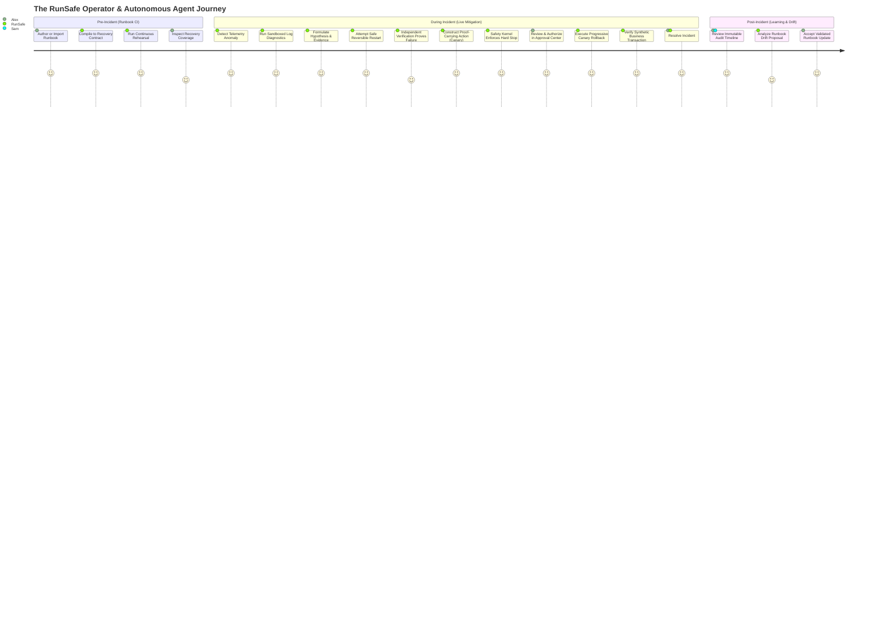
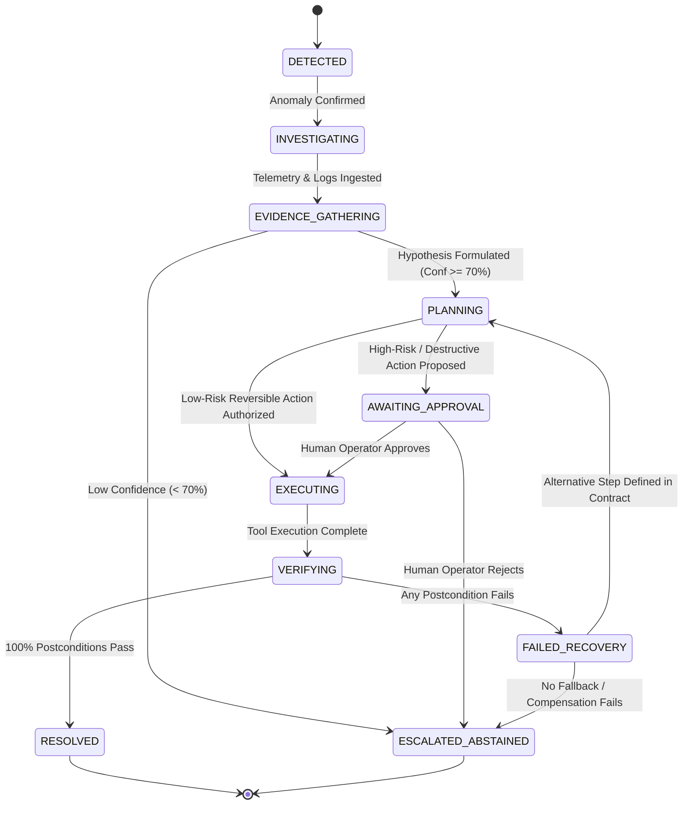
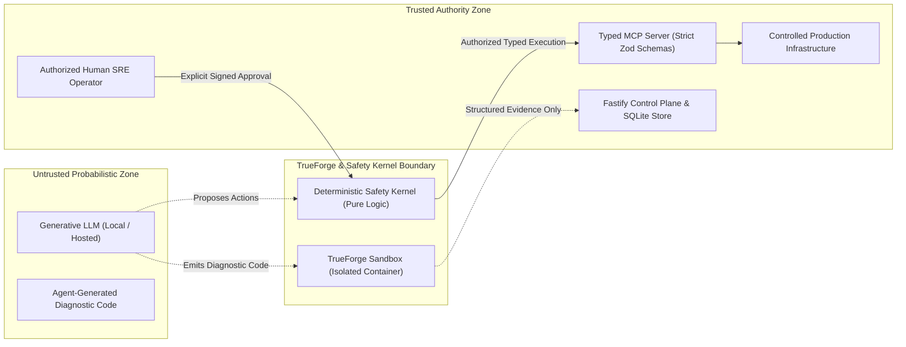

# RUNSAFE — Product Requirements Document (PRD)

**Document Identifier:** RUNSAFE-PRD-001  
**Target File Path:** `docs/03_PRD.md`  
**Document Version:** 1.0.0 (Authoritative Base Specification)  
**Status:** FROZEN / BASELINE SOURCE OF TRUTH  
**Date:** 26 September 2026  
**Event:** Agents That Act: TrueFoundry × Polaris Hackathon (Bengaluru, In-Person)  
**Core Theme:** *"Build agents that act, not ones that just answer."*  
**Intended Audience:** Product Managers, System Architects, SRE Leads, Agent Developers, Hackathon Evaluators / Judges  

---

## 1. Document Control & Metadata

### 1.1 Revision History
| Version | Date | Author / Role | Status | Description |
|---|---|---|---|---|
| **1.0.0** | 2026-09-26 | RunSafe Core Team | Frozen Baseline | Authoritative PRD establishing frozen product requirements, functional boundaries, state models, safety guarantees, and demo criteria. |

### 1.2 Source-of-Truth Statement
This document is the **authoritative product requirements specification** for RunSafe. All downstream technical designs, including the Technical Requirements Document (`docs/04_TRD.md`), System Architecture (`docs/05_ARCHITECTURE.md`), UI/UX Specifications, Data Schemas, Tool Definitions, and Verification Plans, must strictly conform to the requirements, semantics, and constraints detailed herein. 

No architectural trend, framework convenience, or implementation shortcut may silently alter, dilute, or remove any core differentiator, safety boundary, or verification requirement defined in this PRD.

---

## 2. Executive Summary

**RunSafe** is a **Verified Autonomous Incident Recovery / AI SRE Control Plane**. It elevates the conventional concept of a "Runbook Executor" into a resilient, production-grade operational control system.

Operational runbooks represent an organization’s documented knowledge for mitigating system downtime. However, in contemporary engineering environments, runbooks decay silently; when real incidents occur at 2 AM, on-call engineers are paged into high-stress situations only to discover that manual runbook steps are stale, ambiguous, or broken. Conversely, handing unrestricted autonomous authority to generative AI models introduces unacceptable operational hazards: Large Language Models (LLMs) hallucinate, lack physical awareness of system state, cannot prove the safety of their mutations, and frequently mistake command execution success (e.g. exit code `0`) for genuine operational recovery.

RunSafe resolves this dual crisis of **untested recovery procedures** and **untrusted AI automation** by enforcing three architectural pillars:
1. **AI provides Intelligence:** LLMs reason over telemetry, interpret operational runbooks, formulate diagnostic hypotheses, and generate sandboxed diagnostic scripts.
2. **The Safety Kernel provides Authority:** An out-of-band, deterministic policy engine enforces machine-enforceable **Recovery Contracts**, evaluates blast radius, and mandates a hard stop for human approval prior to executing any high-risk or irreversible action.
3. **The Verifier provides Truth:** Independent, deterministic machine assertions (probing health endpoints, database state, error budgets, and synthetic user transactions) objectively prove recovery before any incident can be marked resolved.

Furthermore, RunSafe introduces **Runbook CI (Recovery Rehearsal)**—an automated testing discipline that subjects runbooks to continuous, controlled fault-injection tests in staging environments, proving that recovery workflows function before disaster strikes.

---

## 3. Background & Problem Statement

### 3.1 The Reality of Modern Incident Response
Complex distributed applications fail in non-linear ways. When an outage occurs, the mean time to recovery (MTTR) is dominated not by the time it takes to execute a fix, but by the time required to:
- Correlate thousands of disparate log lines, metrics, and deployment diffs.
- Identify the correct runbook amidst fragmented documentation.
- Verify whether the written runbook steps still match the deployed infrastructure topology.
- Manually run commands under immense cognitive pressure without fat-fingering commands or expanding the blast radius.

### 3.2 The Stale Runbook Problem
Runbooks are typically written once during service launch and neglected thereafter. Infrastructure changes (API deprecations, topology shifts, environment variable renames, and containerization updates) quickly render runbooks obsolete. Organizations possess zero automated mechanisms to test whether their written recovery procedures can actually restore an unhealthy service.

### 3.3 The Failure Modes of Naive "AI for DevOps"
Attempts to apply generative AI to DevOps have predominantly produced three unacceptable anti-patterns:
1. **Passive Chatbots / Log Summarizers:** Systems that merely ingest logs and suggest terminal commands in a chat interface. They do not act, forcing the human to remain the manual executor while introducing cognitive latency.
2. **Unrestricted AI Shells:** Systems that grant an LLM raw bash/terminal access. In an incident, an unconstrained LLM can execute destructive commands (`rm -rf`, premature database drops, indiscriminate pod terminations) without guardrails or rollback plans.
3. **Command-Level Blindness:** Naive automation assumes that if a command executes without error, the incident is resolved. In reality, a container restart command can exit with code `0` while the application remains deadlocked or crashing in a loop.

### 3.4 The RunSafe Paradigm Shift
RunSafe rejects both passive chatbots and reckless autonomous agents. It introduces structured, deterministic constraints around probabilistic AI:
- Free-text runbooks are compiled into machine-enforceable **Recovery Contracts**.
- Proposed mutations must be packaged as **Proof-Carrying Actions** carrying evidence, risk tiering, blast-radius boundaries, and success criteria.
- Generated diagnostic code runs exclusively in isolated sandboxes.
- The system practices **Confidence-Based Abstention**, knowing when to halt autonomous workflows and request human engineering escalation.

---

## 4. Product Vision, Positioning & Core Principles

### 4.1 Primary Product Positioning
> *"Existing runbooks tell you how to recover. RunSafe proves the runbook works, then safely executes it when production actually fails."*

### 4.2 Safety Philosophy
> *"We don’t ask you to trust the AI. We make the AI prove every recovery action."*

### 4.3 Technical Philosophy
> *"AI provides intelligence. The Safety Kernel provides authority. The Verifier provides truth."*

### 4.4 Core Product Principles
1. **Act, Do Not Just Answer:** The agent must reach real infrastructure via typed operational tools, performing tangible mutations within approved boundaries.
2. **Deterministic Safety over Probabilistic Reasoning:** An LLM may propose any action, but the deterministic Safety Kernel holds absolute authority over execution.
3. **No Unverified Success:** No incident is resolved until independent machine verification passes. Command success $\neq$ business recovery.
4. **Smallest Safe Mutation (Canary Remediation):** Where topology permits, the system must prefer progressive, single-replica canary remediation to minimize blast radius before executing broad state changes.
5. **Know When to Stop:** The agent must enforce hard stops in two distinct scenarios:
   - *Policy Gate:* When an action is classified as high-risk or irreversible, requiring explicit human approval.
   - *Epistemic Gate:* When evidence is ambiguous or diagnostic confidence falls below safety thresholds, requiring human escalation.
6. **Continuous Rehearsal (Runbook CI):** Recovery procedures must be validated via automated fault-injection rehearsals prior to production emergencies.
7. **Human Sovereignty Over Policy:** RunSafe may observe operational patterns and propose runbook improvements, but it must never silently alter operational contracts.

---

## 5. Product Goals & Explicit Non-Goals

### 5.1 Goals
- **G-1 (Real-System Interaction):** Provide an autonomous control plane capable of observing, diagnosing, mutating, and verifying real containerized infrastructure services via typed MCP tools.
- **G-2 (Machine-Enforceable Contracts):** Transform human-authored markdown runbooks into structured, validated Recovery Contracts that enforce preconditions, postconditions, and risk classifications.
- **G-3 (Fail-Closed Safety Kernel):** Guarantee that zero state-changing mutations occur outside verified contract rules and that all high-risk/destructive actions require human approval.
- **G-4 (Sandboxed Code Execution):** Isolate all LLM-generated diagnostic and data-analysis code within a TrueForge sandbox runtime, preventing arbitrary code execution against host infrastructure.
- **G-5 (Objective Outcome Verification):** Enforce independent multi-metric verification (HTTP status, latency, error rate, synthetic business transactions) before updating incident state.
- **G-6 (Progressive Canary Remediation):** Enable phased multi-replica rollbacks that evaluate canary traffic against faulty versions prior to complete rollback execution.
- **G-7 (Runbook CI / Rehearsal):** Implement a continuous rehearsal engine that injects controlled faults, runs recovery contracts, and calculates recovery coverage metrics.
- **G-8 (Transparent Auditability):** Maintain an immutable chronological timeline recording every observation, sandbox execution, tool dispatch, policy evaluation, approval decision, and verification check.

### 5.2 Explicit Non-Goals
- **NG-1 (Not a Generic Chatbot):** RunSafe will not provide a conversational free-form chatbot as its primary operational interface.
- **NG-2 (Not Unrestricted Terminal Access):** RunSafe will not provide an LLM with arbitrary, unbounded shell/SSH access to target hosts.
- **NG-3 (Not an Autonomous Policy Rewriter):** RunSafe will not automatically modify, update, or publish operational runbooks without explicit, recorded human review and approval.
- **NG-4 (Not a Replacement for Human SREs):** RunSafe is designed to handle well-defined, contract-bounded recovery workflows and amplify operator capacity; it does not replace human incident commanders.
- **NG-5 (No Third-Party Cloud Dependency for Core Demo):** The core product verification and hackathon demonstration will not depend on external paid cloud services (AWS/GCP/Azure) or live internet connectivity; it must function completely local-first.
- **NG-6 (No Large-Scale Distributed Observability Stack):** RunSafe will not embed or require heavy enterprise telemetry backends (e.g. multi-node Kafka, Elasticsearch clusters, Datadog/Prometheus enterprise agents) for its prototype operation.

---

## 6. Target Personas & Stakeholder Analysis

| Persona | Primary Role | Pre-Incident Responsibilities | During-Incident Responsibilities | Post-Incident Responsibilities |
|---|---|---|---|---|
| **Alex (On-Call SRE / DevOps)** | Primary Operator | Imports and validates human runbooks; runs Runbook CI rehearsals to ensure coverage. | Monitors live incident telemetry; reviews Proof-Carrying Actions in Approval Center; authorizes canary rollbacks. | Reviews incident timeline; inspects verification evidence; accepts or rejects proposed runbook drift updates. |
| **Sam (Platform / Infrastructure Lead)** | Secondary / Policy Owner | Defines organizational safety tiers; configures typed MCP tool policies and blast-radius mappings. | Acts as high-risk escalation contact for ambiguous outages where RunSafe abstains. | Audits automated actions across services; reviews MTTR trends and system reliability reports. |
| **Hackathon Evaluator / Judge** | Evaluator / Observer | Reviews project architecture, README, AI disclosures, and local Docker demo topology. | Observes live fault injection, autonomous diagnosis, sandbox code execution, human approval gate, and verified recovery. | Assesses technical rigor, compliance with TrueForge constraints, real-system execution, and safety boundaries. |

---

## 7. Current Operational Pain Points & Value Proposition

### 7.1 Pain Points Addressed
1. **Runbook Rot:** Runbooks are static text files that drift out of sync with actual application architecture.
2. **Cognitive Overload Under Fire:** Paged engineers must rapidly parse multi-page runbooks while triaging live alerts, leading to delayed action or catastrophic errors.
3. **Lack of Remediation Verification:** Traditional automation scripts fire commands blindly without confirming that the application has resumed correct business functionality.
4. **Blast-Radius Insecurity:** Ad-hoc remediations (e.g. blanket rollbacks or service restarts) frequently trigger cascading failures in downstream dependencies.
5. **AI Hallucination Hazards:** Generic AI assistants make confident assertions without evidence, invent non-existent flags, and cannot be trusted with write access.

### 7.2 RunSafe Value Proposition
RunSafe delivers **provable operational resilience**:
- **70%+ Reduction in MTTR:** Automates diagnostic log slicing and low-risk mitigations in seconds rather than minutes.
- **Zero-Risk Autonomous Mitigation:** Hard limits prevent the AI from exceeding approved authority, ensuring complete peace of mind for engineering leadership.
- **Pre-Incident Assurance:** Runbook CI exposes broken recovery paths before outages occur in production.
- **Explainable Operational Decisions:** Every action is backed by transparent, auditable evidence and clear blast-radius visualizations.

---

## 8. User Journeys & End-to-End Workflows

### 8.1 High-Level Operational Journey


### 8.2 Detailed Workflow Stages
1. **Pre-Incident Phase (Runbook Authoring & Rehearsal):**
   - Operator imports a markdown runbook into the **Runbook Lab**.
   - RunSafe parses the document into a typed **Recovery Contract**, flagging undefined steps or missing success criteria.
   - Operator triggers a **Runbook CI Rehearsal**. RunSafe triggers controlled fault injection in staging, executes the contract, validates postconditions, and renders a recovery coverage score.
2. **Incident Phase (Detection, Diagnosis & Gated Remediation):**
   - Telemetry poller detects error rates exceeding thresholds. An incident record is created (`INC-...`).
   - RunSafe gathers initial evidence. High-volume logs are routed into the **TrueForge Sandbox**, where an agent-generated Python script computes error distributions across versions.
   - RunSafe pairs the diagnostic evidence with the matching Recovery Contract.
   - For low-risk reversible steps (e.g. single-replica restart), RunSafe executes autonomously and tests postconditions.
   - If verification fails or a high-risk mutation (e.g. rollback) is required, RunSafe compiles a **Proof-Carrying Action** and blocks execution.
   - The operator inspects the proposed action in the **Approval Center**, examines the blast-radius dependency graph, and clicks **Approve**.
   - RunSafe dispatches the canary rollback tool, isolates traffic, compares metrics, confirms resolution, and executes full remediation.
3. **Post-Incident Phase (Audit, Drift & Self-Improvement):**
   - Independent Verifier confirms synthetic end-to-end checkout transactions succeed. Incident transitions to `RESOLVED`.
   - The **Audit / Postmortem View** populates the complete timeline of observations, sandbox executions, human approvals, and tool actions.
   - RunSafe detects that initial restart instructions failed while rollback succeeded; it generates a **Runbook Drift Proposal** suggesting that version checks precede restart steps in future incidents.
   - Operator accepts the recommendation; the Recovery Contract version increments.

---

## 9. Functional Requirements

### 9.1 Runbook Ingestion & Recovery Contracts
- **FR-001 (Markdown Runbook Ingestion):** The system shall allow operators to import operational runbooks in standard Markdown format via web UI upload or text input.
- **FR-002 (Recovery Contract Compilation):** The system shall parse unstructured markdown runbook steps into structured, machine-enforceable Recovery Contracts validated against strict Zod schemas.
- **FR-003 (Contract Schema Completeness):** Each compiled Recovery Contract step must define: `step_id`, `description`, `intent`, `required_evidence`, `preconditions`, `action`, `action_parameters`, `risk_classification`, `reversibility`, `blast_radius`, `approval_policy`, `timeout_ms`, `success_criteria`, `postconditions`, `compensation`, `fallback_step_id`, `on_success_step_id`, and `on_failure_step_id`.
- **FR-004 (Contract Validation & Linting):** The system shall analyze compiled contracts for syntactic or logical defects (e.g., missing rollback paths, undefined risk classifications, circular transitions) and surface warnings in the Runbook Lab.
- **FR-005 (Contract Versioning):** The system shall maintain an immutable revision history for each Recovery Contract, ensuring active incidents bind to a specific contract version.

### 9.2 Incident Detection & Evidence Engine
- **FR-006 (Autonomous Anomaly Detection):** The system shall continuously monitor target infrastructure telemetry (HTTP 5xx rate, health check status, latency percentiles) and automatically instantiate an incident when configured alert thresholds are breached.
- **FR-007 (Evidence Collection & Provenance):** The system shall collect operational telemetry via typed observation tools and store each datum with an immutable timestamp, source identifier, metric name, observed value, and associated incident ID.
- **FR-008 (Hypothesis Formulation):** The system shall analyze collected evidence to generate ranked root-cause hypotheses, associating each hypothesis with an explicit probabilistic confidence score ($0.0$ to $1.0$).
- **FR-009 (Evidence-Action Traceability):** Every hypothesis and action proposal must link directly to supporting evidence records stored in the state database.

### 9.3 Sandboxed Diagnostic Code Execution (TrueForge)
- **FR-010 (Agent Diagnostic Script Generation):** When raw log lines or metric sets exceed direct LLM token context limits or require statistical correlation, the agent shall generate dedicated diagnostic analysis scripts (e.g., Python).
- **FR-011 (TrueForge Sandbox Isolation):** Generated diagnostic scripts must execute strictly within an isolated TrueForge container sandbox with zero write access or network access to host infrastructure.
- **FR-012 (Structured Sandbox Output Ingestion):** The system shall capture standard output and standard error from the sandbox, parse structured JSON telemetry results, and ingest them directly into the Evidence Store.
- **FR-013 (Sandbox Activity Visibility):** The UI and audit logs shall distinctly display the generated code, execution status, runtime duration, and parsed findings separately from real infrastructure tool invocations.

### 9.4 Typed MCP Operational Tools
- **FR-014 (Typed Observation Tools):** The system shall interact with target systems via strictly typed Model Context Protocol (MCP) observation tools, including: `get_service_health`, `get_service_metrics`, `get_recent_logs`, `get_database_health`, `get_current_deployment`, and `get_dependencies`.
- **FR-015 (Typed Mutation Tools):** The system shall perform state changes exclusively through typed MCP mutation tools, including: `restart_service`, `rollback_canary`, `rollback_full`, and `set_traffic_weight`.
- **FR-016 (Strict Tool Validation):** All tool inputs and outputs must be validated at runtime against strict Zod schemas. Any tool invocation with invalid parameters must fail closed immediately.
- **FR-017 (Execution Timeouts):** Every tool invocation must enforce a deterministic timeout (configurable, default: 15,000ms). Operations exceeding the timeout must fail closed and trigger compensation logic.

### 9.5 Deterministic Safety Kernel
- **FR-018 (Out-of-Band Policy Enforcement):** The system shall evaluate all tool proposals through a deterministic Safety Kernel operating outside the LLM reasoning loop. The LLM shall possess zero authority to bypass or alter kernel decisions.
- **FR-019 (Deterministic Action Classification):** The Safety Kernel shall classify all proposed actions into one of six deterministic tiers: `READ_ONLY`, `LOW_RISK_REVERSIBLE`, `STATE_CHANGING`, `HIGH_RISK`, `DESTRUCTIVE`, or `UNKNOWN`.
- **FR-020 (Autonomous Execution Policy):** `READ_ONLY` actions shall execute automatically. `LOW_RISK_REVERSIBLE` actions shall execute automatically only if explicitly authorized by the active Recovery Contract step and preconditions are verified.
- **FR-021 (Mandatory Approval Gate):** All actions classified as `HIGH_RISK` or `DESTRUCTIVE` must trigger an immediate execution halt and dispatch a formal approval request to the Approval Center.
- **FR-022 (Fail-Closed Default):** Any action classified as `UNKNOWN`, or any proposal with unsatisfied preconditions or corrupted schemas, must fail closed immediately with an alert dispatched to human operators.

### 9.6 Proof-Carrying Actions & Approval Experience
- **FR-023 (Proof-Carrying Action Construction):** Prior to proposing any state mutation, the system must construct a Proof-Carrying Action data structure containing: action identifier, intent, supporting evidence IDs, authorizing contract step, risk tier, blast-radius node list, expected postconditions, compensation procedure, and timeout.
- **FR-024 (Approval Center Interface):** The system shall present pending Proof-Carrying Actions within a dedicated web interface displaying complete justification context, visual blast radius, and explicit **Approve** and **Reject** controls.
- **FR-025 (Explicit Human Consent):** Approval requires an active, recorded human click. The system shall never infer approval from operator inactivity or timeout; missing approval must result in workflow suspension.
- **FR-026 (Anti-Self-Approval):** The system shall programmatically prevent the AI agent or automated background processes from approving its own mutation requests.

### 9.7 Progressive / Canary Remediation
- **FR-027 (Canary Isolation):** Where multi-replica infrastructure exists, the system shall support progressive remediation by mutating a single replica (e.g. `checkout-api-1`) while maintaining existing state on sibling replicas.
- **FR-028 (Canary Metric Comparison):** The system shall evaluate telemetry deltas between the canary replica and baseline replicas over a defined observation window prior to recommending full rollout.
- **FR-029 (Full Rollout Gating):** Expansion from canary rollback to full fleet rollback must be governed by Recovery Contract policy and require secondary human confirmation if configured.

### 9.8 Independent Outcome Verification & Abstention
- **FR-030 (Deterministic Machine Verification):** After executing any mutation, the system shall invoke independent verification probes (HTTP endpoint status, latency percentiles, error rates, database read/write queries).
- **FR-031 (Synthetic Business Transactions):** Verification must include executing end-to-end synthetic user journeys (e.g. placing a test checkout order) to confirm true functional recovery.
- **FR-032 (Command Success Disassociation):** A tool returning exit code `0` or HTTP `200` must not transition an incident to resolved status; resolution requires 100% of objective postconditions to pass.
- **FR-033 (Confidence-Based Abstention):** If the highest diagnostic hypothesis confidence score is below the configured threshold (default: $0.70$) or evidence is contradictory, RunSafe must halt autonomous remediation, declare abstention, and escalate to human engineering.
- **FR-034 (Compensation & Rollback on Verification Failure):** If independent verification fails following an action, the system must halt further execution, initiate the defined compensation/rollback procedure, and update the incident state to `FAILED_RECOVERY`.

### 9.9 Runbook CI / Continuous Recovery Rehearsal
- **FR-035 (Controlled Fault Injection):** The system shall incorporate a local fault injection controller capable of simulating service crashes, container deadlocks, deployment regressions, and database connection pool exhaustion in controlled environments.
- **FR-036 (Automated Rehearsal Execution):** The system shall execute Recovery Contracts against fault-injected staging environments, evaluating whether the automated recovery path successfully restores system health.
- **FR-037 (Recovery Coverage Metrics):** The system shall calculate and display recovery coverage metrics, representing the proportion of verified recovery paths versus total defined failure modes.
- **FR-038 (Broken Path Detection):** Runbook CI must explicitly flag contract steps that fail verification, lack compensation definitions, or result in execution timeouts during rehearsal.

### 9.10 Learning, Runbook Drift & Auditability
- **FR-039 (Immutable Timeline Recording):** The system shall persist an append-only chronological audit log of all observations, evidence items, sandbox scripts, model decisions, safety evaluations, human approvals, tool calls, and verification results.
- **FR-040 (Runbook Drift Detection):** Following an incident or rehearsal, the system shall compare actual successful execution paths against the original runbook instructions to identify procedural drift or inefficiency.
- **FR-041 (Evidence-Backed Improvement Proposals):** If an alternative recovery sequence proves superior, RunSafe shall formulate a structured runbook improvement proposal referencing historical incident evidence.
- **FR-042 (Human Approval for Policy Changes):** Proposed runbook improvements must require explicit operator acceptance in the Runbook Lab before updating the active contract; autonomous policy overwrites are strictly prohibited.

### 9.11 Product Surfaces & Navigation
- **FR-043 (Command Center View):** Provides high-level operational visibility: active services, open incidents, system MTTR, overall Runbook CI rehearsal pass rates, and real-time agent status.
- **FR-044 (Incident Room View):** The primary operational triage surface, streaming live evidence, hypothesis ranking, sandboxed diagnostic code, active contract execution progress, and verification results.
- **FR-045 (Approval Center View):** The dedicated human-in-the-loop decision card displaying Proof-Carrying Actions, evidence diffs, blast-radius highlights, and approval actions.
- **FR-046 (Recovery & Dependency Graph View):** Interactive visual topology (React Flow) rendering service nodes, database relationships, active incident blast radius, and canary traffic routing.
- **FR-047 (Runbook Lab View):** Interactive runbook authoring, contract inspection, linting diagnostics, version comparison, and drift proposal review.
- **FR-048 (Runbook CI / Rehearsal View):** Test runner console displaying scenario execution matrices, pass/fail logs, broken step alerts, and historical rehearsal scores.
- **FR-049 (Audit / Postmortem View):** Complete post-incident review console displaying end-to-end event chronologies, MTTR breakdowns, operator actions, and downloadable audit reports.

---

## 10. Non-Functional Requirements

### 10.1 Safety, Reliability & Determinism
- **NFR-001 (Fail-Closed Default):** Under any internal failure condition (database lock, network drop, unhandled exception, tool timeout, ambiguous schema), the system must immediately fail closed, denying all pending state mutations.
- **NFR-002 (Deterministic Safety Enforcement):** Safety policy evaluations must be strictly deterministic, executing pure logic with zero LLM dependency.
- **NFR-003 (Idempotent Execution & Replay Defense):** Every Proof-Carrying Action must carry a unique cryptographic UUID (`action_id`). The Safety Kernel must reject any duplicate or previously executed action identifier.

### 10.2 Performance & Responsiveness
- **NFR-004 (Control Plane Latency):** The Fastify API control plane must process telemetry ingestion and safety evaluation requests with a p95 latency under 50 milliseconds.
- **NFR-005 (Real-Time UI Updates):** Operational state changes, telemetry updates, and approval requests must propagate to the Next.js frontend via Server-Sent Events (SSE) or WebSockets within 250 milliseconds of event emission.
- **NFR-006 (Sandbox Execution Timeout):** Diagnostic script execution within the TrueForge sandbox must enforce a hard execution ceiling (configurable, default: 30 seconds) to prevent infinite loops.

### 10.3 Hardware Constraints & Local-First Operation
- **NFR-007 (Local Host Resource Budget):** The entire RunSafe control plane, Next.js frontend, SQLite database, Docker Compose demo infrastructure, and local Ollama model must operate concurrently within:
  - CPU: AMD Ryzen 5000 series (or equivalent 6-8 core CPU).
  - RAM: 24 GB total system RAM (RunSafe stack footprint $\le 8$ GB, leaving ample headroom for Docker and OS).
  - GPU / VRAM: NVIDIA RTX 3050 Laptop GPU (4 GB VRAM limit; local Qwen3 4B quantized model footprint $\le 2.8$ GB VRAM).
- **NFR-008 (Zero Cloud Dependency for Core Demo):** The complete core demonstration (Scenarios 1, 2, and 3) must execute 100% offline without external API keys, public internet access, or third-party cloud infrastructure.

### 10.4 Security & Privacy
- **NFR-009 (Zero Secret Leakage):** Credentials, API tokens, and private infrastructure keys must never be committed to Git, logged in plain text, passed into LLM prompt contexts, or output in demo recordings.
- **NFR-010 (Sandbox Isolation):** TrueForge sandboxes running generated Python code must execute with non-root user privileges, dropped capabilities, and read-only host mount restrictions.

### 10.5 Auditability & Compliance
- **NFR-011 (Immutable Audit Records):** All state changes, approval decisions, and tool invocations must be recorded in an append-only SQLite database with millisecond-precision UTC timestamps.
- **NFR-012 (AI Assistant Disclosure):** The project documentation and README must explicitly disclose all AI coding assistants utilized during development in strict compliance with hackathon regulations.

---

## 11. Formal State Models

### 11.1 Incident State Model
An incident represents a detected operational degradation. The incident lifecycle enforces strict transition gates:



#### Incident State Definitions:
- `DETECTED`: Alert triggered by metric threshold breach or health check failure.
- `INVESTIGATING`: RunSafe agent assigned; initial topology inspection underway.
- `EVIDENCE_GATHERING`: Active log retrieval and TrueForge sandbox diagnostic execution.
- `PLANNING`: Root-cause hypothesis selected; matching Recovery Contract evaluated; Proof-Carrying Action constructed.
- `AWAITING_APPROVAL`: Execution halted; Proof-Carrying Action presented in Approval Center.
- `EXECUTING`: Approved or low-risk action dispatched to typed MCP tool.
- `VERIFYING`: Independent outcome verifier actively executing health and business transaction checks.
- `RESOLVED`: System health and synthetic transactions objectively verified; incident closed.
- `FAILED_RECOVERY`: Verification failed; system executing compensation or initiating fallback.
- `ESCALATED_ABSTAINED`: Autonomous recovery halted due to low confidence, human rejection, or unrecoverable failure; paged to human engineer.

### 11.2 Action State Model
Every individual state mutation adheres to a rigorous execution lifecycle:

| Action State | Description | Transition Trigger |
|---|---|---|
| `PROPOSED` | Action constructed by planner with initial metadata. | Agent identifies required contract step. |
| `POLICY_EVALUATED` | Evaluated by deterministic Safety Kernel. | Safety Kernel assigns risk tier and policy rule. |
| `APPROVAL_REQUIRED` | Suspended awaiting human operator intervention. | Action classified as `HIGH_RISK` or `DESTRUCTIVE`. |
| `APPROVED` | Explicit approval recorded from human operator. | Operator clicks "Approve" in Approval Center. |
| `REJECTED` | Operator explicitly denies proposed mutation. | Operator clicks "Reject" in Approval Center. |
| `EXECUTING` | Action dispatched to target typed MCP tool. | Kernel dispatch following policy pass or approval. |
| `SUCCEEDED` | Tool reports successful command execution. | MCP tool returns exit code 0 / success payload. |
| `FAILED` | Tool encounters runtime error or execution timeout. | Tool throws error, exits non-zero, or exceeds timeout. |
| `VERIFYING` | Independent Verifier executing postcondition checks. | Tool execution completed; waiting for probe response. |
| `VERIFIED_EFFECTIVE` | Independent Verifier confirms all success criteria met. | Synthetic transactions and health endpoints pass. |
| `VERIFIED_INEFFECTIVE`| Independent Verifier detects continued degradation. | Health checks fail or error rates remain elevated. |
| `COMPENSATED_ROLLED_BACK` | Compensation or rollback executed following failure. | Verifier confirms restoration of prior safe state. |
| `CANCELLED` | Action discarded prior to execution. | Superseded by operator override or incident abort. |

### 11.3 Runbook & Recovery Contract Lifecycle
1. `AUTHORED_IMPORTED`: Raw markdown document provided by engineering team.
2. `PARSED`: Text tokenized and mapped to conceptual operational steps.
3. `COMPILED_CONTRACT`: Structured Zod-validated JSON Recovery Contract produced.
4. `VALIDATED`: Schema integrity, risk classifications, and rollback paths verified.
5. `REHEARSED`: Contract tested via controlled fault injection in Runbook CI.
6. `VERIFIED`: Rehearsal successfully achieved all objective postconditions.
7. `PARTIALLY_VERIFIED`: Rehearsal revealed untested or non-critical failing sub-paths.
8. `FAILED`: Rehearsal failed objective recovery criteria; flagged for operator review.
9. `ACTIVE`: Contract authorized for autonomous/gated execution during live incidents.
10. `DRIFT_DETECTED`: Real incident execution deviated from written sequence.
11. `IMPROVEMENT_PROPOSED`: Evidence-backed refinement submitted for human review.
12. `SUPERSEDED_VERSIONED`: Updated contract approved; prior version archived.

---

## 12. Approval Experience & Proof-Carrying Action Protocol

### 12.1 The Proof-Carrying Action (PCA) Protocol
An operational mutation can never be reduced to a bare tool call (e.g. `restart_service()`). Every proposed mutation must bundle an immutable **Proof-Carrying Action** package satisfying the following specification:

```typescript
// Formal Proof-Carrying Action Schema (Conceptual Zod Representation)
interface ProofCarryingActionPayload {
  action_id: string;               // Cryptographic UUID nonce
  incident_id: string;             // Associated active incident
  step_id: string;                 // Authorizing step in Recovery Contract
  contract_version: string;        // Specific version of active contract
  tool_name: string;               // Target MCP tool identifier
  parameters: Record<string, any>; // Strictly typed tool arguments
  
  justification: {
    root_cause_hypothesis: string; // Plain-English diagnostic explanation
    confidence_score: number;      // Numeric confidence (0.00 - 1.00)
    supporting_evidence_ids: string[]; // Explicit references to Evidence Store
    preconditions_validated: boolean;  // Confirmation of prerequisite checks
  };
  
  safety_envelope: {
    risk_tier: 'READ_ONLY' | 'LOW_RISK_REVERSIBLE' | 'STATE_CHANGING' | 'HIGH_RISK' | 'DESTRUCTIVE';
    is_reversible: boolean;        // True if verified rollback exists
    blast_radius_services: string[]; // List of potentially affected components
    compensation_procedure: string;// Specific fallback tool call if action fails
    execution_timeout_ms: number;  // Hard execution limit
  };
  
  verification_contract: {
    health_endpoint: string;       // Target URL for health verification
    expected_status_code: number;  // Required HTTP status (e.g. 200)
    max_acceptable_error_rate: number; // Error threshold (e.g. 0.01)
    synthetic_transaction_type: string;// Specific end-to-end check
  };
}
```

### 12.2 Operator Experience in the Approval Center
When a Proof-Carrying Action arrives in the Approval Center, the UI must render an **Operational Decision Card** containing:
1. **Headline & Target:** Clear statement of action (e.g. *"Rollback checkout-api-1 from v2 to v1"*).
2. **The "Why" (Diagnostic Justification):** Summary of sandboxed log analysis showing that version `v2` accounts for $94\%$ of all $503$ exceptions while database health is normal.
3. **Evidence Carousel / Diff:** Visual telemetry graphs displaying the spike in 5xx errors coinciding with the v2 deployment timestamp.
4. **Blast-Radius Visualizer:** Node highlight in the topology graph showing `checkout-api-1` and its immediate downstream dependents (`order-service`, `payment-gateway`).
5. **Reversibility Guarantee:** Explicit display of the rollback procedure should the canary mutation fail.
6. **Objective Verification Criteria:** List of checks that will run automatically post-mutation.
7. **Action Triggers:** Two explicit, non-ambiguous buttons:
   - **[Approve & Execute]:** Prompts for optional operator note; dispatches execution token to Safety Kernel.
   - **[Reject & Escalate]:** Halts automated recovery; transfers incident to manual SRE control.

---

## 13. Runbook CI & Recovery Rehearsal Specifications

### 13.1 Product Purpose & Outcomes
Runbook CI adapts the rigorous discipline of software Continuous Integration (CI) to operational disaster recovery. It transforms runbooks from passive, unverified text into tested, reliable code.

### 13.2 Rehearsal Engine Execution Workflow
1. **Scenario Selection:** Operator or scheduled job selects a defined failure scenario (e.g. *Scenario 2: Deployment Regression*).
2. **Staging Environment Reset:** Target demo infrastructure is verified to be in a known healthy baseline state.
3. **Controlled Fault Injection:** The RunSafe Failure Injector introduces the specific fault (e.g. triggers API container crash or swaps image to buggy v2).
4. **Autonomous Contract Execution:** RunSafe detects the anomaly, selects the matching Recovery Contract, and executes approved steps in rehearsal mode.
5. **Postcondition Evaluation:** The Independent Verifier tests whether the rehearsal restored full functionality.
6. **Telemetry & Report Generation:** The system records execution duration, broken steps, and postcondition results.
7. **Environment Restoration:** Infrastructure is restored to pristine baseline.

### 13.3 Recovery Coverage Metric Formulation
The system calculates and displays the **Recovery Coverage Score** ($RC$):
$$RC = \left( \frac{N_{\text{verified\_paths}}}{N_{\text{total\_defined\_failure\_modes}}} \right) \times 100$$
- $N_{\text{verified\_paths}}$: Number of recovery paths that achieve 100% objective postcondition verification during automated rehearsal.
- $N_{\text{total\_defined\_failure\_modes}}$: Total catalog of supported operational incident scenarios defined in the system.

The Runbook CI dashboard renders historical pass/fail trends, last verified timestamps, and actionable warnings for any contract containing unverified or failing paths.

---

## 14. Error, Exception & Failure Handling Matrix

The system must handle operational failures with absolute predictability. The following matrix governs system behavior under anomalous conditions:

| Failure Mode | Detection Mechanism | Immediate System Behavior | User / Operator Impact | Fallback / Recovery Action |
|---|---|---|---|---|
| **Local LLM (Ollama) Unavailable** | Connection refused on port `11434` / timeout. | Halt reasoning; preserve state; flag LLM disconnect in UI. | Banner alert in Command Center: *"Local AI Engine Offline"*. | Attempt failover to hosted model if configured; otherwise pause incident in `INVESTIGATING` state. |
| **Hosted LLM API Exceeded / Unavailable** | HTTP 401, 429, or 5xx from hosted provider. | Drop seamlessly to local Ollama Qwen3 4B runtime. | Notification logged; zero interruption to active mitigation workflow. | Local model assumes full diagnostic and planning duties. |
| **TrueForge Sandbox Crash / Timeout** | Sandbox process exits non-zero or exceeds 30s limit. | Terminate sandbox; log raw stderr; abort code-assisted analysis. | Incident Room shows *"Sandbox Diagnostic Failed"*. | Fall back to standard typed MCP log retrieval and pattern matching. |
| **Target Service Unreachable (Docker Hang)** | MCP tool times out after 15,000ms. | Mark tool call `FAILED`; Safety Kernel blocks further mutations. | Incident transitions to `FAILED_RECOVERY`. | Escalate to human operator; recommend manual container inspect. |
| **Safety Kernel Precondition Failure** | Required evidence missing from Evidence Store. | Safety Kernel denies tool dispatch; throws `PreconditionError`. | Action proposal marked `REJECTED_BY_POLICY`. | Agent prompted to gather missing evidence or select alternative contract branch. |
| **Human Operator Rejects Action** | Operator clicks "Reject" in Approval Center. | Cancel proposed action; log operator rejection audit record. | Incident Room transitions to `ESCALATED_ABSTAINED`. | Agent ceases all autonomous mutations; awaits human command. |
| **Approval Request Timeout (No Operator Response)** | Configurable timer expires (default: 10 mins). | Maintain execution halt; re-trigger high-priority alert. | Notification dispatched: *"Pending Approval Stalled"*. | System remains fail-closed; never proceeds without explicit consent. |
| **Independent Verification Failure** | Health check $\neq 200$ or synthetic transaction fails. | Keep incident open; mark action `VERIFIED_INEFFECTIVE`. | Incident timeline updates: *"Verification Failed - Incident Open"*. | Trigger compensation procedure defined in contract; initiate fallback step. |
| **Conflicting Diagnostic Evidence** | Evidence yields equal scores for mutually exclusive hypotheses. | Confidence falls below $0.70$ threshold; trigger abstention. | Incident Room flags *"Ambiguous Root Cause - Abstaining"*. | Halt autonomous changes; request senior SRE diagnostic review. |
| **Runbook Syntax / Compilation Error** | Zod schema validation failure during ingestion. | Reject runbook import; highlight specific malformed step/line. | Runbook Lab displays compilation error trace. | Operator edits markdown source to resolve missing fields. |

---

## 15. Security, Privacy & Trust Boundaries

### 15.1 Architectural Trust Boundaries


### 15.2 Mandatory Security Directives
1. **LLM Output is Untrusted:** Reasoning emitted by an LLM is treated as unvalidated suggestion. It must never directly bind to host execution privileges.
2. **Zero Shell Exposure:** No typed tool or control plane interface shall expose an unrestricted `exec_sh()` or raw bash terminal to the agent.
3. **Strict Parameter Validation:** Every MCP tool invocation must pass strict schema validation. String parameters must be sanitized against command injection patterns.
4. **Credential Isolation:** Database credentials and system passwords must reside exclusively within local environment files (`.env`) and Docker network scopes; they must never be passed into prompt contexts or stored in SQLite audit tables.
5. **Fail-Closed Default:** Any breach of security boundaries, unexpected payload, or unrecognized tool invocation must trigger an immediate fail-closed state.

---

## 16. Prototype Scope vs. Future Industry Extensions

To guarantee delivery of a 10/10 hackathon-winning prototype within the hackathon timeframe, product scope is strictly demarcated between the **Current Hackathon Prototype** and **Future Industry Extensions**:

| Functional Domain | Current Hackathon Prototype (FROZEN SCOPE) | Future Industry Extensions (POST-HACKATHON) |
|---|---|---|
| **Infrastructure Target** | Local-first Docker Compose: Nginx reverse proxy, 2x Checkout API replicas, PostgreSQL database. | Multi-cloud Kubernetes clusters (EKS/GKE), AWS ECS/Lambda, bare-metal fleets. |
| **Agent Runtime** | `@truefoundry/trueforge-core` + `@truefoundry/trueforge` CLI/server harness. | Distributed TrueForge agent swarms across global multi-region deployments. |
| **Model Strategy** | Local primary: Ollama Qwen3 4B Instruct. Optional fallback: Hosted OpenAI/Bedrock if provided. | Dynamic multi-model routing, fine-tuned domain-specific SRE models. |
| **Diagnostic Sandbox** | TrueForge isolated container running generated Python log/metric diagnostic scripts. | Dynamic multi-language sandboxes (Python, Go, eBPF) with live kernel trace analysis. |
| **Failure Injection** | Local fault injection controller: container crashes, 5xx error injection, bad version swaps, DB pool exhaustion. | Enterprise chaos engineering integration (Gremlin, Chaos Mesh, AWS Fault Injection Simulator). |
| **Telemetry & Observability** | Direct HTTP health endpoints, Docker container metrics, application logs, synthetic checkout calls. | Enterprise integrations: Datadog, Prometheus, Dynatrace, New Relic, OpenTelemetry collector. |
| **Authentication & RBAC** | Local operator role with auditable action signatures and explicit approval checkpoints. | Enterprise SSO, Okta/SAML integration, multi-party authorization policies (four-eyes principle). |
| **Runbook Repository** | Local file system / SQLite runbook store with Markdown-to-Contract compilation. | Bi-directional GitOps synchronization (GitHub/GitLab PRs), Confluence runbook sync. |

---

## 17. Prototype Acceptance & Hackathon Demo Criteria

### 17.1 Canonical Demo Scenarios
The RunSafe prototype must flawlessly execute three canonical demonstration scenarios:

#### Scenario 1: Autonomous Low-Risk Process Recovery (Service Crash)
- **Objective:** Prove autonomous execution of known, safe, reversible actions without unnecessary human interruption.
- **Workflow:**
  1. Operator or script kills `checkout-api-1`.
  2. Health check probe fails; RunSafe detects incident `INC-001`.
  3. Evidence confirms isolated process termination; database and sister replicas healthy.
  4. Matching Recovery Contract step permits autonomous restart (`LOW_RISK_REVERSIBLE`).
  5. RunSafe executes `restart_service(checkout-api-1)`.
  6. Independent Verifier confirms `/health` returns `200 OK`.
  7. Incident marked `RESOLVED`. Total time $< 30$ seconds. Zero human intervention required.

#### Scenario 2: The Hero Demo — Bad Deployment with Sandboxed Diagnostics & Canary Rollback
- **Objective:** Demonstrate end-to-end capabilities: real system mutation, sandboxed code execution, Proof-Carrying Action generation, human approval gating, canary isolation, independent business verification, and runbook drift detection.
- **Workflow:**
  1. Controlled deployment injects buggy application version `v2` into both checkout replicas.
  2. Error rate spikes ($> 15\%$ HTTP 503 errors); incident `INC-002` opens.
  3. High-volume logs stream from replicas. RunSafe writes `analyze_logs.py` and dispatches it to the **TrueForge Sandbox**.
  4. Sandbox output reveals $94\%$ of exceptions correlate specifically with version `v2` (connection leak).
  5. RunSafe attempts initial low-risk restart per contract Step 1.
  6. Independent Verifier tests `/health`; error rate remains $18\%$. **Incident remains OPEN**.
  7. RunSafe formulates Proof-Carrying Action for `rollback_canary(checkout-api-1, v1)`.
  8. Safety Kernel classifies action as `HIGH_RISK`; **HARD STOP** enforced. Approval request dispatched.
  9. Operator inspects Approval Center, reviews blast radius, and clicks **Approve**.
  10. RunSafe rolls back `checkout-api-1` to `v1`. Nginx canary routing directs test traffic.
  11. Real-time telemetry comparison proves `checkout-api-1` (v1) error rate is $0.1\%$ while `checkout-api-2` (v2) remains $18\%$.
  12. Complete rollback executed and independently verified via synthetic checkout transaction.
  13. Incident marked `RESOLVED`.
  14. RunSafe analyzes execution history and presents a **Runbook Drift Proposal**: *"Recommend deployment version correlation check prior to service restart for 503 error spikes."* Operator accepts.

#### Scenario 3: Confidence-Based Abstention (Ambiguous Outage)
- **Objective:** Prove that the agent "knows when to stop" when evidence is uncertain, refusing to guess or execute dangerous actions.
- **Workflow:**
  1. Failure injector introduces conflicting anomalies (sporadic latency + partial network packet loss).
  2. RunSafe gathers evidence and computes hypotheses: $H_1$ (Database Issue: $41\%$), $H_2$ (Upstream Network: $32\%$), $H_3$ (Memory Pressure: $27\%$).
  3. Because top confidence ($41\%$) is below the $70\%$ safety threshold, RunSafe **refuses autonomous mutation**.
  4. System updates state to `ESCALATED_ABSTAINED`, locks all mutation tools, and presents an escalation ticket detailing the ambiguity to the human engineer.

### 17.2 General Hackathon Acceptance Checklist
- [x] **Agent Runs on TrueForge:** Verified integration with `@truefoundry/trueforge-core`.
- [x] **Acts on a Real System:** Live Docker Compose environment with real HTTP traffic and real PostgreSQL database.
- [x] **Sandboxed Code Execution:** Generated Python scripts execute strictly inside TrueForge isolated sandbox.
- [x] **Stops for Approval:** High-risk actions halt and await human confirmation in the Approval Center.
- [x] **Deterministic Safety Kernel:** Logic outside LLM dictates action authorization; fail-closed defaults verified.
- [x] **Independent Verification:** No incident resolves without passing multi-metric and synthetic transaction checks.
- [x] **Runbook CI Demonstrated:** Automated rehearsal execution renders pass/fail and coverage results.
- [x] **Real-Time UI:** Live Next.js Command Center reflects truthful backend state via real-time events.
- [x] **Zero Mocking:** Backend operations execute genuine Docker commands; zero simulated or fake success states.

---

## 18. Organizer Rules & Traceability Mapping

| Hackathon Rule / Requirement | Specific RunSafe Implementation | PRD Traceability |
|---|---|---|
| **Build During Hackathon** | Project implementation scheduled strictly during event window; prior documentation and research permitted. | Section 1, Section 16 |
| **Agent Must Run on TrueForge** | Core agent reasoning, session management, and sandbox execution driven by `@truefoundry/trueforge-core`. | `FR-011`, `FR-012`, `NFR-007` |
| **Reach a Real System / Tool** | Agent commands real Docker Compose infrastructure (Nginx, Node.js API replicas, PostgreSQL) via typed MCP server. | `FR-014`, `FR-015`, Section 17 |
| **Generated Code Runs in Sandbox** | Diagnostic log correlation scripts run exclusively within TrueForge container sandboxes. | `FR-010`, `FR-011`, `FR-013` |
| **Know When to Stop** | Enforces hard stops for both high-risk approval policies and low-confidence abstention gates. | `FR-021`, `FR-033`, Scenario 3 |
| **Request Human Approval** | Mandatory Approval Center blocks high-risk/destructive actions until human operator approves. | `FR-024`, `FR-025`, Section 12 |
| **Own Accounts / Systems Only** | Entire system executes local-first on developer hardware; no external unauthorized accounts. | `NFR-008`, Section 15 |
| **No Secrets in Repo / Video** | `.gitignore` enforces exclusion of `.env` files; sensitive credentials excluded from logs and UI. | `NFR-009`, Section 15 |
| **AI Assistants Disclosed** | Explicit disclosure of AI coding tools (Claude, Cursor, Copilot) documented in project README. | `NFR-012` |

---

## 19. Comprehensive Glossary

- **Runbook:** A documented, step-by-step operational procedure guiding human engineers through incident mitigation.
- **Recovery Contract:** A structured, machine-enforceable specification compiled from a runbook, defining strict preconditions, typed actions, risk tiers, blast radius, success criteria, and compensations.
- **Proof-Carrying Action (PCA):** An immutable action proposal bundling operational justification, evidence provenance, risk classification, blast radius, and verification criteria.
- **Safety Kernel:** An out-of-band, deterministic policy engine that holds absolute authority over tool execution, enforcing fail-closed boundaries outside the LLM.
- **Evidence:** Concrete, timestamped operational telemetry (health status, error rates, logs, metrics) collected from target infrastructure.
- **Incident:** A confirmed operational degradation requiring triage, diagnosis, and remediation.
- **Remediation:** An operational state change intended to mitigate an incident and restore normal system health.
- **Independent Verifier:** An objective testing component that evaluates system postconditions (health checks, synthetic transactions) independently of the tool that executed the fix.
- **Compensation:** A defined rollback or neutralizing procedure executed if a remediation step fails verification.
- **Blast Radius:** The set of direct and downstream services, databases, or users potentially impacted by an operational mutation.
- **Canary Remediation:** Applying an operational fix (e.g. rollback) to a single replica while observing comparative telemetry against un-remediated replicas.
- **Runbook CI (Recovery Rehearsal):** Automated testing of Recovery Contracts in staging environments via controlled fault injection to measure recovery coverage.
- **Confidence-Based Abstention:** The deliberate decision by the agent to halt autonomous action when diagnostic evidence is ambiguous or confidence is below safety thresholds.
- **TrueForge:** The mandatory hackathon agent harness providing runtime execution, session management, and isolated sandboxed code execution.
- **Model Context Protocol (MCP) Tool:** A strictly typed interface exposing defined infrastructure observations or actions to the agent.
- **Sandbox:** An isolated, secure container environment within TrueForge used for executing agent-generated code without host risk.
- **Synthetic Transaction:** An automated test simulating a real end-to-end user journey (e.g. placing an order) to objectively verify business functionality.
- **Runbook Drift:** The observed divergence between historical runbook instructions and the actual optimal recovery actions discovered during live incidents.

---

## 20. PRD Completion & Downstream Handoff

### 20.1 Frozen Decisions in this PRD
This PRD freezes the following architectural and product decisions:
1. Product name: **RunSafe**.
2. Core positioning: *"Existing runbooks tell you how to recover. RunSafe proves the runbook works, then safely executes it when production actually fails."*
3. Tripartite architectural model: **AI = Intelligence, Safety Kernel = Authority, Verifier = Truth**.
4. Mandatory differentiators: **Recovery Contracts, Proof-Carrying Actions, Deterministic Safety Kernel, Sandboxed Diagnostics, Canary Remediation, Independent Verification, Runbook CI, and Abstention**.
5. Three canonical demonstration scenarios: **Service Crash, Bad Deployment (Hero Demo), and Ambiguous Failure (Abstention)**.
6. Local-first, zero-cloud dependency constraint for core demo resilience.

### 20.2 Downstream Document Boundaries
To preserve modularity and prevent documentation bloat, specific technical implementations are intentionally delegated to downstream specifications:
- **Technical Requirements Document (`docs/04_TRD.md`):** Deep technical architecture, component interfaces, Fastify server specs, and system performance benchmarks.
- **Workflow & Data Flow Specification (`docs/05_WORKFLOW_DATA_FLOW.md`):** Exhaustive sequence diagrams, event state machines, and message schemas.
- **UI/UX Specification (`docs/06_UI_UX_SPECIFICATION.md`):** Screen wireframes, Tailwind styling tokens, React Flow graph layouts, and component interaction specs.
- **Data Architecture & Schemas (`docs/07_DATA_ARCHITECTURE.md`):** Complete SQLite table definitions, migrations, and Zod contract schemas.
- **Agent & MCP Specification (`docs/08_TRUEFORGE_AGENT_ARCHITECTURE.md` / `docs/09_MCP_TOOL_SPECIFICATION.md`):** TrueForge harness configuration, prompt templates, and typed MCP tool schemas.
- **Testing & Demo Plan (`docs/14_TESTING_EVALUATION_PLAN.md` / `docs/17_DEMO_RUNBOOK_PRESENTATION_FLOW.md`):** Step-by-step judge presentation script, rehearsal commands, and failure injection triggers.

---
*End of Authoritative Product Requirements Document (PRD) — RunSafe v1.0.0*
