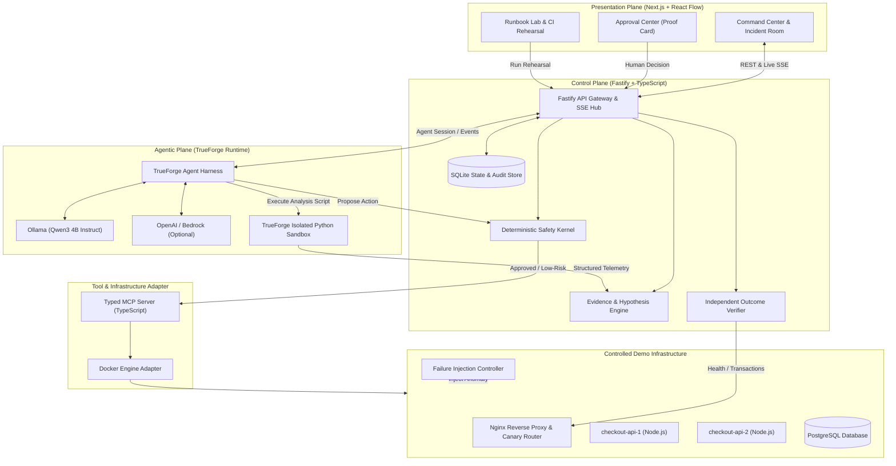
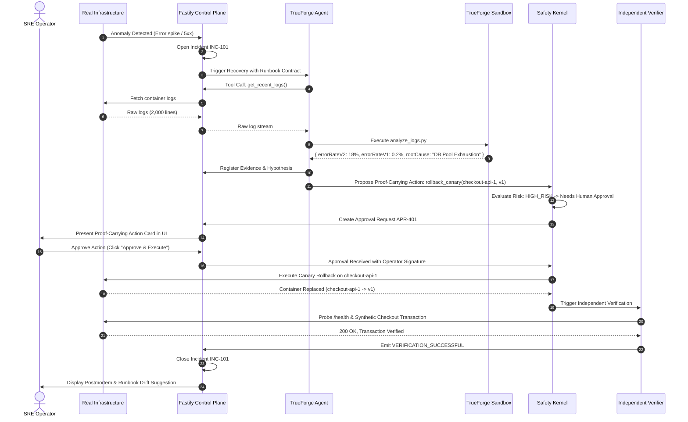

# RUNSAFE — System Architecture Document

**Document Version:** 1.0.0  
**Status:** Approved / Read-Only Source of Truth Reference  
**Product Name:** RunSafe

---

## 1. High-Level Architectural Topology

RunSafe is structured into four primary planes:
1. **Presentation Plane (Next.js Dashboard):** Real-time situational awareness, visual blast-radius topologies, human-in-the-loop approvals, and Runbook CI management.
2. **Control Plane (Fastify + SQLite + Safety Kernel):** Deterministic authority layer managing incident lifecycles, contract evaluation, proof verification, audit logging, and tool dispatch.
3. **Agentic Reasoning & Execution Plane (TrueForge + Ollama):** Cognitive layer parsing runbooks, formulating hypotheses, generating sandboxed diagnostic code, and proposing Proof-Carrying Actions.
4. **Target Infrastructure Plane (Docker Compose Workload):** Real, isolated production-like application topology (Nginx ingress, Checkout API replicas, PostgreSQL database, fault injection hooks).



---

## 2. Component Detailed Architecture

### 2.1 The Deterministic Safety Kernel
The Safety Kernel is pure, deterministic application logic—completely separated from the LLM. It guarantees that regardless of what the LLM generates, the system cannot perform unauthorized or unverified actions.
- **Input:** Proposed Action + Evidence Bundle + Current Recovery Contract.
- **Verification Gates:**
  1. **Schema Integrity:** Arguments match strict Zod definitions.
  2. **Runbook Authorization:** Step is authorized by the current active incident contract.
  3. **Precondition Satisfaction:** All required evidence items (e.g. `service_status == "unhealthy"`, `error_rate > 5%`) exist in the Evidence Engine.
  4. **Risk Classification Check:**
     - `READ_ONLY` -> Allowed immediately.
     - `LOW_RISK_REVERSIBLE` -> Checked against autonomous policy; executed if permitted.
     - `HIGH_RISK` / `DESTRUCTIVE` -> Suspended; triggers Approval Event.
- **Fail-Closed Guarantee:** Any unexpected exception, timeout, or missing parameter immediately denies execution.

### 2.2 Proof-Carrying Actions
A Proof-Carrying Action (PCA) is an immutable data structure emitted by the planner before any state mutation:
```typescript
interface ProofCarryingAction {
  actionId: string;
  incidentId: string;
  stepId: string;
  runbookRef: string;
  toolName: string;
  arguments: Record<string, unknown>;
  justification: {
    hypothesis: string;
    supportingEvidence: string[];
    preconditionsSatisfied: boolean;
  };
  safetyMetadata: {
    riskLevel: 'READ_ONLY' | 'LOW_RISK_REVERSIBLE' | 'STATE_CHANGING' | 'HIGH_RISK' | 'DESTRUCTIVE';
    blastRadius: string[];
    isReversible: boolean;
    rollbackProcedure: string;
    timeoutMs: number;
  };
  verificationCriteria: {
    endpoint: string;
    expectedStatus: number;
    maxLatencyMs: number;
    maxErrorRatePercent: number;
  };
}
```

### 2.3 Independent Outcome Verifier
The Verifier runs in its own execution thread once an action is reported as executed:
1. **Delay Period:** Waits for cooldown/warmup (e.g., 3-5 seconds after container restart).
2. **Multi-Probe Health Check:**
   - Ingress endpoint check (`/health` via Nginx)
   - Direct container check (`/health` direct to API-1 and API-2)
   - Database read/write probe
3. **Synthetic End-to-End Transaction:**
   - Calls `POST /api/checkout/synthetic-order`
   - Verifies HTTP 201 Created and transaction persistence in PostgreSQL.
4. **Resolution Decision:**
   - If ALL pass -> Emits `VERIFICATION_SUCCESSFUL`; Incident marked `RESOLVED`.
   - If ANY fail -> Emits `VERIFICATION_FAILED`; Triggers contract fallback/compensation or escalates to human operator.

---

## 3. Data Flow Between Subsystems



---

## 4. Hardware Sizing & Port Allocations

- **Host Machine:** Windows 11 (AMD Ryzen 5000, 24 GB RAM, NVIDIA RTX 3050 Laptop GPU, 4 GB VRAM)
- **Port Mapping:**
  - `3000`: Next.js Web Console
  - `4000`: Fastify Control Plane API & WebSocket/SSE
  - `8080`: Nginx Ingress / Canary Proxy
  - `8081`: `checkout-api-1` (direct port)
  - `8082`: `checkout-api-2` (direct port)
  - `5432`: PostgreSQL Demo Database
  - `11434`: Ollama Local LLM Server
