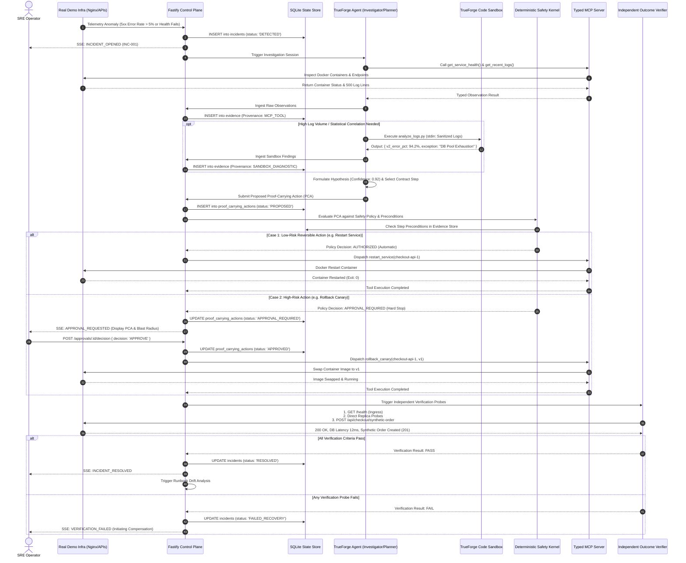

# RUNSAFE — Workflow & Data Flow Specification

**Document Identifier:** RUNSAFE-WDF-001  
**Target File Path:** `docs/05_WORKFLOW_AND_DATA_FLOW.md`  
**Document Version:** 1.0.0 (Authoritative Base Specification)  
**Status:** FROZEN / BASELINE SOURCE OF TRUTH  
**Date:** 26 September 2026  
**Event:** Agents That Act: TrueFoundry × Polaris Hackathon (Bengaluru, In-Person)  
**Core Theme:** *"Build agents that act, not ones that just answer."*  
**Primary Source Documents:** `docs/RUNSAFE_PROJECT_CONTEXT.md`, `docs/03_PRD.md`, `docs/04_TRD.md`, `docs/RUNSAFE_PROJECT_MEMORY.md`  
**Intended Audience:** System Architects, Backend/Frontend Engineers, Agent Developers, SRE Leads, Evaluators  

---

## 1. Document Control, Scope & Governance

### 1.1 Revision History
| Version | Date | Author / Role | Status | Description |
|---|---|---|---|---|
| **1.0.0** | 2026-09-26 | RunSafe System Architect | Frozen Baseline | Authoritative behavioral workflow and data movement specification. Defines runtime sequences, decision gates, state transitions, payload transformations, and error branches across all RunSafe subsystems. |

### 1.2 Purpose & Scope Boundaries
This document defines the complete end-to-end operational behaviors, decision paths, and data transformations for RunSafe. It serves as the behavioral bridge connecting product requirements (`docs/03_PRD.md`) and technical requirements (`docs/04_TRD.md`) to subsequent implementation blueprints.

#### What This Document Owns:
1. Exact sequential execution order of all agent, safety, and infrastructure interactions.
2. Complete lifecycle state transitions for Incidents, Actions, and Recovery Contracts.
3. Precise data flow from raw telemetry to normalized Evidence, Proof-Carrying Actions, Approval Requests, Tool Payloads, Verification Probes, and Audit Records.
4. Decision branch logic for the Safety Kernel, Human Approval Gates, Independent Verifier, and Runbook CI Engine.
5. Exact behavioral mechanics for the three canonical demonstration scenarios.

#### What This Document Intentionally Delegates:
- **Pixel-level layout & component styling:** Delegated to `docs/06_UI_UX_SPECIFICATION.md`.
- **Database DDL, indexing, and REST route schemas:** Delegated to `docs/07_DATA_ARCHITECTURE.md` and `docs/16_API_SPECIFICATION.md`.
- **Low-level TrueForge/MCP TypeScript bindings:** Delegated to `docs/08_TRUEFORGE_AGENT_ARCHITECTURE.md` and `docs/09_MCP_TOOL_SPECIFICATION.md`.
- **Test case timing thresholds & judge demo script:** Delegated to `docs/14_TESTING_EVALUATION_PLAN.md` and `docs/17_DEMO_RUNBOOK_PRESENTATION_FLOW.md`.

---

## 2. Global Workflow Principles & Invariants

All RunSafe workflows must strictly uphold the following architectural invariants:

1. **The Tripartite Invariant:**
   - **AI provides Intelligence:** Formulates hypotheses, generates diagnostic code, and proposes next steps.
   - **Safety Kernel provides Authority:** Pure deterministic gatekeeper outside the LLM; enforces fail-closed execution.
   - **Verifier provides Truth:** Independent machine probes decide recovery; LLM judgment or command exit code `0` never equals incident resolution.
2. **The Non-Negotiable Mutation Chain:**
   $$\text{Reasoning} \longrightarrow \text{PCA} \longrightarrow \text{Contract Preconditions} \longrightarrow \text{Safety Kernel} \longrightarrow \text{Approval (if High-Risk)} \longrightarrow \text{Typed MCP Tool} \longrightarrow \text{Real Infra} \longrightarrow \text{Verifier} \longrightarrow \text{State Update}$$
   No operational shortcut may ever collapse this into `LLM -> Shell Execution`.
3. **The Sandbox Isolation Invariant:**
   Agent-generated code runs exclusively in the TrueForge container sandbox with non-root privileges and disabled networking. Sandbox output returns strictly as structured Evidence to the Evidence Engine, never as direct infrastructure authority.
4. **The Anti-Self-Approval Invariant:**
   The AI agent cannot approve its own action proposals, simulate operator tokens, or bypass pending approval gates.
5. **Fail-Closed Default:**
   Any missing precondition, malformed payload, timeout, or unrecognized tool invocation immediately terminates the mutation path, locks execution, and alerts the operator.

---

## 3. Canonical Workflow Master Index

| Workflow ID | Workflow Title | Primary Trigger | Primary Actors / Components | Terminal Outcome |
|---|---|---|---|---|
| **WF-INC-001** | End-to-End Incident Lifecycle | Anomaly threshold breach or manual alert | Incident Engine, Fastify, Next.js UI | Incident `RESOLVED`, `FAILED_RECOVERY`, or `ESCALATED_ABSTAINED` |
| **WF-RUN-001** | Runbook Ingestion & Contract Compilation | Markdown file uploaded or text entered | Runbook Compiler, Zod Validator, Runbook Lab | Active, versioned Recovery Contract in SQLite |
| **WF-EVD-001** | Evidence Gathering & Hypothesis Formation | Incident opened or state updated | Investigator, Typed MCP Tools, Evidence Engine | Normalized Evidence records & ranked hypotheses |
| **WF-SBX-001** | TrueForge Sandboxed Log Diagnostics | Error spike / log volume $> 200$ lines | Agent, TrueForge Sandbox, Evidence Engine | Derived Evidence record ingested into SQLite |
| **WF-PCA-001** | Proof-Carrying Action Construction | Next contract step identified | Planner, Evidence Store, PCA Builder | Validated immutable PCA record in SQLite |
| **WF-SAF-001** | Deterministic Safety Kernel Evaluation | PCA submitted for authorization | Safety Kernel, Contract Engine, Audit Logger | Policy Decision: `AUTHORIZED`, `APPROVAL_REQUIRED`, or `BLOCKED` |
| **WF-APR-001** | Human-in-the-Loop Approval | Action classified `HIGH_RISK` / `DESTRUCTIVE` | Approval Subsystem, Operator, Next.js UI | Explicit Signed `APPROVED` or `REJECTED` token |
| **WF-REM-001** | Automatic Low-Risk Remediation | Action classified `LOW_RISK_REVERSIBLE` | Executor, MCP Server, Infrastructure Adapter | Tool execution completed; triggers Verifier |
| **WF-VRF-001** | Independent Outcome Verification | Mutation tool execution completed | Independent Verifier, Nginx, PostgreSQL | Verification result: `PASS` (Resolves) or `FAIL` (Rollback/Compensate) |
| **WF-CMP-001** | Compensation & Fallback Execution | Independent Verification fails | Safety Kernel, Executor, Recovery Contract | State reverted to baseline or escalated to SRE |
| **WF-CNR-001** | Progressive / Canary Remediation | Multi-replica bad deployment detected | Planner, Canary Engine, Nginx, Verifier | Single-replica canary evaluated before fleet rollout |
| **WF-ABS-001** | Confidence-Based Abstention & Escalation | Confidence $< 0.70$ or conflicting data | Evidence Engine, Safety Kernel, Operator | Autonomous mutation blocked; SRE escalation ticket |
| **WF-RCI-001** | Runbook CI / Continuous Rehearsal | Operator triggers staging test | Rehearsal Runner, Fault Injector, Verifier | Pass/Fail report & deterministic Recovery Coverage score |
| **WF-DFT-001** | Runbook Drift Detection & Improvement | Incident or rehearsal closes | Drift Engine, Runbook Lab, Operator | Human-reviewed Runbook Improvement Proposal |
| **WF-AUD-001** | Immutable Timeline & Audit Recording | Any state change or tool invocation | Audit Logger, SQLite (`audit_events`) | Append-only audit record persisted & streamed to UI |
| **WF-SSE-001** | Real-Time UI Event Synchronization | State change emitted in Fastify | Fastify SSE Hub, Event Stream, Next.js UI | Reactive UI update across all product surfaces |

---

## 4. End-to-End Incident Response Workflow (`WF-INC-001`)



---

## 5. Detailed Component Workflows

### 5.1 Runbook Ingestion & Contract Compilation Workflow (`WF-RUN-001`)
- **Trigger:** SRE uploads a Markdown runbook (`.md`) via the Runbook Lab UI.
- **Workflow Steps:**
  1. Fastify endpoint `POST /api/v1/runbooks/compile` receives raw Markdown text.
  2. The **Runbook Compiler** invokes the local AI engine (Qwen3 4B via Ollama) with a structured extraction prompt to map text sections into structural JSON nodes.
  3. Fastify validates the compiled JSON against the Zod `RecoveryContractSchema`.
  4. The compiler runs a deterministic **Tool Availability Linter**, cross-referencing all referenced action tools against the registered MCP tool catalog. Any unmapped or hallucinated tool throws a validation error.
  5. The contract is stored in SQLite `recovery_contracts` with status `COMPILED_VALIDATED` and an incremented semantic version (e.g. `v1.0`).
  6. The compiled contract payload is streamed to the Runbook Lab UI.
- **Decision Gates:**
  - *If Zod validation fails:* Return HTTP 400 with the exact line number and malformed field. Contract remains unpersisted.
  - *If tool references are invalid:* Flag warnings in UI; mark contract `UNVERIFIED_TOOL_MISMATCH`. Cannot be set to `ACTIVE`.

### 5.2 Evidence Gathering & Hypothesis Formation Workflow (`WF-EVD-001`)
- **Trigger:** Incident Engine initiates triage for an open incident.
- **Workflow Steps:**
  1. The **Investigator** role receives the incident context and target service ID.
  2. The Investigator queries only `READ_ONLY` MCP tools:
     - `get_service_health(service_id)`
     - `get_recent_logs(service_id, tail_lines: 100)`
     - `get_database_health()`
     - `get_current_deployment(service_id)`
  3. MCP returns typed JSON objects. Fastify assigns each an immutable UUID (`EVD-...`) and stores it in SQLite `evidence` table with fields: `incident_id`, `source_type`, `metric_name`, `structured_value`, `collected_at`.
  4. The Investigator evaluates collected evidence against the active Recovery Contract preconditions.
  5. The Investigator formulates one or more ranked diagnostic hypotheses with confidence scores ($0.00$ to $1.00$).
  6. Each hypothesis explicitly binds to supporting Evidence UUIDs (`supporting_evidence_ids: ["EVD-101", "EVD-102"]`).
- **Decision Gates:**
  - *If top hypothesis confidence $\ge 0.70$:* Transition to `WF-PCA-001` (Planning).
  - *If top hypothesis confidence $< 0.70$ or evidence is contradictory:* Transition to `WF-ABS-001` (Abstention).

### 5.3 TrueForge Sandboxed Log Diagnostics Workflow (`WF-SBX-001`)
- **Trigger:** `get_recent_logs` returns $> 200$ error lines, or log analysis requires statistical grouping and version correlation.
- **Workflow Steps:**
  1. Agent identifies analytical need (e.g. correlating exception frequency with deployment version tags).
  2. Agent emits an isolated Python script (`analyze_logs.py`). The script must adhere to strict formatting: read JSON from standard input, output strictly JSON to standard output.
  3. Fastify sanitizes log entries (redacting IP addresses, tokens, and passwords) and packages them into a scratch execution payload.
  4. Payload is dispatched to the **TrueForge Sandbox Engine**.
  5. The sandbox executes the script inside an isolated, non-root, unprivileged container with network access disabled (`--network none`).
  6. Sandbox returns standard output, standard error, execution duration, and exit code.
  7. Fastify validates that stdout is valid JSON matching `DiagnosticSummarySchema`.
  8. Parsed output is written to SQLite `evidence` with `source_type: "SANDBOX_DIAGNOSTIC"`.
  9. Real-time event `SANDBOX_EXECUTION_COMPLETED` is emitted to the Incident Room.
- **Decision Gates:**
  - *If sandbox times out ($> 30\text{s}$) or script exits non-zero:* Log failure; mark sandbox run `FAILED`. Fall back to standard keyword log parsing. Never invent missing metrics.

### 5.4 Proof-Carrying Action (PCA) Construction Workflow (`WF-PCA-001`)
- **Trigger:** Planner determines the next operational action based on the active contract step.
- **Workflow Steps:**
  1. Planner maps active contract step to target MCP mutation tool (`restart_service`, `rollback_canary`, etc.).
  2. Planner queries the Dependency Graph to determine affected downstream services (`blast_radius_services`).
  3. Planner extracts objective success criteria and compensation procedures defined in the contract step.
  4. Fastify constructs an immutable `ProofCarryingAction` object satisfying `ProofCarryingActionSchema`:
     - Generates UUID `action_id`.
     - Bundles `justification` with supporting Evidence UUIDs.
     - Bundles `safety` envelope with risk tier, blast radius, and timeout.
     - Bundles `verification_contract` assertions.
  5. PCA is persisted in SQLite `proof_carrying_actions` table with status `PROPOSED`.
  6. Fastify dispatches PCA to `WF-SAF-001` (Safety Kernel).

### 5.5 Deterministic Safety Kernel Evaluation Workflow (`WF-SAF-001`)
- **Trigger:** Fastify receives a newly created PCA.
- **Workflow Steps:**
  1. **Gate 1 (Zod Schema Validation):** Validates tool arguments against strict schema. Fails closed on mismatch.
  2. **Gate 2 (Contract Authorization):** Verifies that the proposed action matches the step authorized by the active contract. Fails closed if unauthorized.
  3. **Gate 3 (Precondition Verification):** Queries SQLite to verify that all prerequisite Evidence records exist and evaluate to `true`.
  4. **Gate 4 (Replay & Idempotency Check):** Ensures `action_id` has not been previously executed or evaluated.
  5. **Gate 5 (Risk Tier & Approval Policy Decision):**
     - `READ_ONLY` $\longrightarrow$ Status: `AUTHORIZED`. Proceed to immediate dispatch.
     - `LOW_RISK_REVERSIBLE` $\longrightarrow$ If contract `approval_policy == 'AUTOMATIC'`, Status: `AUTHORIZED`. Else: `APPROVAL_REQUIRED`.
     - `HIGH_RISK` or `DESTRUCTIVE` $\longrightarrow$ Status: `APPROVAL_REQUIRED`. Enforce **HARD STOP**.
     - `UNKNOWN` $\longrightarrow$ Status: `BLOCKED`. Fail closed; raise security alert.
  6. Decision recorded in SQLite `audit_events`.
  7. If `APPROVAL_REQUIRED`, transition directly to `WF-APR-001`. If `AUTHORIZED`, transition to `WF-REM-001`.

### 5.6 Human-in-the-Loop Approval Workflow (`WF-APR-001`)
- **Trigger:** Safety Kernel evaluates action as `APPROVAL_REQUIRED`.
- **Workflow Steps:**
  1. Fastify transitions incident state to `AWAITING_APPROVAL` and PCA status to `APPROVAL_REQUIRED`.
  2. Fastify broadcasts SSE event `APPROVAL_REQUESTED` to all connected Next.js clients.
  3. The **Approval Center** in the UI displays an **Operational Decision Card** rendering:
     - Plain-English intent and diagnostic justification.
     - Supporting evidence cards and log diffs.
     - Blast-radius node highlights in React Flow.
     - Reversibility guarantee and compensation tool call.
     - Objective verification criteria.
  4. The system enters a hard pause. The agent is blocked from dispatching mutations.
  5. Operator inspects the decision card and clicks either **[Approve & Execute]** or **[Reject & Escalate]**.
  6. UI dispatches `POST /api/v1/approvals/:action_id/decision` with decision payload, operator note, and operator ID.
  7. Fastify verifies that the pending action hash has not mutated since approval generation.
  8. If **Approved:** PCA status updates to `APPROVED`; incident state transitions to `EXECUTING`; dispatches to `WF-REM-001`.
  9. If **Rejected:** PCA status updates to `REJECTED`; incident state transitions to `ESCALATED_ABSTAINED`; autonomous mitigation halts.
- **Decision Gates:**
  - *Silence is NOT consent:* If operator does not respond within configurable timeout (default: 10 mins), system remains paused and re-pages the on-call engineer. It never auto-approves.

### 5.7 Automatic Low-Risk Remediation Workflow (`WF-REM-001`)
- **Trigger:** Action authorized by Safety Kernel (`AUTHORIZED` or `APPROVED`).
- **Workflow Steps:**
  1. Fastify dispatches typed tool execution to the **Typed MCP Server** via stdio or HTTP RPC.
  2. MCP server translates typed call into target Docker Engine API call (e.g. `docker restart runsafe-checkout-api-1`).
  3. Docker Engine executes the container operation.
  4. MCP server captures exit code, standard output, and execution latency.
  5. MCP server returns structured result to Fastify: `{ success: true, exit_code: 0, execution_duration_ms: 1420 }`.
  6. Fastify records tool execution result in SQLite `audit_events`.
  7. PCA status updates to `EXECUTION_SUCCEEDED`.
  8. Fastify immediately hands off execution to `WF-VRF-001` (Independent Verifier).
- **Decision Gates:**
  - *If Docker tool returns non-zero exit code or times out ($> 15\text{s}$):* PCA status updates to `EXECUTION_FAILED`. Trigger contract fallback branch or compensation (`WF-CMP-001`).

### 5.8 Independent Outcome Verification Workflow (`WF-VRF-001`)
- **Trigger:** Mutation tool completes execution.
- **Workflow Steps:**
  1. Incident state transitions to `VERIFYING`.
  2. Fastify pauses for a configurable warmup period (default: 5,000ms) to allow container initialization and socket binding.
  3. The **Independent Verifier** executes four sequential, objective probes:
     - **Probe 1 (Ingress Health):** `GET http://localhost:8080/health`. Must return HTTP `200 OK` within $500\text{ ms}$.
     - **Probe 2 (Direct Container Health):** Probes `checkout-api-1:8081/health` and `checkout-api-2:8082/health`.
     - **Probe 3 (Database Connectivity):** Executes `SELECT 1;` against PostgreSQL. Confirms connection pool has $> 20\%$ free capacity and query latency $< 50\text{ ms}$.
     - **Probe 4 (Synthetic Transaction):** Dispatches `POST http://localhost:8080/api/checkout/synthetic-order`. Validates HTTP `201 Created` and confirms transaction ID in database `orders` table.
  4. Verifier tallies probe outcomes into a structured `VerificationReport`.
- **Decision Gates:**
  - *If ALL probes PASS:* PCA status updates to `VERIFIED_EFFECTIVE`. Incident transitions to `RESOLVED`. Emits `INCIDENT_RESOLVED` event. Hands off to `WF-DFT-001` (Drift Engine).
  - *If ANY probe FAILS:* PCA status updates to `VERIFIED_INEFFECTIVE`. Incident remains OPEN (`FAILED_RECOVERY`). Hands off to `WF-CMP-001` (Compensation) or executes next contract fallback step.

### 5.9 Compensation & Rollback Workflow (`WF-CMP-001`)
- **Trigger:** Independent Verifier reports `VERIFIED_INEFFECTIVE` following a mutation.
- **Workflow Steps:**
  1. Incident state transitions to `FAILED_RECOVERY`.
  2. Fastify inspects the failed contract step to locate `safety.compensation_step_id`.
  3. If compensation is defined:
     - Evaluates risk of compensation action.
     - If compensation is `LOW_RISK_REVERSIBLE`, executes automatically.
     - If compensation is `HIGH_RISK` / `DESTRUCTIVE`, halts and requests human approval (`WF-APR-001`).
  4. Executor dispatches compensation tool (e.g. restoring previous configuration or reverting container image).
  5. Verifier checks whether compensation restored baseline system state.
  6. If compensation succeeds, PCA status updates to `COMPENSATED`; agent evaluates secondary fallback contract branch.
  7. If compensation fails or no compensation is defined, incident transitions to `ESCALATED_ABSTAINED`. All automated mutations cease.

### 5.10 Progressive / Canary Remediation Workflow (`WF-CNR-001`)
- **Trigger:** Bad deployment scenario detected across multiple replicas (`checkout-api-1` and `checkout-api-2`).
- **Workflow Steps:**
  1. Planner evaluates blast radius and selects single-replica canary rollback (`target_replica: "checkout-api-1"`, `rollback_version: "v1"`).
  2. PCA constructed with `risk_tier: "HIGH_RISK"` and canary routing metadata.
  3. Safety Kernel halts execution; triggers `WF-APR-001` (Approval Request).
  4. SRE reviews PCA card showing 1-replica canary scope; clicks **Approve**.
  5. Executor invokes `rollback_canary(checkout-api-1, v1)`.
  6. MCP tool replaces `checkout-api-1` container image with stable version `v1` while `checkout-api-2` remains on buggy version `v2`.
  7. Nginx gateway routes traffic across both replicas ($50/50$ split).
  8. Verifier observes comparative telemetry over a 15-second observation window:
     - Measures error rate on `checkout-api-1` (v1): drops to $0.1\%$.
     - Measures error rate on `checkout-api-2` (v2): remains at $18.5\%$.
  9. Verifier confirms canary remediation is effective.
  10. Planner proposes Phase 2: complete fleet rollback (`rollback_full`).
  11. Once fleet rollback completes, Verifier executes synthetic checkout transaction. Incident transitions to `RESOLVED`.

### 5.11 Confidence-Based Abstention & Escalation Workflow (`WF-ABS-001`)
- **Trigger:** Hypothesis confidence score falls below $0.70$ or evidence is contradictory.
- **Workflow Steps:**
  1. The Evidence Engine analyzes collected telemetry and computes hypothesis probabilities.
  2. If the highest confidence score is $< 0.70$ (e.g. Database: $41\%$, Upstream Network: $32\%$, Host Memory: $27\%$):
     - The engine triggers an immediate **Epistemic Halt**.
  3. Fastify locks all mutation tools for the active incident.
  4. Incident state transitions to `ESCALATED_ABSTAINED`.
  5. An **Escalation Ticket** is generated in SQLite detailing:
     - Top unresolved hypotheses.
     - Conflicting or missing evidence items.
     - List of safe diagnostic queries recommended for human engineers.
  6. Fastify emits SSE event `INCIDENT_ABSTAINED` to the Incident Room.
  7. UI renders a prominent warning banner explaining that RunSafe has deliberately abstained from action due to diagnostic uncertainty, satisfying the hackathon mandate to *"know when to stop"*.

### 5.12 Runbook CI / Continuous Rehearsal Workflow (`WF-RCI-001`)
- **Trigger:** Operator clicks **[Run Continuous Rehearsal]** in the Runbook CI view or scheduled cron triggers test.
- **Workflow Steps:**
  1. Rehearsal Runner verifies that target staging environment is in a clean baseline state.
  2. Runner selects a configured scenario (e.g. *Scenario 2: Deployment Regression*).
  3. Fault Injector introduces the failure condition via Docker API.
  4. Rehearsal Runner triggers the active Recovery Contract in **Rehearsal Mode**:
     - Actions execute against the local staging environment.
     - Approvals are pre-authorized by rehearsal policy or handled interactively.
  5. The Independent Verifier tests whether the contract successfully recovered the system.
  6. Rehearsal record is persisted in SQLite `rehearsal_runs` table:
     - `contract_id`, `scenario_id`, `outcome` (`PASS`/`FAIL`), `duration_ms`, `broken_step_id`.
  7. Rehearsal Runner updates the **Recovery Coverage Score**:
     $$\text{Recovery Coverage } (RC) = \left( \frac{\text{Passed Rehearsal Scenarios}}{\text{Total Configured Scenarios}} \right) \times 100$$
  8. If rehearsal fails, flags broken step and triggers `WF-DFT-001` (Drift Engine).

### 5.13 Runbook Drift Detection & Improvement Workflow (`WF-DFT-001`)
- **Trigger:** Incident marked `RESOLVED` or rehearsal completes with unexpected step execution paths.
- **Workflow Steps:**
  1. The **Drift Engine** compares the actual sequence of executed actions against the original written runbook sequence.
  2. Detects operational discrepancies, such as:
     - Step 1 (Restart Service) repeatedly fails while Step 2 (Rollback) consistently succeeds.
     - A prerequisite check was missing from the written runbook.
  3. Drift Engine invokes Qwen3 4B to draft a structured **Runbook Improvement Proposal**:
     - *Summary:* Re-order recovery steps: execute deployment version delta check prior to service restart for 503 error spikes.
     - *Evidence:* References Incident `INC-002` where restart failed to resolve error rate.
  4. Proposal is persisted in SQLite with status `PENDING_REVIEW`.
  5. Runbook Lab displays the proposal with an interactive diff viewer.
  6. SRE operator reviews the proposal and clicks **[Accept Proposal]** or **[Reject Proposal]**.
  7. If **Accepted:** Fastify increments contract version to `v1.1`, archives prior version, and marks new contract `UNVERIFIED_PENDING_REHEARSAL`.
  8. If **Rejected:** Proposal is archived; active contract remains unchanged.

### 5.14 Real-Time UI Event & State Synchronization Flow (`WF-SSE-001`)
- **Trigger:** Any state mutation, evidence ingestion, or approval dispatch in Fastify.
- **Workflow Steps:**
  1. Fastify event bus emits a strongly typed event payload:
     ```json
     {
       "event_type": "INCIDENT_STATE_CHANGED",
       "incident_id": "INC-001",
       "timestamp": "2026-09-26T10:15:30.450Z",
       "payload": {
         "previous_state": "PLANNING",
         "new_state": "AWAITING_APPROVAL",
         "action_id": "PCA-501"
       }
     }
     ```
  2. Fastify SSE Hub broadcasts event over persistent HTTP stream (`GET /api/v1/events/stream`).
  3. Next.js `useEventStream` hook receives event, validates payload via Zod, and updates global React state.
  4. Affected UI views re-render reactively:
     - Incident Room moves stepper to *Awaiting Approval*.
     - Approval Center mounts the decision card.
  5. *Reconnection Guarantee:* If network drops, Next.js client reconnects with `Last-Event-ID`. Fastify streams missing events or client performs a full state reconciliation fetch via `GET /api/v1/incidents/:id`.

---

## 6. Formal State Machine Specifications

### 6.1 Formal Incident State Transition Matrix
An incident represents the lifecycle of a detected system degradation:

| Current State | Permitted Next States | Triggering Event / Transition Guard | Initiating Component |
|---|---|---|---|
| `OPEN / DETECTED` | `INVESTIGATING` | Telemetry threshold confirmed; agent session initialized. | Fastify Incident Engine |
| `INVESTIGATING` | `EVIDENCE_GATHERING` | Initial read observation tools dispatched. | Investigator Agent |
| `EVIDENCE_GATHERING`| `PLANNING` | Sufficient evidence collected; hypothesis confidence $\ge 0.70$. | Investigator Agent |
| `EVIDENCE_GATHERING`| `ESCALATED_ABSTAINED` | Confidence $< 0.70$ or contradictory evidence. | Evidence Engine |
| `PLANNING` | `AWAITING_APPROVAL` | PCA constructed; Safety Kernel classifies as `HIGH_RISK` / `DESTRUCTIVE`. | Safety Kernel |
| `PLANNING` | `EXECUTING` | PCA constructed; Safety Kernel classifies as `LOW_RISK_REVERSIBLE` (Auto).| Safety Kernel |
| `AWAITING_APPROVAL` | `EXECUTING` | Human operator clicks "Approve" in Approval Center. | Operator / Fastify |
| `AWAITING_APPROVAL` | `ESCALATED_ABSTAINED` | Human operator clicks "Reject" in Approval Center. | Operator / Fastify |
| `EXECUTING` | `VERIFYING` | Typed MCP mutation tool returns execution result. | Executor Agent / MCP |
| `VERIFYING` | `RESOLVED` | 100% of Independent Verifier probes return `PASS`. | Independent Verifier |
| `VERIFYING` | `FAILED_RECOVERY` | Any Independent Verifier probe returns `FAIL`. | Independent Verifier |
| `FAILED_RECOVERY` | `PLANNING` | Contract defines fallback recovery branch. | Planner Agent |
| `FAILED_RECOVERY` | `ESCALATED_ABSTAINED` | Compensation fails or no fallback branches exist. | Safety Kernel |
| `RESOLVED` | `TERMINAL` | Post-incident audit saved; drift analysis triggered. | Fastify Engine |
| `ESCALATED_ABSTAINED`| `TERMINAL` | Escalation ticket dispatched to human on-call engineer. | Fastify Engine |

*Illegal Transition Invariant:* Direct transition from `EXECUTING` to `RESOLVED` is strictly prohibited. Every mutation must pass through `VERIFYING`.

### 6.2 Formal Action State Transition Matrix
An action represents an individual operational mutation:

```
[PROPOSED] ──► [POLICY_EVALUATED]
                      │
        ┌─────────────┴─────────────┐
        ▼                           ▼
[APPROVAL_REQUIRED]           [AUTHORIZED]
        │                           │
  ┌─────┴─────┐                     │
  ▼           ▼                     │
[APPROVED] [REJECTED]               │
  │                                 │
  └─────────────┬───────────────────┘
                ▼
           [EXECUTING]
                │
        ┌───────┴───────┐
        ▼               ▼
[EXECUTION_FAILED] [EXECUTION_SUCCEEDED]
        │               │
        │               ▼
        │          [VERIFYING]
        │               │
        │       ┌───────┴───────┐
        │       ▼               ▼
        │ [VERIFIED_INEFFECTIVE] [VERIFIED_EFFECTIVE]
        │       │
        ▼       ▼
    [COMPENSATING]
        │
        ▼
   [COMPENSATED]
```

---

## 7. The Three Canonical Demo Workflows (Exhaustive Trace)

### 7.1 Scenario 1: Autonomous Process Crash Recovery (`WF-SCENARIO-1`)
*Proves:* Autonomous execution of known, safe, reversible actions without human interruption.

| Step | Component | Input | Action / Decision | Output | Persisted Data | Event Emitted |
|---|---|---|---|---|---|---|
| **S1-01** | Fault Injector | Operator command | Executes `docker stop runsafe-checkout-api-1`. | Container stops | None | `DEMO_FAULT_INJECTED` |
| **S1-02** | Telemetry Poller | Ingress `/health` | Detects HTTP 503 from Nginx. | Anomaly detected | Incident `INC-001` created in SQLite (`OPEN`) | `INCIDENT_OPENED` |
| **S1-03** | Investigator | Incident `INC-001` | Calls `get_service_health('checkout-api-1')` and `get_recent_logs()`. | Exit code `137` / SIGKILL found | Evidence records `EVD-101`, `EVD-102` | `EVIDENCE_ADDED` |
| **S1-04** | Planner | Evidence bundle | Evaluates Recovery Contract Step 1: Process Restart. Preconditions met. | Generates PCA for `restart_service` | PCA record `PCA-201` (`PROPOSED`) | `ACTION_PROPOSED` |
| **S1-05** | Safety Kernel | PCA `PCA-201` | Classifies as `LOW_RISK_REVERSIBLE`. Contract approval policy: `AUTOMATIC`. | Authorizes execution | Policy decision logged in `audit_events` | `POLICY_DECISION_AUTHORIZED` |
| **S1-06** | Executor | Authorized PCA | Invokes `restart_service(checkout-api-1)`. | Docker container restarted (Exit: 0) | PCA status `EXECUTION_SUCCEEDED` | `TOOL_EXECUTION_COMPLETED` |
| **S1-07** | Verifier | Target infra | Executes Ingress `/health` and synthetic transaction probe. | All probes return 200 OK / 201 Created | Verifier report `VRF-301` (`PASS`) | `VERIFICATION_COMPLETED` |
| **S1-08** | Incident Engine | Verification PASS | Closes incident. | Incident `INC-001` marked `RESOLVED` | Incident `resolved_at` timestamp recorded | `INCIDENT_RESOLVED` |

*Result:* Total elapsed time $< 30$ seconds. Zero human clicks required.

### 7.2 Scenario 2: Bad Deployment, Sandboxed Diagnostics & Canary Rollback (`WF-SCENARIO-2` — Hero Demo)
*Proves:* End-to-end capabilities: real system mutation, sandboxed code execution, PCA generation, human approval gating, canary isolation, independent business verification, and runbook drift detection.

```mermaid
sequenceDiagram
    autonumber
    actor SRE as SRE Operator
    participant Target as Real Demo Infrastructure
    participant Control as Fastify Control Plane
    participant Agent as TrueForge Agent
    participant Sandbox as TrueForge Sandbox
    participant Kernel as Safety Kernel
    participant Verifier as Independent Verifier

    Note over Target: Injected Buggy Version v2 (Connection Leak)
    Target->>Control: 5xx Error Rate Spikes to 18.5%
    Control->>Control: Open Incident INC-002

    Control->>Agent: Trigger Diagnosis
    Agent->>Target: Call get_recent_logs() (500 lines returned)
    Agent->>Sandbox: Dispatch analyze_logs.py
    Note over Sandbox: Runs isolated (network: none)
    Sandbox-->>Agent: Output: { v2_error_pct: 94.2%, exception: "DB Pool Exhaustion" }
    Agent->>Control: Register Evidence EVD-201 (v2 Bug Correlated)

    Note over Agent: Attempt Low-Risk Contract Step 1: Restart
    Agent->>Kernel: Propose restart_service(checkout-api-1)
    Kernel->>Control: Auto-Authorize Low-Risk
    Control->>Target: Restart Container
    Control->>Verifier: Run Probes
    Verifier->>Target: Probe /health & Synthetic Order
    Target-->>Verifier: HTTP 503 - Still Unhealthy
    Verifier-->>Control: Verification FAILED (Incident Remains OPEN)

    Note over Agent: Planner Proposes Canary Rollback to v1
    Agent->>Control: Submit PCA: rollback_canary(checkout-api-1, v1)
    Control->>Kernel: Evaluate PCA
    Kernel->>Control: Decision: APPROVAL_REQUIRED (HIGH_RISK)
    Control->>Control: Incident State -> AWAITING_APPROVAL
    Control-->>SRE: Display Decision Card in Approval Center

    SRE->>Control: Click [Approve & Execute]
    Control->>Control: Action State -> APPROVED; Incident -> EXECUTING
    Control->>Target: Swap checkout-api-1 Image to v1
    Note over Target: Traffic split: 50% v1 / 50% v2

    Control->>Verifier: Run Canary Verification
    Verifier->>Target: Compare Metrics over 15s Window
    Target-->>Verifier: v1 Error Rate: 0.1% vs v2 Error Rate: 18.5%
    Verifier-->>Control: Canary Verification PASSED

    Note over Control: Complete Fleet Rollback Authorized
    Control->>Target: Swap checkout-api-2 Image to v1
    Control->>Verifier: Final Probes
    Verifier->>Target: POST /api/checkout/synthetic-order
    Target-->>Verifier: 201 Created (Transaction Verified)
    Verifier-->>Control: Final Verification PASSED
    Control->>Control: Incident INC-002 Marked RESOLVED

    Note over Control: Post-Incident Drift Detection
    Control->>Control: Analyze Timeline: Step 1 (Restart) Failed, Step 2 Succeeded
    Control-->>SRE: Runbook Drift Proposal: Check version delta before restart
    SRE->>Control: Accept Proposal -> Contract Increments to v1.1
```

### 7.3 Scenario 3: Confidence-Based Abstention on Ambiguous Failure (`WF-SCENARIO-3`)
*Proves:* The agent "knows when to stop" when evidence is ambiguous, refusing to execute dangerous mutations.

| Step | Component | Input | Action / Decision | Output | Persisted Data | Event Emitted |
|---|---|---|---|---|---|---|
| **S3-01** | Fault Injector | Operator command | Injects sporadic network latency ($1,200\text{ms}$) and random HTTP 400 errors without crash logs. | Anomaly active | None | `DEMO_FAULT_INJECTED` |
| **S3-02** | Telemetry Poller | Ingress `/health` | Detects elevated latency and intermittent client errors. | Anomaly detected | Incident `INC-003` created (`OPEN`) | `INCIDENT_OPENED` |
| **S3-03** | Investigator | Incident `INC-003` | Collects health, metrics, database state, and logs. | Telemetry contradictory: DB healthy, no stack traces | Evidence records `EVD-301`–`EVD-304` | `EVIDENCE_ADDED` |
| **S3-04** | Investigator | Evidence bundle | Evaluates hypotheses: $H_1$ (Database: $41\%$), $H_2$ (Network: $32\%$), $H_3$ (Memory: $27\%$). | Confidence score: $0.41$ | Hypothesis record persisted | `HYPOTHESIS_UPDATED` |
| **S3-05** | Safety Kernel | Confidence score $0.41$ | Compares confidence against safety threshold ($0.70$). $0.41 < 0.70$. | **Enforces Epistemic Halt** | Locks all mutation tools in SQLite | `POLICY_DECISION_BLOCKED` |
| **S3-06** | Incident Engine | Epistemic Halt | Transitions incident state to `ESCALATED_ABSTAINED`. | Generates Escalation Ticket | Escalation record persisted in `incidents` | `INCIDENT_ABSTAINED` |
| **S3-07** | Next.js UI | SSE stream | Renders prominent warning banner in Incident Room explaining that RunSafe has abstained due to ambiguity. | Operator alerted | None | `UI_RENDER_COMPLETED` |

*Result:* Zero unauthorized mutations executed. Proves safe stopping behavior.

---

## 8. Data Transformation & Trust Boundaries

### 8.1 Data Transformation Lifecycle
```
[Raw Telemetry / Docker Logs]
       │ (Sanitization & Normalization)
       ▼
[Typed Evidence Record (Zod Validated, UUID)]
       │ (LLM Diagnostic Inference)
       ▼
[Ranked Hypothesis (Confidence 0.0 - 1.0)]
       │ (Planner Evaluation against Recovery Contract)
       ▼
[Proof-Carrying Action Payload (Immutable Nonce)]
       │ (Safety Kernel Evaluation)
       ▼
[Policy Authorization Decision (Signed Token)]
       │ (MCP RPC Dispatch)
       ▼
[Docker Engine Mutation (Real Container State Change)]
       │ (Deterministic Probes)
       ▼
[Verification Report (Multi-Metric PASS/FAIL)]
       │ (Audit Engine Processing)
       ▼
[Audit Timeline Event & Drift Improvement Proposal]
```

### 8.2 Architectural Trust Boundaries

| Trust Zone | Components Included | Inbound Data Trust Level | Outbound Authority |
|---|---|---|---|
| **Untrusted Zone** | Raw logs, external HTTP responses, markdown runbook text, LLM prompt responses. | **Untrusted:** May contain prompt injection, corrupted JSON, or hallucinated commands. | Zero execution authority. Must pass through Zod validators and Safety Kernel. |
| **Isolated Execution Zone** | TrueForge Container Sandbox running generated Python diagnostic scripts. | **Constrained:** Receives sanitized input data only. | Zero host network or filesystem write access. Emits structured JSON telemetry only. |
| **Authoritative Control Zone** | Fastify Control Plane, Deterministic Safety Kernel, SQLite State DB, Independent Verifier. | **Verified:** Ingests only Zod-validated schemas and signed operator approval tokens. | Absolute authority to evaluate policy, manage incident state, and dispatch MCP tools. |
| **Privileged Execution Zone** | Typed MCP Server, Docker Engine API, Host Container Runtimes. | **Restricted:** Accepts RPC calls exclusively from authorized Fastify Control Plane. | Executes approved container restarts, image rollbacks, and network routing changes. |

---

## 9. Workflow Guardrails & Agent Loop Protections

To prevent uncontrolled autonomous loops or cascading failures, RunSafe enforces six hard operational ceilings:

1. **Maximum Sequential Mutations Ceiling:** An incident workflow is limited to a maximum of **3 state-changing mutations** per incident. If the incident remains unverified after 3 attempts, autonomous execution is revoked and the incident transitions to `ESCALATED_ABSTAINED`.
2. **Action Deduplication Guard:** Every proposed PCA carries a cryptographic SHA-256 hash of its parameters. If an identical action hash is proposed within the same incident without new intervening evidence, the proposal is rejected as a duplicate.
3. **Execution Timeouts:**
   - Typed MCP Tool Call: Hard ceiling of **15,000 milliseconds**.
   - Sandbox Diagnostic Script: Hard ceiling of **30,000 milliseconds**.
   - Independent Verifier Probe: Hard ceiling of **5,000 milliseconds** per probe.
4. **Approval Request Expiration:** An approval request remaining in `APPROVAL_REQUIRED` state for longer than **10 minutes** triggers an alert escalation; it never auto-approves.
5. **Anti-Harassment Rejection Guard:** If an operator clicks **[Reject]** on an action proposal, the agent is blocked from re-proposing the identical tool and argument set for that incident.

---

## 10. Organizer Rules & Hackathon Traceability Mapping

| Hackathon Requirement | Workflow Implementation & Enforcement Point | Workflow Traceability ID |
|---|---|---|
| **Build Agent on TrueForge** | TrueForge harness coordinates agent sessions, prompt assembly, and sandboxed code execution on port 8790. | `WF-INC-001`, `WF-SBX-001` |
| **Reach a Real System / Tool** | Agent commands real Docker Compose infrastructure (Nginx, Node.js API replicas, PostgreSQL) exclusively via typed MCP tools. | `WF-REM-001`, `WF-CNR-001` |
| **Generated Code Runs in Sandbox** | High-volume log correlation scripts execute inside isolated TrueForge scratch containers with dropped privileges and `--network none`. | `WF-SBX-001` |
| **Stop for Irreversible Actions** | Safety Kernel enforces hard stop on `HIGH_RISK` / `DESTRUCTIVE` actions, dispatches approval request, and awaits human click. | `WF-SAF-001`, `WF-APR-001` |
| **Know When to Stop** | Enforces hard stops under two distinct conditions: policy requirement for human sign-off (`WF-APR-001`) and epistemic abstention under uncertainty (`WF-ABS-001`). | `WF-APR-001`, `WF-ABS-001` |
| **Own Accounts / Systems Only** | Stack runs 100% local-first on developer HP Victus hardware with zero unauthorized external connectivity. | Global Invariant |
| **No Secrets Exposed** | Logging middleware and SSE serialization sanitize all output; credentials excluded from prompts and transcripts. | Section 8.2 |
| **AI Assistant Disclosure** | Development assistants disclosed in README and project documentation. | Document Header |

---

## 11. Prototype Scope vs. Future Flow Extensions

| Workflow Capability | Current Hackathon Prototype (FROZEN SCOPE) | Future Industry Extensions (POST-HACKATHON) |
|---|---|---|
| **Incident Triggering** | Telemetry poller threshold breach or manual demo fault injection button. | Real-time Webhooks from Datadog, PagerDuty, Alertmanager, AWS CloudWatch. |
| **Infrastructure Target** | Local-first Docker Compose: Nginx, 2x Checkout API replicas, PostgreSQL. | Multi-region Kubernetes clusters (EKS/GKE), AWS ECS/Fargate, bare-metal fleets. |
| **Approval Mechanics** | Single-operator click in Next.js Approval Center with recorded audit token. | Multi-party authorization (Four-Eyes Principle), Slack interactive cards, Okta/SAML SSO. |
| **Sandbox Environment** | Local Docker scratch container managed via TrueForge harness. | MicroVM-based isolation (AWS Firecracker), dynamic eBPF kernel tracing. |
| **Rehearsal Scheduling** | Manual execution via Runbook CI UI button or test runner script. | Continuous GitHub Actions CI/CD pipeline integration, automated nightly chaos rehearsals. |
| **Multi-Incident Handling** | Single active incident workflow at a time; serial processing. | Distributed concurrent recovery swarms with shared cross-service dependency locks. |

---

## 12. Workflow Completion & Downstream Handoff

### 12.1 Frozen Behavioral Decisions
This document freezes the following behavioral contracts:
1. The **tripartite execution model**: AI provides intelligence, the Safety Kernel provides authority, and the Independent Verifier provides truth.
2. The **dual execution pipelines**: complete physical and logical separation between the *Infrastructure Mutation Path* and the *Diagnostic Sandbox Path*.
3. The **exact state machines** for Incidents, Actions, and Recovery Contracts.
4. The **step-by-step sequences** for the three canonical demonstration scenarios: Service Crash, Hero Bad Deployment with Canary Rollback, and Ambiguous Failure Abstention.
5. The **fail-closed default** across all safety, tool, and approval gates.

### 12.2 Downstream Document Boundaries
This specification hands off directly to the following technical design packages:
- **`docs/06_UI_UX_SPECIFICATION.md`:** Translates `WF-APR-001` and `WF-INC-001` into component layouts, Tailwind tokens, and React Flow visual graphs.
- **`docs/07_DATA_ARCHITECTURE.md`:** Translates the entity transformations in Section 8 into exact SQLite table schemas, DDL, and migrations.
- **`docs/08_TRUEFORGE_AGENT_ARCHITECTURE.md`:** Translates Investigator, Planner, and Executor roles into TrueForge agent definitions and prompt templates.
- **`docs/09_MCP_TOOL_SPECIFICATION.md`:** Translates the typed tool contracts into executable TypeScript MCP server implementations.
- **`docs/14_TESTING_EVALUATION_PLAN.md`:** Translates the three canonical demo flows into verifiable test automation suites and timing benchmarks.

---
*End of Authoritative Workflow & Data Flow Specification — RunSafe v1.0.0*
