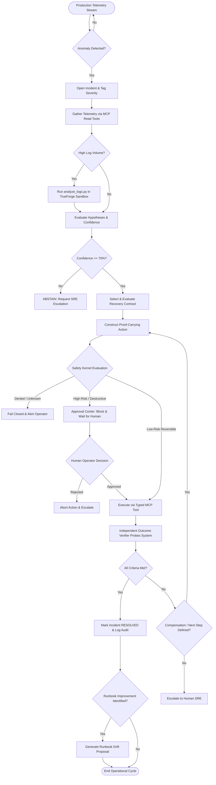

# RUNSAFE — Workflow & Data Flow Specification

**Document Version:** 1.0.0  
**Status:** Approved / Read-Only Source of Truth Reference  
**Product Name:** RunSafe

---

## 1. End-to-End Operational Lifecycle

The RunSafe operational lifecycle encompasses five primary phases:
1. **Detection & Triage:** Autonomous observation of real infrastructure telemetry.
2. **Investigation & Sandboxed Diagnosis:** Evidence gathering, log analysis inside isolated TrueForge sandboxes, hypothesis ranking.
3. **Planning & Contract Evaluation:** Mapping evidence to Recovery Contracts, building Proof-Carrying Actions, blast-radius computation.
4. **Safety & Execution:** Safety Kernel risk gating, human-in-the-loop approval when required, typed tool dispatch.
5. **Independent Verification & Drift Learning:** Objective multi-metric checks, incident resolution or fallback compensation, runbook drift suggestion.



---

## 2. Detailed Phase Specifications

### Phase 1: Detection & Triage
- Telemetry poller or webhook detects:
  - Consecutive 5xx HTTP response rate > 5% over 10 seconds.
  - Or container health check status transition to `unhealthy`.
- Fastify backend opens a new record in SQLite `incidents` table:
  - `id`: `inc_01j8xyz...` (ULID)
  - `service_id`: `checkout-api`
  - `status`: `INVESTIGATING`
  - `started_at`: UTC timestamp

### Phase 2: Evidence Gathering & Sandbox Execution
- Agent queries typed observation tools:
  - `get_service_health(service_id: "checkout-api")`
  - `get_recent_logs(service_id: "checkout-api", maxLines: 500)`
  - `get_database_health()`
- When logs indicate version-specific anomalies, agent emits a Python diagnostic script:
  ```python
  # Generated analyze_logs.py executed in TrueForge Sandbox
  import json, sys, re
  from collections import Counter

  logs = json.loads(sys.stdin.read())
  errors_by_version = Counter()
  exceptions = Counter()

  for entry in logs:
      if "ERROR" in entry.get("level", ""):
          ver = entry.get("version", "unknown")
          errors_by_version[ver] += 1
          msg = entry.get("message", "")
          exc = re.findall(r"([A-Za-z]+Error):", msg)
          if exc:
              exceptions[exc[0]] += 1

  print(json.dumps({
      "errors_by_version": dict(errors_by_version),
      "exceptions": dict(exceptions.most_common(5))
  }))
  ```
- Script runs isolated inside TrueForge Sandbox; output enters Evidence Store.

### Phase 3: Hypothesis Formulation & Abstention
- Hypotheses scored based on evidence weights:
  - $H_1$: Version v2 regression (92% confidence)
  - $H_2$: Database connection pool exhaustion (85% confidence)
  - $H_3$: Host memory pressure (12% confidence)
- **Abstention Gate:** If top hypothesis confidence is < 70%, the orchestrator abstains from automatic mutation and raises an escalation ticket.

### Phase 4: Proof-Carrying Action Construction & Safety Kernel
- Agent creates PCA specifying target tool, exact arguments, blast radius, rollback plan, and deterministic verification criteria.
- Safety Kernel validates:
  - If action is `rollback_canary`, classification is `HIGH_RISK`.
  - Safety Kernel halts execution and publishes approval request `apr_...` over WebSocket/SSE to Next.js dashboard.
  - SRE Operator reviews:
    - Blast radius nodes (`checkout-api-1`, `checkout-api-2`, `order-service`)
    - Error rate diff (v2: 18% vs v1: 0.2%)
    - Operator clicks **Approve**.

### Phase 5: Progressive Execution, Verification & Drift
- Tool execution swaps `checkout-api-1` container image to stable version `v1`.
- Independent Verifier conducts:
  - Synthetic checkout transaction test.
  - 30-second latency and error rate measurement.
- If verified, full rollback of remaining replicas proceeds if policy dictates, or incident closes.
- Post-incident analyzer observes:
  - "Service restart was attempted first as per Step 6 of runbook, but failed. Canary rollback at Step 8 succeeded."
  - Generates drift recommendation: *"Recommend checking deployment version delta before service restart for 503 error spikes."*
