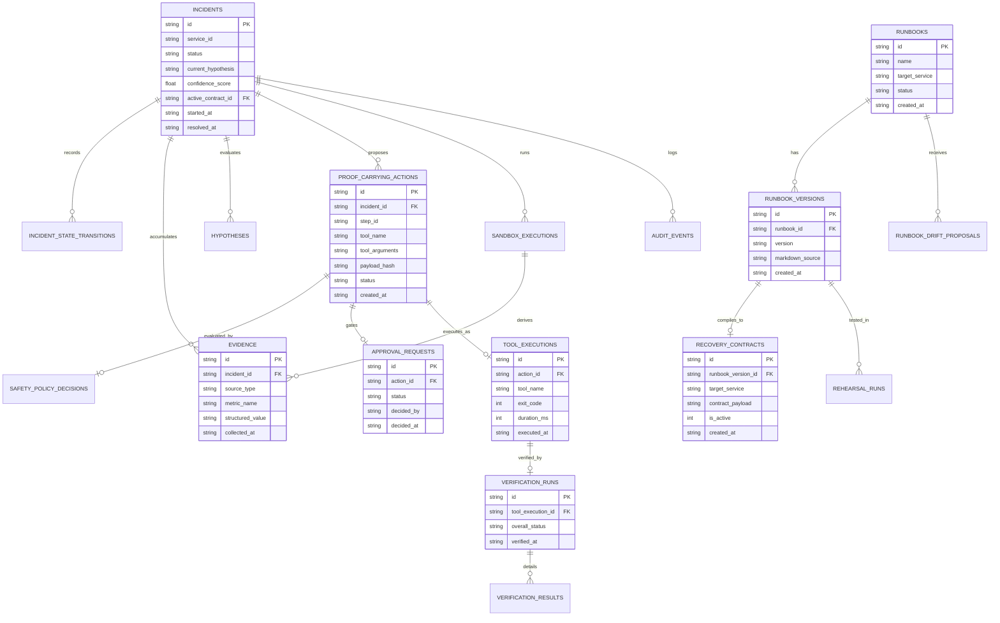
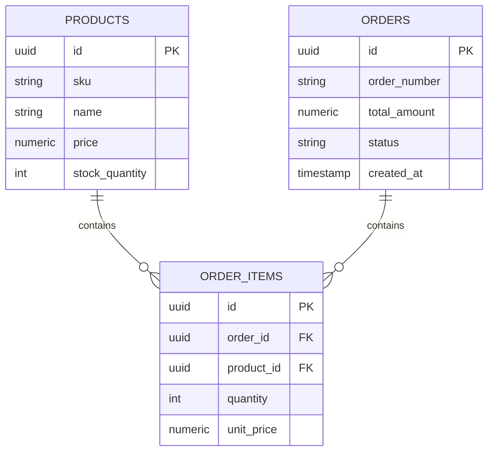

# RUNSAFE — Data, Database & API Design Specification

**Document Identifier:** RUNSAFE-DDA-001  
**Target File Path:** `docs/07_DATA_DATABASE_API_DESIGN.md`  
**Document Version:** 1.0.0 (Authoritative Base Specification)  
**Status:** FROZEN / BASELINE SOURCE OF TRUTH  
**Date:** 26 September 2026  
**Event:** Agents That Act: TrueFoundry × Polaris Hackathon (Bengaluru, In-Person)  
**Core Theme:** *"Build agents that act, not ones that just answer."*  
**Primary Source Documents:** `docs/RUNSAFE_PROJECT_CONTEXT.md`, `docs/03_PRD.md`, `docs/04_TRD.md`, `docs/05_WORKFLOW_AND_DATA_FLOW.md`, `docs/06_UI_UX_SPECIFICATION.md`  
**Intended Audience:** Backend Engineers, Database Architects, API Developers, Agent Integrators, Evaluators  

---

## 1. Document Control & Scope Boundaries

### 1.1 Revision History
| Version | Date | Author / Role | Status | Description |
|---|---|---|---|---|
| **1.0.0** | 2026-09-26 | RunSafe Data Architect | Frozen Baseline | Authoritative Data, Database, and API Design Specification. Establishes the strict dual-database boundary (SQLite Control Plane vs. PostgreSQL Demo Workload), complete entity relational schemas, Zod validation models, REST API endpoint contracts, realtime SSE event envelopes, transaction invariants, and data security policies. |

### 1.2 Purpose & Scope Boundaries
This document defines the canonical representation, persistence, validation, querying, mutation, streaming, and protection of all operational and application data within RunSafe.

#### What This Document Owns:
1. **The Dual-Database Architectural Boundary:** Absolute isolation between the RunSafe Control Plane (`SQLite`) and the target Demo Application Workload (`PostgreSQL`).
2. **Control-Plane Data Architecture:** Complete relational schemas, constraints, indexing strategies, audit persistence, and transactional invariants for SQLite.
3. **Demo Workload Data Architecture:** Minimal PostgreSQL relational schema supporting synthetic checkout transactions and deterministic failure injection.
4. **Fastify Control-Plane API Specification:** Domain-driven REST endpoints (`/api/v1`), Zod request/response contracts, status codes, and domain error matrices.
5. **Real-Time Streaming Event Specification:** Strongly typed Server-Sent Events (SSE) envelopes, reconnection semantics, and state reconciliation contracts.
6. **Data Security & Sanitization:** Zero-secret leakage policies, credential redaction, and prompt injection defense at the database boundary.

#### What This Document Intentionally Delegates:
- **Product & Safety Requirements:** Defined in `docs/03_PRD.md`.
- **System Architecture & Hardware Budgets:** Defined in `docs/04_TRD.md`.
- **Sequential Workflow State Machines:** Defined in `docs/05_WORKFLOW_AND_DATA_FLOW.md`.
- **Visual Design Tokens & Component Layouts:** Defined in `docs/06_UI_UX_SPECIFICATION.md`.
- **Test Fixtures & Evaluation Metrics:** Defined in `docs/14_TESTING_EVALUATION_PLAN.md`.

---

## 2. Dual-Database Architectural Boundary

RunSafe operates with two physically and logically separated database engines. Conflating these two storage domains is strictly prohibited:

```
+----------------------------------------------------------------------------------------------------+
|                                    RUNSAFE PLATFORM BOUNDARIES                                     |
+----------------------------------------------------------------------------------------------------+
|                                                                                                    |
|    +------------------------------------------+        +--------------------------------------+    |
|    |      RUNSAFE CONTROL-PLANE STORE         |        |        TARGET DEMO WORKLOAD STORE    |    |
|    |      Engine: SQLite (runsafe.db)         |        |        Engine: PostgreSQL (Port 5432)|    |
|    +------------------------------------------+        +--------------------------------------+    |
|    |  OWNED BY: Fastify Control Plane Server  |        |  OWNED BY: Target Checkout Services  |    |
|    |  PURPOSE:  Authoritative Platform State  |        |  PURPOSE:  Synthetic Business Data   |    |
|    |  CONTENTS:                               |        |  CONTENTS:                           |    |
|    |    - Runbooks & Immutable Versions       |        |    - Product Catalog (Items/SKUs)    |    |
|    |    - Compiled Recovery Contracts         |        |    - Customer Orders (Transactions)  |    |
|    |    - Incidents & State Transitions       |        |    - Order Items                     |    |
|    |    - Normalized Telemetry Evidence       |        |    - Simulated Connection Pools      |    |
|    |    - Proof-Carrying Actions (PCAs)       |        |                                      |    |
|    |    - Safety Kernel Policy Decisions      |        |  DISPOSABLE & RESETTABLE:            |    |
|    |    - Human Approval Requests & Decisions |        |  Intentionally broken, degraded,     |    |
|    |    - Tool & Sandbox Execution Logs       |        |  locked, or reset during controlled  |    |
|    |    - Independent Verification Probes     |        |  incident rehearsals.                |    |
|    |    - Runbook CI Rehearsal Records        |        |                                      |    |
|    |    - Runbook Drift Proposals             |        |  RUNSAFE NEVER STORES PLATFORM       |    |
|    |    - Append-Only Audit Event Timeline    |        |  SAFETY STATE IN POSTGRESQL.         |    |
|    +------------------------------------------+        +--------------------------------------+    |
|                                                                                                    |
+----------------------------------------------------------------------------------------------------+
```

### 2.1 Data Ownership & Authority Matrix
| Data Domain | Authoritative Producer | Authoritative Store | Client Access Policy |
|---|---|---|---|
| **Incident Lifecycle State** | Fastify Incident Engine | SQLite (`incidents`) | Read-only via REST/SSE; mutations via backend workflows only. |
| **Telemetry Evidence** | Typed MCP Observation Tools | SQLite (`evidence`) | Read-only; created strictly via verified tool responses. |
| **Proof-Carrying Actions** | TrueForge Planner / PCA Generator | SQLite (`proof_carrying_actions`) | Read-only for SRE inspection; immutable once proposed. |
| **Safety Kernel Decisions** | Deterministic Safety Kernel | SQLite (`safety_policy_decisions`) | Read-only; pure application logic output. |
| **Human Approvals** | Authorized SRE Operator | SQLite (`approval_requests`) | Write via `POST /api/v1/approvals/:id/decision`. |
| **Verification Outcomes** | Independent Outcome Verifier | SQLite (`verification_runs`) | Read-only; written strictly by deterministic verifier probes. |
| **Synthetic Business Orders**| Checkout API Replicas / Verifier | PostgreSQL (`orders`) | Accessed via Ingress HTTP or direct Verifier DB probe. |

---

## 3. Control-Plane Database Architecture (SQLite)

The RunSafe Control Plane persistence layer runs locally using embedded SQLite via `better-sqlite3`. The database file resides at `data/runsafe.db`.

### 3.1 Entity Relationship Diagram (SQLite Control Plane)


---

### 3.2 Relational Data Dictionary (SQLite Control Plane)

#### 1. Table: `runbooks`
Logical container for operational recovery runbooks.
```sql
CREATE TABLE IF NOT EXISTS runbooks (
  id TEXT PRIMARY KEY,                 -- ULID / UUID
  name TEXT NOT NULL UNIQUE,          -- Human-readable name (e.g. "Checkout API Recovery")
  description TEXT,                    -- Operational scope
  target_service TEXT NOT NULL,        -- Primary service mapping (e.g. "checkout-api")
  active_version_id TEXT,              -- Link to currently active runbook_version
  status TEXT NOT NULL DEFAULT 'DRAFT',-- DRAFT, ACTIVE, ARCHIVED
  created_at TEXT NOT NULL,            -- ISO-8601 UTC
  updated_at TEXT NOT NULL
);
CREATE INDEX IF NOT EXISTS idx_runbooks_service ON runbooks(target_service);
```

#### 2. Table: `runbook_versions`
Immutable archive of human-authored Markdown source.
```sql
CREATE TABLE IF NOT EXISTS runbook_versions (
  id TEXT PRIMARY KEY,                 -- UUID
  runbook_id TEXT NOT NULL,            -- FK to runbooks.id
  version TEXT NOT NULL,               -- Semantic version string (e.g. "v1.0")
  markdown_source TEXT NOT NULL,       -- Raw human text
  author TEXT NOT NULL DEFAULT 'SRE',  -- Operator / Author ID
  created_at TEXT NOT NULL,
  FOREIGN KEY (runbook_id) REFERENCES runbooks(id) ON DELETE RESTRICT,
  UNIQUE(runbook_id, version)
);
CREATE INDEX IF NOT EXISTS idx_runbook_versions_lookup ON runbook_versions(runbook_id, version);
```

#### 3. Table: `recovery_contracts`
Machine-enforceable, Zod-validated operational contracts compiled from runbook versions.
```sql
CREATE TABLE IF NOT EXISTS recovery_contracts (
  id TEXT PRIMARY KEY,                 -- UUID
  runbook_version_id TEXT NOT NULL,    -- FK to runbook_versions.id
  target_service TEXT NOT NULL,
  schema_version TEXT NOT NULL DEFAULT '1.0.0',
  contract_payload TEXT NOT NULL,      -- Full JSON satisfying RecoveryContractSchema
  is_active INTEGER NOT NULL DEFAULT 0,-- 1 for active production contract, 0 otherwise
  created_at TEXT NOT NULL,
  FOREIGN KEY (runbook_version_id) REFERENCES runbook_versions(id) ON DELETE RESTRICT
);
CREATE INDEX IF NOT EXISTS idx_contracts_service_active ON recovery_contracts(target_service, is_active);
```

#### 4. Table: `incidents`
Authoritative root runtime record for operational failures.
```sql
CREATE TABLE IF NOT EXISTS incidents (
  id TEXT PRIMARY KEY,                 -- e.g. "INC-001" or UUID
  service_id TEXT NOT NULL,            -- Primary degraded service (e.g. "checkout-api")
  severity TEXT NOT NULL DEFAULT 'HIGH',-- CRITICAL, HIGH, MEDIUM, LOW
  status TEXT NOT NULL,                -- DETECTED, INVESTIGATING, EVIDENCE_GATHERING, PLANNING, 
                                       -- AWAITING_APPROVAL, EXECUTING, VERIFYING, RESOLVED, 
                                       -- FAILED_RECOVERY, ESCALATED_ABSTAINED
  current_hypothesis TEXT,             -- Plain-English diagnostic summary
  confidence_score REAL DEFAULT 0.0,   -- Metric (0.00 - 1.00)
  active_contract_id TEXT,             -- FK to recovery_contracts.id
  started_at TEXT NOT NULL,            -- Timestamp of alert trigger
  resolved_at TEXT,                    -- Timestamp of verified resolution
  FOREIGN KEY (active_contract_id) REFERENCES recovery_contracts(id) ON DELETE RESTRICT
);
CREATE INDEX IF NOT EXISTS idx_incidents_status ON incidents(status);
CREATE INDEX IF NOT EXISTS idx_incidents_service ON incidents(service_id);
```

#### 5. Table: `incident_state_transitions`
Append-only log of all incident lifecycle movements.
```sql
CREATE TABLE IF NOT EXISTS incident_state_transitions (
  id TEXT PRIMARY KEY,                 -- UUID
  incident_id TEXT NOT NULL,           -- FK to incidents.id
  from_state TEXT NOT NULL,
  to_state TEXT NOT NULL,
  trigger_reason TEXT NOT NULL,        -- Explanation / event reference
  actor TEXT NOT NULL,                 -- AGENT, SAFETY_KERNEL, HUMAN_OPERATOR, VERIFIER
  transitioned_at TEXT NOT NULL,
  FOREIGN KEY (incident_id) REFERENCES incidents(id) ON DELETE CASCADE
);
CREATE INDEX IF NOT EXISTS idx_transitions_incident ON incident_state_transitions(incident_id, transitioned_at);
```

#### 6. Table: `evidence`
Immutable operational telemetry observations and sandboxed diagnostic findings.
```sql
CREATE TABLE IF NOT EXISTS evidence (
  id TEXT PRIMARY KEY,                 -- e.g. "EVD-101" or UUID
  incident_id TEXT NOT NULL,           -- FK to incidents.id
  source_type TEXT NOT NULL,           -- HTTP_PROBE, CONTAINER_LOG, DB_METRIC, SANDBOX_DIAGNOSTIC
  source_tool TEXT NOT NULL,           -- e.g. "get_service_health", "analyze_logs.py"
  target_resource TEXT NOT NULL,       -- e.g. "checkout-api-1", "postgres"
  metric_name TEXT NOT NULL,           -- e.g. "5xx_error_rate", "pool_utilization"
  structured_value TEXT NOT NULL,      -- JSON string of observed metric
  provenance_ref TEXT,                 -- Raw log hash or request ID
  collected_at TEXT NOT NULL,
  FOREIGN KEY (incident_id) REFERENCES incidents(id) ON DELETE CASCADE
);
CREATE INDEX IF NOT EXISTS idx_evidence_incident ON evidence(incident_id, collected_at);
```

#### 7. Table: `proof_carrying_actions`
Safety-critical mutation proposals bundling operational justifications and verification contracts.
```sql
CREATE TABLE IF NOT EXISTS proof_carrying_actions (
  id TEXT PRIMARY KEY,                 -- e.g. "PCA-401" or UUID
  incident_id TEXT NOT NULL,           -- FK to incidents.id
  step_id TEXT NOT NULL,               -- Step ID in active contract (e.g. "STEP-002")
  contract_id TEXT NOT NULL,           -- FK to recovery_contracts.id
  tool_name TEXT NOT NULL,             -- e.g. "rollback_canary"
  tool_arguments TEXT NOT NULL,        -- JSON string of validated arguments
  payload_hash TEXT NOT NULL,          -- SHA-256 of canonical tool_arguments (Anti-tamper)
  justification_summary TEXT NOT NULL, -- Diagnostic "Why"
  confidence_score REAL NOT NULL,
  supporting_evidence_ids TEXT NOT NULL,-- JSON Array of Evidence UUIDs
  risk_tier TEXT NOT NULL,             -- READ_ONLY, LOW_RISK_REVERSIBLE, STATE_CHANGING, HIGH_RISK, DESTRUCTIVE
  blast_radius TEXT NOT NULL,          -- JSON Array of affected service IDs
  is_reversible INTEGER NOT NULL,      -- 1 or 0
  rollback_procedure TEXT NOT NULL,    -- Plain-English compensation plan
  verification_criteria TEXT NOT NULL, -- JSON string of objective assertions
  status TEXT NOT NULL,                -- PROPOSED, POLICY_EVALUATED, APPROVAL_REQUIRED, APPROVED,
                                       -- REJECTED, EXECUTING, EXECUTION_SUCCEEDED, EXECUTION_FAILED,
                                       -- VERIFYING, VERIFIED_EFFECTIVE, VERIFIED_INEFFECTIVE, COMPENSATED
  created_at TEXT NOT NULL,
  FOREIGN KEY (incident_id) REFERENCES incidents(id) ON DELETE CASCADE,
  FOREIGN KEY (contract_id) REFERENCES recovery_contracts(id) ON DELETE RESTRICT
);
CREATE INDEX IF NOT EXISTS idx_pca_incident_status ON proof_carrying_actions(incident_id, status);
```

#### 8. Table: `safety_policy_decisions`
Deterministic evaluations generated by the Safety Kernel.
```sql
CREATE TABLE IF NOT EXISTS safety_policy_decisions (
  id TEXT PRIMARY KEY,                 -- UUID
  action_id TEXT NOT NULL UNIQUE,      -- FK to proof_carrying_actions.id
  policy_decision TEXT NOT NULL,       -- AUTHORIZED, APPROVAL_REQUIRED, BLOCKED, DENIED_UNKNOWN
  matched_rule TEXT NOT NULL,          -- Policy rule descriptor
  preconditions_passed INTEGER NOT NULL,-- 1 or 0
  evaluated_at TEXT NOT NULL,
  FOREIGN KEY (action_id) REFERENCES proof_carrying_actions(id) ON DELETE CASCADE
);
```

#### 9. Table: `approval_requests`
Explicit operational sign-off records bound cryptographically to action payloads.
```sql
CREATE TABLE IF NOT EXISTS approval_requests (
  id TEXT PRIMARY KEY,                 -- UUID
  action_id TEXT NOT NULL UNIQUE,      -- FK to proof_carrying_actions.id
  payload_hash TEXT NOT NULL,          -- Must match proof_carrying_actions.payload_hash
  status TEXT NOT NULL DEFAULT 'PENDING',-- PENDING, APPROVED, REJECTED, EXPIRED, INVALIDATED
  decided_by TEXT,                     -- Operator ID / username
  operator_note TEXT,                  -- Optional approval comment
  decided_at TEXT,
  expires_at TEXT NOT NULL,            -- Hard expiration timestamp (default: +10 mins)
  FOREIGN KEY (action_id) REFERENCES proof_carrying_actions(id) ON DELETE CASCADE
);
CREATE INDEX IF NOT EXISTS idx_approvals_status ON approval_requests(status);
```

#### 10. Table: `tool_executions`
Dispatches of typed MCP operational tools to real Docker infrastructure.
```sql
CREATE TABLE IF NOT EXISTS tool_executions (
  id TEXT PRIMARY KEY,                 -- UUID
  action_id TEXT,                      -- Nullable for read-only observation queries
  incident_id TEXT NOT NULL,
  tool_name TEXT NOT NULL,
  arguments_snapshot TEXT NOT NULL,    -- Sanitized JSON string
  exit_code INTEGER NOT NULL,          -- 0 for success
  duration_ms INTEGER NOT NULL,
  raw_output_excerpt TEXT,             -- Bounded excerpt (< 4KB)
  error_message TEXT,
  executed_at TEXT NOT NULL,
  FOREIGN KEY (incident_id) REFERENCES incidents(id) ON DELETE CASCADE
);
CREATE INDEX IF NOT EXISTS idx_tool_executions_incident ON tool_executions(incident_id);
```

#### 11. Table: `sandbox_executions`
Isolated TrueForge container executions running agent-generated Python diagnostic scripts.
```sql
CREATE TABLE IF NOT EXISTS sandbox_executions (
  id TEXT PRIMARY KEY,                 -- UUID
  incident_id TEXT NOT NULL,
  script_name TEXT NOT NULL,           -- e.g. "analyze_logs.py"
  script_content TEXT NOT NULL,        -- Complete Python source code executed
  input_data_summary TEXT NOT NULL,    -- Description of stdin logs passed
  stdout_parsed TEXT NOT NULL,         -- Structured JSON output
  stderr_text TEXT,
  exit_code INTEGER NOT NULL,
  duration_ms INTEGER NOT NULL,
  is_timeout INTEGER NOT NULL DEFAULT 0,
  executed_at TEXT NOT NULL,
  FOREIGN KEY (incident_id) REFERENCES incidents(id) ON DELETE CASCADE
);
CREATE INDEX IF NOT EXISTS idx_sandbox_incident ON sandbox_executions(incident_id);
```

#### 12. Table: `verification_runs` & `verification_results`
Objective multi-probe evaluations conducted by the Independent Verifier.
```sql
CREATE TABLE IF NOT EXISTS verification_runs (
  id TEXT PRIMARY KEY,                 -- UUID
  incident_id TEXT NOT NULL,
  action_id TEXT NOT NULL,             -- FK to proof_carrying_actions.id
  tool_execution_id TEXT NOT NULL,     -- FK to tool_executions.id
  overall_status TEXT NOT NULL,        -- PASS, FAIL, UNKNOWN
  total_probes INTEGER NOT NULL,
  passed_probes INTEGER NOT NULL,
  completed_at TEXT NOT NULL,
  FOREIGN KEY (incident_id) REFERENCES incidents(id) ON DELETE CASCADE,
  FOREIGN KEY (action_id) REFERENCES proof_carrying_actions(id) ON DELETE CASCADE,
  FOREIGN KEY (tool_execution_id) REFERENCES tool_executions(id) ON DELETE CASCADE
);

CREATE TABLE IF NOT EXISTS verification_results (
  id TEXT PRIMARY KEY,                 -- UUID
  verification_run_id TEXT NOT NULL,   -- FK to verification_runs.id
  probe_type TEXT NOT NULL,            -- INGRESS_HEALTH, REPLICA_HEALTH, DB_LATENCY, SYNTHETIC_ORDER
  target_endpoint TEXT NOT NULL,
  expected_value TEXT NOT NULL,        -- e.g. "200 OK", "201 Created"
  observed_value TEXT NOT NULL,
  status TEXT NOT NULL,                -- PASS, FAIL, ERROR
  latency_ms INTEGER NOT NULL,
  evaluated_at TEXT NOT NULL,
  FOREIGN KEY (verification_run_id) REFERENCES verification_runs(id) ON DELETE CASCADE
);
```

#### 13. Table: `rehearsal_scenarios` & `rehearsal_runs`
Runbook CI continuous recovery testing records.
```sql
CREATE TABLE IF NOT EXISTS rehearsal_scenarios (
  id TEXT PRIMARY KEY,                 -- e.g. "SCENARIO-001"
  name TEXT NOT NULL,                  -- e.g. "Process / Service Crash"
  description TEXT NOT NULL,
  target_service TEXT NOT NULL,
  fault_type TEXT NOT NULL,            -- KILL_REPLICA, BUGGY_DEPLOYMENT_V2, LATENCY_SPIKE
  expected_recovery_tool TEXT NOT NULL
);

CREATE TABLE IF NOT EXISTS rehearsal_runs (
  id TEXT PRIMARY KEY,                 -- UUID
  contract_id TEXT NOT NULL,           -- FK to recovery_contracts.id
  scenario_id TEXT NOT NULL,           -- FK to rehearsal_scenarios.id
  outcome TEXT NOT NULL,               -- PASS, FAIL, INCONCLUSIVE
  recovery_duration_ms INTEGER NOT NULL,
  broken_step_id TEXT,
  executed_at TEXT NOT NULL,
  FOREIGN KEY (contract_id) REFERENCES recovery_contracts(id) ON DELETE RESTRICT,
  FOREIGN KEY (scenario_id) REFERENCES rehearsal_scenarios(id) ON DELETE RESTRICT
);
```

#### 14. Table: `runbook_drift_proposals`
AI-synthesized, human-reviewed operational runbook improvements.
```sql
CREATE TABLE IF NOT EXISTS runbook_drift_proposals (
  id TEXT PRIMARY KEY,                 -- UUID
  runbook_id TEXT NOT NULL,            -- FK to runbooks.id
  source_version TEXT NOT NULL,        -- Version analyzed (e.g. "v1.0")
  incident_id TEXT,                    -- Reference incident justifying change
  rehearsal_run_id TEXT,               -- Reference rehearsal justifying change
  summary TEXT NOT NULL,               -- Concise description of operational finding
  proposed_patch TEXT NOT NULL,        -- Structured diff / JSON replacement step
  status TEXT NOT NULL DEFAULT 'PENDING',-- PENDING, ACCEPTED, REJECTED
  reviewed_by TEXT,
  reviewed_at TEXT,
  created_at TEXT NOT NULL,
  FOREIGN KEY (runbook_id) REFERENCES runbooks(id) ON DELETE CASCADE
);
```

#### 15. Table: `audit_events`
Append-only chronological audit log preserving full operational provenance.
```sql
CREATE TABLE IF NOT EXISTS audit_events (
  id TEXT PRIMARY KEY,                 -- Sequential ULID or UUID
  incident_id TEXT,                    -- Optional (null for system-wide events)
  event_type TEXT NOT NULL,            -- INCIDENT_OPENED, EVIDENCE_INGESTED, SANDBOX_EXECUTED,
                                       -- PCA_PROPOSED, POLICY_EVALUATED, APPROVAL_REQUESTED,
                                       -- APPROVAL_DECIDED, TOOL_DISPATCHED, VERIFICATION_EVALUATED,
                                       -- INCIDENT_RESOLVED, REHEARSAL_COMPLETED
  actor TEXT NOT NULL,                 -- TRUEFORGE_AGENT, SAFETY_KERNEL, SRE_OPERATOR, VERIFIER
  payload TEXT NOT NULL,               -- Sanitized JSON event snapshot
  created_at TEXT NOT NULL             -- High-precision ISO-8601 UTC
);
CREATE INDEX IF NOT EXISTS idx_audit_incident ON audit_events(incident_id, created_at);
```

---

## 4. Demo Workload Database Architecture (PostgreSQL)

The target demo application workload uses PostgreSQL (`port 5432`, database `checkout_db`). It is designed to be minimal, deterministic, and easily seeded or reset.



### 4.1 Demo Workload Schema (DDL)
```sql
CREATE EXTENSION IF NOT EXISTS "uuid-ossp";

CREATE TABLE IF NOT EXISTS products (
  id UUID PRIMARY KEY DEFAULT uuid_generate_v4(),
  sku VARCHAR(50) UNIQUE NOT NULL,
  name VARCHAR(100) NOT NULL,
  price NUMERIC(10, 2) NOT NULL,
  stock_quantity INTEGER NOT NULL DEFAULT 100,
  created_at TIMESTAMP WITH TIME ZONE DEFAULT NOW()
);

CREATE TABLE IF NOT EXISTS orders (
  id UUID PRIMARY KEY DEFAULT uuid_generate_v4(),
  order_number VARCHAR(50) UNIQUE NOT NULL,
  total_amount NUMERIC(10, 2) NOT NULL,
  status VARCHAR(20) NOT NULL DEFAULT 'COMPLETED', -- COMPLETED, FAILED
  is_synthetic INTEGER NOT NULL DEFAULT 0,         -- 1 for test transactions, 0 otherwise
  created_at TIMESTAMP WITH TIME ZONE DEFAULT NOW()
);

CREATE TABLE IF NOT EXISTS order_items (
  id UUID PRIMARY KEY DEFAULT uuid_generate_v4(),
  order_id UUID NOT NULL REFERENCES orders(id) ON DELETE CASCADE,
  product_id UUID NOT NULL REFERENCES products(id),
  quantity INTEGER NOT NULL,
  unit_price NUMERIC(10, 2) NOT NULL
);

CREATE INDEX IF NOT EXISTS idx_orders_created ON orders(created_at);
```

### 4.2 Deterministic Baseline Seeding
A single deterministic seed script resets PostgreSQL to a pristine operational state before any scenario:
```sql
TRUNCATE TABLE order_items, orders RESTART IDENTITY CASCADE;

INSERT INTO products (sku, name, price, stock_quantity) VALUES
  ('PROD-CHECKOUT-001', 'Standard Synthetic Widget', 29.99, 1000),
  ('PROD-CHECKOUT-002', 'Premium Enterprise Sensor', 99.50, 500)
ON CONFLICT (sku) DO NOTHING;
```

---

## 5. Control-Plane REST API Specification

All RunSafe control-plane APIs are served by Fastify under the `/api/v1` namespace on port `4000`.

### 5.1 Endpoint Routing & Operation Matrix

| HTTP Method | Route Path | Subsystem Owner | Primary Purpose | Side Effects | Realtime Event Emitted |
|---|---|---|---|---|---|
| `GET` | `/api/v1/system/readiness` | System Engine | Inspect health of all platform subsystems | None (Read-only) | None |
| `GET` | `/api/v1/runbooks` | Runbook Lab | List all managed runbooks & active versions | None (Read-only) | None |
| `POST` | `/api/v1/runbooks/compile`| Runbook Compiler | Compile Markdown runbook into Zod Recovery Contract | None (Scratch compile) | None |
| `POST` | `/api/v1/runbooks` | Runbook Lab | Save compiled runbook and create version record | Inserts in SQLite | `RUNBOOK_VERSION_CREATED` |
| `POST` | `/api/v1/runbooks/:id/activate` | Runbook Lab | Set specific Recovery Contract as active production policy | Updates SQLite | `RUNBOOK_ACTIVATED` |
| `GET` | `/api/v1/incidents` | Incident Engine | List recent incidents with state filters | None (Read-only) | None |
| `GET` | `/api/v1/incidents/:id` | Incident Engine | Fetch complete incident context, timeline & PCA | None (Read-only) | None |
| `GET` | `/api/v1/incidents/:id/evidence` | Evidence Engine | Fetch all normalized evidence for an incident | None (Read-only) | None |
| `GET` | `/api/v1/approvals` | Approval Center | List pending & historical approval requests | None (Read-only) | None |
| `POST` | `/api/v1/approvals/:id/decision` | Approval Subsystem| Record operator decision (`APPROVE` or `REJECT`) | Updates SQLite; triggers execution | `APPROVAL_DECIDED`, `INCIDENT_STATE_CHANGED` |
| `GET` | `/api/v1/topology` | Dependency Engine | Fetch React Flow service nodes, edges & health | None (Read-only) | None |
| `GET` | `/api/v1/rehearsals/scenarios`| Rehearsal Engine | List configured Runbook CI staging scenarios | None (Read-only) | None |
| `POST` | `/api/v1/rehearsals/start` | Rehearsal Engine | Trigger automated staging rehearsal run | Injects fault & executes contract | `REHEARSAL_STARTED`, `REHEARSAL_COMPLETED` |
| `GET` | `/api/v1/drift/proposals` | Drift Engine | Fetch pending runbook drift proposals | None (Read-only) | None |
| `POST` | `/api/v1/drift/proposals/:id/decision` | Drift Engine | Accept or reject proposed runbook revision | Updates SQLite; increments contract version | `DRIFT_PROPOSAL_RESOLVED` |
| `POST` | `/api/v1/demo/fault` | Demo Injector | Inject controlled fault into local Docker stack | Real Docker State Mutation | `DEMO_FAULT_INJECTED` |
| `POST` | `/api/v1/demo/reset` | Demo Injector | Restore Docker containers & Postgres baseline | Resets Docker & PostgreSQL | `DEMO_BASELINE_RESTORED` |
| `GET` | `/api/v1/audit/events` | Audit Subsystem | Paginated query of append-only audit timeline | None (Read-only) | None |
| `GET` | `/api/v1/events/stream` | SSE Hub | Persistent Server-Sent Events stream | Establishes SSE connection | None |

---

### 5.2 Request & Response Schema Contracts (Representative Examples)

#### 1. System Readiness: `GET /api/v1/system/readiness`
- **Response (`200 OK`):**
```json
{
  "status": "READY",
  "checked_at": "2026-09-26T10:14:00.120Z",
  "subsystems": {
    "control_plane_db": { "status": "ONLINE", "type": "SQLite", "file": "data/runsafe.db" },
    "trueforge_harness": { "status": "ONLINE", "endpoint": "http://127.0.0.1:8790", "mode": "STANDALONE_SQLITE" },
    "local_ai_ollama": { "status": "ONLINE", "model": "qwen3:4b-instruct-2507-q4_K_M", "vram_allocated_mb": 2680 },
    "typed_mcp_server": { "status": "ONLINE", "registered_tools_count": 8 },
    "demo_infrastructure": { "status": "ONLINE", "containers_active": 4 },
    "demo_postgres": { "status": "ONLINE", "active_connections": 3, "pool_max": 20 }
  }
}
```

#### 2. Incident Detail: `GET /api/v1/incidents/INC-002`
- **Response (`200 OK`):**
```json
{
  "id": "INC-002",
  "service_id": "checkout-api",
  "severity": "CRITICAL",
  "status": "AWAITING_APPROVAL",
  "current_hypothesis": "Version v2 connection pool exhaustion",
  "confidence_score": 0.942,
  "started_at": "2026-09-26T10:14:22.000Z",
  "active_contract": {
    "contract_id": "CNT-CHECKOUT-v1.0",
    "name": "Checkout Recovery Runbook",
    "version": "v1.0"
  },
  "active_proof_carrying_action": {
    "action_id": "PCA-401",
    "step_id": "STEP-002",
    "tool_name": "rollback_canary",
    "tool_arguments": { "target_replica": "checkout-api-1", "rollback_version": "v1", "traffic_percentage": 50 },
    "payload_hash": "e3b0c44298fc1c149afbf4c8996fb92427ae41e4649b934ca495991b7852b855",
    "justification": "Sandboxed log analysis (EVD-103) proved 94.2% of 503 errors correlate with v2. Step 1 restart failed.",
    "risk_tier": "HIGH_RISK",
    "blast_radius": ["checkout-api-1", "order-service", "payment-gateway"],
    "is_reversible": true,
    "rollback_procedure": "Revert traffic weight to 100% on replica 2 if verification fails.",
    "status": "APPROVAL_REQUIRED"
  }
}
```

#### 3. Approval Decision: `POST /api/v1/approvals/:id/decision`
- **Request Body:**
```json
{
  "decision": "APPROVE",
  "payload_hash": "e3b0c44298fc1c149afbf4c8996fb92427ae41e4649b934ca495991b7852b855",
  "operator_id": "SRE-ONCALL-ALEX",
  "operator_note": "Canary rollback approved for checkout-api-1 to isolate v1 error rate."
}
```
- **Response (`200 OK`):**
```json
{
  "approval_id": "APR-901",
  "action_id": "PCA-401",
  "status": "APPROVED",
  "decided_at": "2026-09-26T10:15:30.145Z",
  "execution_dispatched": true
}
```
- **Error Response (`409 Conflict` - Stale / Tampered Action):**
```json
{
  "error_code": "ERR_PAYLOAD_TAMPERED_OR_STALE",
  "message": "The proposed action arguments have mutated or the action has expired. Re-approval required.",
  "action_id": "PCA-401"
}
```

---

## 6. Real-Time Streaming Event Specification (SSE)

Real-time platform events stream over HTTP Server-Sent Events via `GET /api/v1/events/stream`.

### 6.1 The Event Envelope Schema
```typescript
export interface RunSafeEventEnvelope<T = Record<string, unknown>> {
  event_id: string;        // Sequential UUID
  event_type: string;      // e.g. "INCIDENT_STATE_CHANGED"
  timestamp: string;       // ISO-8601 UTC
  incident_id?: string;    // Associated incident ID
  correlation_id?: string; // Request / Task correlation ID
  payload: T;              // Strongly typed payload
}
```

### 6.2 Canonical Real-Time Event Catalog
1. `SYSTEM_READINESS_CHANGED`: Broadcasts operational degradation in dependencies.
2. `INCIDENT_OPENED`: Emitted when an anomaly is detected and an incident record opens.
3. `EVIDENCE_ADDED`: Emitted when new telemetry or sandbox finding is ingested.
4. `HYPOTHESIS_UPDATED`: Emitted when diagnostic reasoning updates root-cause ranking.
5. `SANDBOX_EXECUTION_COMPLETED`: Emitted when a Python diagnostic script finishes in TrueForge sandbox.
6. `ACTION_PROPOSED`: Emitted when a new PCA is constructed by the Planner.
7. `POLICY_DECISION_EVALUATED`: Emitted when Safety Kernel evaluates an action.
8. `APPROVAL_REQUESTED`: Emitted when an action is blocked pending human approval.
9. `APPROVAL_DECIDED`: Emitted when human operator approves or rejects an action.
10. `TOOL_EXECUTION_COMPLETED`: Emitted when typed Docker operation returns.
11. `VERIFICATION_PROBE_EVALUATED`: Emitted as each independent probe passes/fails.
12. `INCIDENT_RESOLVED`: Emitted when all verification criteria pass and incident closes.
13. `INCIDENT_ABSTAINED`: Emitted when confidence falls below safety threshold.
14. `REHEARSAL_PROGRESS_UPDATED`: Emitted during Runbook CI test execution.
15. `DRIFT_PROPOSAL_GENERATED`: Emitted when post-incident analysis flags outdated runbook steps.

---

## 7. Data Invariants & Transaction Boundaries

### 7.1 Database Safety Invariants (Enforced via Transactions & Constraints)
1. **The Approval Binding Invariant:**
   An approval record must match the exact SHA-256 `payload_hash` of the target `proof_carrying_actions` row. Any divergence aborts execution.
2. **The Verification-Before-Resolution Invariant:**
   An incident cannot transition to `RESOLVED` unless a corresponding row exists in `verification_runs` with `overall_status = 'PASS'` and `total_probes = passed_probes`.
3. **The Anti-Self-Approval Invariant:**
   The `decided_by` column in `approval_requests` cannot match the automated agent system identity (`TRUEFORGE_AGENT`).
4. **The Runbook Version Immutability Invariant:**
   Rows in `runbook_versions` are append-only. Accepting a drift proposal creates a new version (`v1.1`); it never updates historical versions (`v1.0`).
5. **The Fail-Closed Invariant:**
   If a database transaction fails during approval recording, the underlying Docker tool dispatch is never invoked.

### 7.2 Critical Atomic Transaction Maps (SQLite)

#### Transaction A: Approval Decision & Execution Dispatch
```sql
BEGIN IMMEDIATE TRANSACTION;
  -- 1. Verify approval is in PENDING state and hash matches
  SELECT id FROM approval_requests 
  WHERE id = ? AND payload_hash = ? AND status = 'PENDING';
  
  -- 2. Mark approval request as APPROVED
  UPDATE approval_requests 
  SET status = 'APPROVED', decided_by = ?, operator_note = ?, decided_at = CURRENT_TIMESTAMP 
  WHERE id = ?;
  
  -- 3. Update PCA status to APPROVED
  UPDATE proof_carrying_actions 
  SET status = 'APPROVED' 
  WHERE id = ?;
  
  -- 4. Transition incident state to EXECUTING
  UPDATE incidents 
  SET status = 'EXECUTING' 
  WHERE id = ?;
  
  -- 5. Record state transition in audit history
  INSERT INTO incident_state_transitions (id, incident_id, from_state, to_state, trigger_reason, actor, transitioned_at)
  VALUES (?, ?, 'AWAITING_APPROVAL', 'EXECUTING', 'Operator Approval Granted', 'HUMAN_OPERATOR', CURRENT_TIMESTAMP);
COMMIT;
```

#### Transaction B: Independent Verification & Incident Resolution
```sql
BEGIN IMMEDIATE TRANSACTION;
  -- 1. Record completed verification run
  INSERT INTO verification_runs (id, incident_id, action_id, tool_execution_id, overall_status, total_probes, passed_probes, completed_at)
  VALUES (?, ?, ?, ?, 'PASS', 4, 4, CURRENT_TIMESTAMP);
  
  -- 2. Mark PCA as VERIFIED_EFFECTIVE
  UPDATE proof_carrying_actions 
  SET status = 'VERIFIED_EFFECTIVE' 
  WHERE id = ?;
  
  -- 3. Close the incident
  UPDATE incidents 
  SET status = 'RESOLVED', resolved_at = CURRENT_TIMESTAMP 
  WHERE id = ?;
  
  -- 4. Record resolution transition
  INSERT INTO incident_state_transitions (id, incident_id, from_state, to_state, trigger_reason, actor, transitioned_at)
  VALUES (?, ?, 'VERIFYING', 'RESOLVED', 'All 4 Independent Probes Passed', 'VERIFIER', CURRENT_TIMESTAMP);
COMMIT;
```

---

## 8. Data Security, Privacy & Sanitization

1. **Zero Secret Persistence:** Passwords, API tokens, and `.env` credentials must never be written to SQLite or exposed in REST responses.
2. **Regex Field Redaction:** Fastify serialization middleware applies redaction patterns against all JSON responses:
   - Matches keys: `password`, `secret`, `token`, `auth`, `authorization`, `private_key`.
   - Replaces values with: `"[REDACTED_BY_RUNSAFE]"`.
3. **Synthetic Demo Data Guarantee:** The PostgreSQL demo application database contains zero real customer data, real names, or real credit card numbers. All catalog items and synthetic orders are procedurally generated test records.

---

## 9. Requirements Traceability Matrix (PRD & TRD)

| Platform Requirement | Specific SQLite / API Enforcement Point | Traceability ID |
|---|---|---|
| **Runbook Ingestion & Compilation** | `POST /api/v1/runbooks/compile`, `recovery_contracts` table | `FR-001`, `FR-002`, `TR-001` |
| **Evidence Collection & Provenance** | `evidence` table, `source_type`, `provenance_ref` columns | `FR-007`, `FR-009`, `TR-008` |
| **Sandboxed Code Execution** | `sandbox_executions` table, stdout sanitization | `FR-010`, `FR-011`, `TR-007` |
| **Proof-Carrying Actions** | `proof_carrying_actions` table, `payload_hash`, `justification` | `FR-023`, `TR-008` |
| **Deterministic Safety Kernel** | `safety_policy_decisions` table, `Gate 1-5` enforcement | `FR-018`, `FR-019`, `TR-005` |
| **Human Approval Enforcement** | `approval_requests` table, `POST /api/v1/approvals/:id/decision` | `FR-024`, `FR-025`, `TR-006` |
| **Progressive / Canary Rollback** | `proof_carrying_actions.tool_name = 'rollback_canary'` | `FR-027`, `FR-028`, `TR-010` |
| **Independent Outcome Verification**| `verification_runs`, `verification_results` tables | `FR-030`, `FR-032`, `TR-009` |
| **Confidence-Based Abstention** | `incidents.status = 'ESCALATED_ABSTAINED'`, confidence threshold | `FR-033`, `TR-011` |
| **Runbook CI / Rehearsal Runner** | `rehearsal_scenarios`, `rehearsal_runs` tables | `FR-035`, `FR-037`, `TR-012` |
| **Runbook Drift Proposals** | `runbook_drift_proposals` table, human acceptance API | `FR-040`, `FR-042` |
| **Immutable Audit Timeline** | `audit_events` append-only table | `FR-039`, `NFR-011`, `TR-013` |

---

## 10. Data & API Completion & Downstream Handoff

### 10.1 Frozen Decisions in this Specification
1. **Dual Database Boundary:** Complete separation of SQLite (`runsafe.db`) for control-plane platform state and PostgreSQL (`checkout_db`) for the demo application workload.
2. **Relational Schemas:** Complete 15-table DDL and constraint model for SQLite; 3-table minimal schema for PostgreSQL.
3. **API Contracts:** Standardized `/api/v1` namespace with Zod validation and transactional integrity.
4. **Realtime Protocol:** Server-Sent Events (SSE) with strongly typed event envelopes.
5. **Anti-Tampering:** SHA-256 payload hashing binding human approval directly to executed tool parameters.

### 10.2 Downstream Document Boundaries
This document hands off directly to implementation and remaining architecture packages:
- **`docs/08_TRUEFORGE_AGENT_ARCHITECTURE.md`:** Maps TrueForge tool calls and prompt context to the SQLite evidence store and PCA schemas.
- **`docs/09_MCP_TOOL_SPECIFICATION.md`:** Implements the typed MCP tools that populate `tool_executions` and `evidence`.
- **`docs/16_API_SPECIFICATION.md`:** Direct implementation reference for Fastify route handlers.
- **`docs/17_DEMO_RUNBOOK_PRESENTATION_FLOW.md`:** Scripts the live demo execution using the `/api/v1/demo/fault` and `/api/v1/demo/reset` endpoints.

---
*End of Authoritative Data, Database & API Design Specification — RunSafe v1.0.0*
