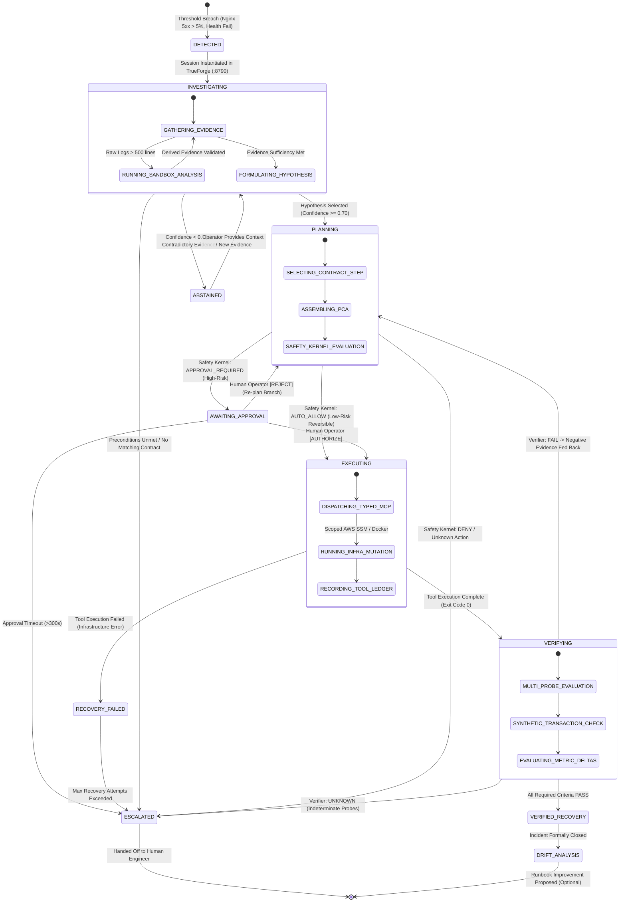
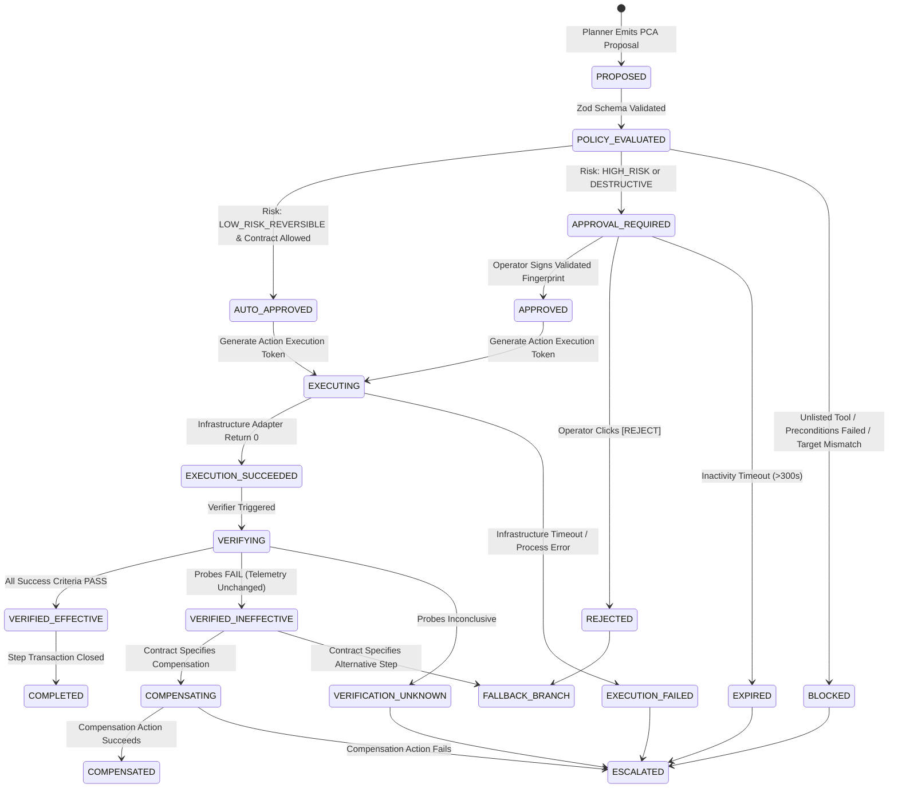
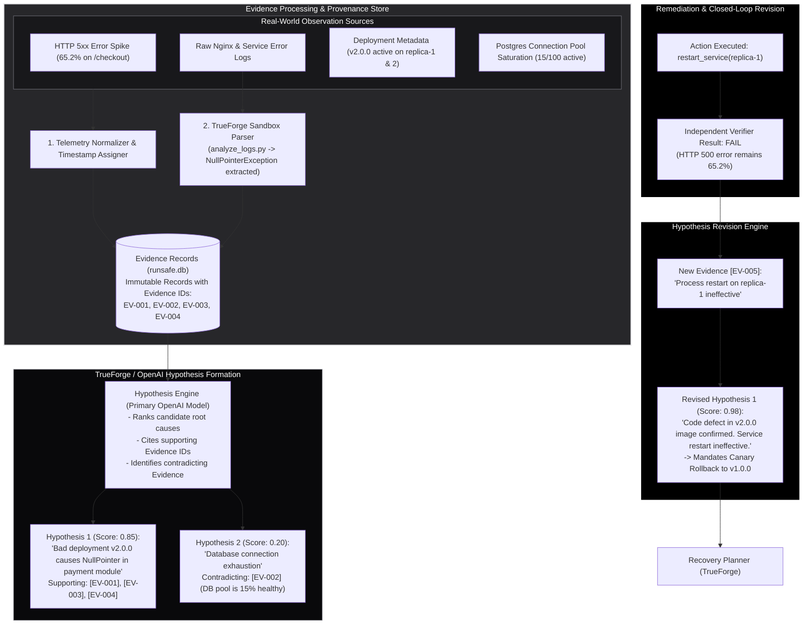
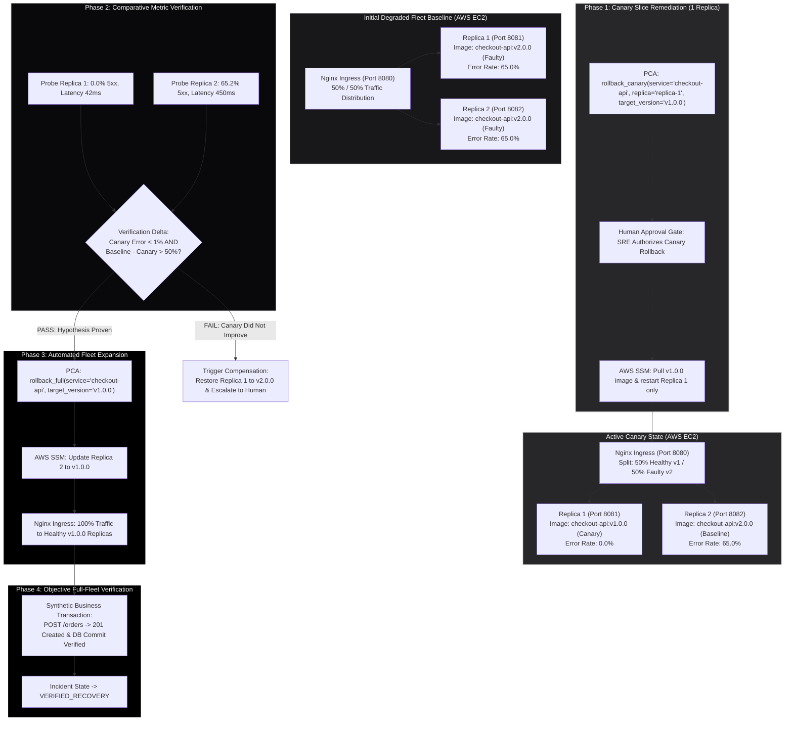
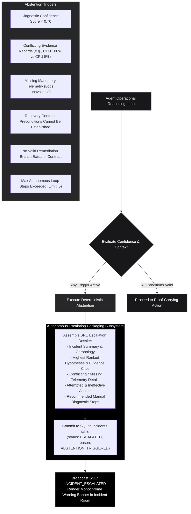
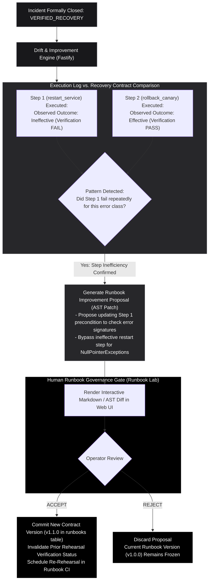
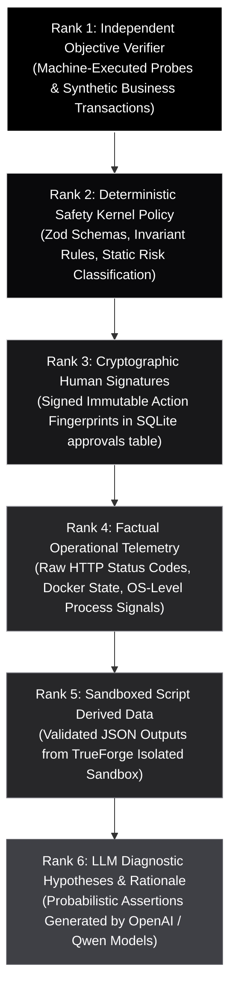

# RunSafe — Incident Recovery & Reliability Architecture Specification

**Document Identifier:** `docs/architecture/11_INCIDENT_RECOVERY_RELIABILITY_ARCHITECTURE.md`  
**Classification:** Authoritative Technical Specification / Frozen Architecture Baseline  
**Hackathon Target:** Agents That Act: TrueFoundry × Polaris Hackathon (Bengaluru, 26 September 2026)  
**Parent Documents:**
- [`docs/RUNSAFE_PROJECT_CONTEXT.md`](file:///c:/SHARAN%20PROJECTS/RunSafe/docs/RUNSAFE_PROJECT_CONTEXT.md)
- [`docs/03_PRD.md`](file:///c:/SHARAN%20PROJECTS/RunSafe/docs/03_PRD.md)
- [`docs/04_TRD.md`](file:///c:/SHARAN%20PROJECTS/RunSafe/docs/04_TRD.md)
- [`docs/05_WORKFLOW_AND_DATA_FLOW.md`](file:///c:/SHARAN%20PROJECTS/RunSafe/docs/05_WORKFLOW_AND_DATA_FLOW.md)
- [`docs/06_UI_UX_SPECIFICATION.md`](file:///c:/SHARAN%20PROJECTS/RunSafe/docs/06_UI_UX_SPECIFICATION.md)
- [`docs/07_DATA_DATABASE_API_DESIGN.md`](file:///c:/SHARAN%20PROJECTS/RunSafe/docs/07_DATA_DATABASE_API_DESIGN.md)
- [`docs/architecture/09_SYSTEM_INFRASTRUCTURE_ARCHITECTURE.md`](file:///c:/SHARAN%20PROJECTS/RunSafe/docs/architecture/09_SYSTEM_INFRASTRUCTURE_ARCHITECTURE.md)
- [`docs/architecture/10_AGENT_TRUEFORGE_SAFETY_ARCHITECTURE.md`](file:///c:/SHARAN%20PROJECTS/RunSafe/docs/architecture/10_AGENT_TRUEFORGE_SAFETY_ARCHITECTURE.md)
- [`docs/RUNSAFE_PROJECT_MEMORY.md`](file:///c:/SHARAN%20PROJECTS/RunSafe/docs/RUNSAFE_PROJECT_MEMORY.md)

---

## 1. Executive Summary & Core Reliability Law

This document is the third and final architectural pack for RunSafe. It defines the formal operational mechanics of the **Incident Recovery Engine, Reliability Guarantees, Verification Subsystem, and Runbook CI Engine**.

RunSafe rejects the brittle paradigm of prompt-based auto-remediation chatbots that rely on command exit codes or model self-declarations to claim success. Instead, RunSafe enforces the immutable architectural law:

$$\mathbf{AI\ provides\ intelligence.\ Safety\ Kernel\ provides\ authority.\ Verifier\ provides\ truth.}$$

```mermaid
flowchart LR
    subgraph S1["1. Trigger & Evidence"]
        TR["Real Incident Alert\n(Nginx 5xx / Process Death)"]
        EE["Evidence Engine\n(Telemetry, Logs, DB Checks)"]
        TR --> EE
    end

    subgraph S2["2. Intelligence & Proposal"]
        TF["TrueForge Harness (:8790)\n+ Primary OpenAI Model"]
        PCA["Proof-Carrying Action (PCA)\n(Zod Schema + SHA-256 Hash)"]
        EE --> TF --> PCA
    end

    subgraph S3["3. Deterministic Authority"]
        SK["Deterministic Safety Kernel"]
        HAP["Human Approval Gate\n(Approval Center)"]
        PCA --> SK
        SK -->|High-Risk| HAP
        SK -->|Low-Risk Auto| EXEC["Typed MCP Tool Dispatch"]
        HAP -->|Signed Approval| EXEC
    end

    subgraph S4["4. Real Mutation"]
        ADAPT["AWS SSM / Docker Adapter"]
        TGT["AWS EC2 / Local Container\n(1 Replica / Canary Slice)"]
        EXEC --> ADAPT --> TGT
    end

    subgraph S5["5. Objective Truth"]
        VERIF["Independent Verifier\n(Probes & Synthetic Tx)"]
        TRUTH{"Verification\nPASS?"}
        TGT -.->|Live Telemetry| VERIF --> TRUTH
    end

    TRUTH -->|YES| RESOLVED["State: VERIFIED_RECOVERY\n(Incident Closed in runsafe.db)"]
    TRUTH -->|NO| REPLAN["Negative Evidence Ingested\n-> Re-plan via TrueForge"]

    classDef s1 fill:#18181b,stroke:#71717a,stroke-width:1px,color:#fff;
    classDef s2 fill:#27272a,stroke:#a1a1aa,stroke-width:1px,color:#fff;
    classDef s3 fill:#09090b,stroke:#e4e4e7,stroke-width:2px,color:#fff;
    classDef s4 fill:#18181b,stroke:#d4d4d8,stroke-width:1px,color:#fff;
    classDef s5 fill:#000000,stroke:#ffffff,stroke-width:2px,color:#fff;

    class S1 s1;
    class S2 s2;
    class S3 s3;
    class S4 s4;
    class S5 s5;
```



### 1.1 Non-Negotiable Recovery Principles

1. **Closed-Loop Truth:** Command execution success (e.g., Docker restart exit code 0) is never equated with recovery. Recovery is declared **only** when the Independent Verifier confirms that all postconditions and end-to-end synthetic checkout transactions pass (`FR-030`, `TR-009`).
2. **Progressive Remediation by Default:** State-changing remediations on multi-replica workloads must alter a single replica or canary slice first, measure telemetry deltas against the baseline, and verify improvement before fleet-wide rollout (`FR-027`, `TR-010`).
3. **Fail-Closed Abstention:** When evidence is missing, contradictory, or below diagnostic confidence thresholds ($\text{confidence} < 0.70$), the system must halt autonomous mutations and safely escalate to human on-call engineers (`FR-033`, `TR-011`).
4. **Separation of Target Environments:** Target environment identity (`aws` or `local`) is bound at incident instantiation. Mid-incident environment switching is strictly prohibited. Evidence from local fallback never authorizes an AWS mutation (`FR-039`, `TR-013`).

---

## 2. Canonical Incident Lifecycle State Machine

The Incident Lifecycle governs the macro operational state of a recovery event within the Fastify control plane and SQLite `runsafe.db`. It maps 1:1 with the finalized state definitions in [`docs/05_WORKFLOW_AND_DATA_FLOW.md`](file:///c:/SHARAN%20PROJECTS/RunSafe/docs/05_WORKFLOW_AND_DATA_FLOW.md).



### 2.1 State Transition Governance Matrix

| Current State | Allowed Next States | Triggering Event / Guard Condition | Responsible Subsystem | Durable Record Committed | Forbidden Transitions |
| :--- | :--- | :--- | :--- | :--- | :--- |
| **`DETECTED`** | `INVESTIGATING`, `ESCALATED` | Telemetry monitor breaches threshold; Runbook matched. | Fastify Monitor | `incidents` (status: OPEN) | Cannot go directly to `EXECUTING` |
| **`INVESTIGATING`** | `PLANNING`, `ABSTAINED`, `ESCALATED` | Evidence sufficiency verified; Diagnostic confidence $\ge 0.70$. | TrueForge / OpenAI | `evidence`, `hypotheses` | Cannot go directly to `VERIFIED_RECOVERY` |
| **`PLANNING`** | `AWAITING_APPROVAL`, `EXECUTING`, `ESCALATED` | PCA schema validated; Safety Kernel policy evaluated. | Safety Kernel | `proof_carrying_actions` | Cannot go directly to `VERIFIED_RECOVERY` |
| **`AWAITING_APPROVAL`** | `EXECUTING`, `PLANNING`, `ESCALATED` | Signed human approval received; Freshness $< 300\text{s}$. | Approval Center | `approvals` (status: APPROVED)| Cannot auto-execute on silence |
| **`EXECUTING`** | `VERIFYING`, `RECOVERY_FAILED` | Scoped infrastructure tool completes; Exit code recorded. | MCP / SSM Adapter | `tool_executions` | **STRICTLY FORBIDDEN to go to `VERIFIED_RECOVERY`** |
| **`VERIFYING`** | `VERIFIED_RECOVERY`, `PLANNING`, `ESCALATED` | All postcondition probes PASS and synthetic transaction succeeds. | Independent Verifier | `verification_runs` | Cannot declare recovery if any probe fails |
| **`ABSTAINED`** | `INVESTIGATING`, `ESCALATED` | Confidence $< 0.70$ or missing required telemetry. | Evidence Engine | `incidents` (status: ABSTAINED) | Cannot execute state-changing mutations |
| **`VERIFIED_RECOVERY`** | `DRIFT_ANALYSIS` | Incident officially closed; Postmortem artifacts generated. | Incident Engine | `incidents` (status: CLOSED) | Terminal state for recovery loop |

---

## 3. Action Lifecycle & Recovery Step Transactions

RunSafe treats each remediation attempt within an incident as an isolated, transactional unit: the **Recovery Step**. An incident may contain multiple actions, but each action must traverse its own strict lifecycle (`FR-023`, `TR-008`).



### 3.1 The Recovery Step Transactional Invariant

Every Recovery Step executes according to the deterministic contract:

$$\text{Step} = \langle \text{Preconditions} \rangle \rightarrow \langle \text{Evidence} \rangle \rightarrow \langle \text{PCA} \rangle \rightarrow \langle \text{Safety} \rangle \rightarrow \langle \text{Action} \rangle \rightarrow \langle \text{Postconditions} \rangle \rightarrow \langle \text{Verification} \rangle \rightarrow \langle \text{Branch} \rangle$$

If $\text{Verification} \neq \text{PASS}$, the step transaction is **aborted**. The system must either:
1. Execute the defined deterministic compensation action (e.g., restore previous replica route), or
2. Transition to a defined fallback recovery branch in the active contract, or
3. Escalate immediately to human on-call engineers.

---

## 4. Evidence Progression & Hypothesis Revision Architecture

RunSafe strictly separates **factual operational observations** from **probabilistic model hypotheses** (`FR-007`, `FR-008`).



### 4.1 Evidence Sufficiency Gate

Before the Planner can emit a state-changing Proof-Carrying Action, the **Evidence Sufficiency Gate** deterministically verifies that:
1. **Mandatory Telemetry Present:** Service health, recent logs, and deployment version must exist in `evidence` with timestamps $\le 120\text{s}$ old.
2. **Preconditions Satisfied:** Contract-defined preconditions (e.g., `previous_version_available == true`) must evaluate to `true` against the evidence store.
3. **No Unhandled Contradictions:** If database metrics indicate healthy connections, the agent cannot propose a database-restart action based on an unsubstantiated hallucination (`NFR-002`).

---

## 5. Progressive & Canary Remediation Architecture

To limit blast radius during high-risk remediations (such as rollbacks or configuration changes), RunSafe implements **Progressive Canary Remediation** (`FR-027`, `FR-028`, `TR-010`).



### 5.1 Canary Decision Rules

1. **Isolation of Risk:** The canary action mutates exactly one replica (`replica-1`). User traffic to `replica-2` continues to expose the fault, providing an active, live control group for comparative telemetry.
2. **Delta Threshold:** Expansion to the entire fleet occurs **only** when the Independent Verifier calculates:
   $$\text{ErrorRate}(\text{replica-1}) \le 1.0\% \quad \text{AND} \quad \text{ErrorRate}(\text{replica-2}) - \text{ErrorRate}(\text{replica-1}) \ge 50.0\%$$
3. **Compensation on Canary Failure:** If the canary replica also fails or exhibits worse latency, the system immediately rolls back the routing slice to prevent asymmetric fleet behavior and triggers operator escalation.

---

## 6. Independent Objective Verification Subsystem

The **Independent Verifier** is a deterministic TypeScript engine residing in the Fastify control plane. It operates outside the LLM reasoning loop (`FR-030`, `FR-031`, `TR-009`).

```mermaid
flowchart TD
    VerifRequest["Verification Requested for Incident inc_20260926_001"] --> ContractLookup["Lookup Success Criteria in Active Recovery Contract"]

    subgraph ExecutionSuite["Deterministic Verification Suite"]
        subgraph HealthChecks["1. Infrastructure Health Probes"]
            H1["GET /health on Replica 1 -> Status 200 OK"]
            H2["GET /health on Replica 2 -> Status 200 OK"]
            H3["Docker Container State: Up (RestartCount = 0)"]
        end

        subgraph TelemetryChecks["2. Statistical Telemetry Probes"]
            T1["HTTP 5xx Error Rate < 1.0% over 30s window"]
            T2["p95 Ingress Latency < 250ms over 30s window"]
            T3["Postgres Active Pool Connections < 80%"]
        end

        subgraph BusinessChecks["3. Synthetic Business Transactions"]
            B1["POST /orders with synthetic payload\n- Generates realistic test cart\n- Verifies HTTP 201 Created\n- Verifies order row inserted in PostgreSQL\n- Reverts test inventory hold"]
        end

        EvaluationCore{"Deterministic AND Evaluator\n(All Required Probes Must Pass)"}
        HealthChecks & TelemetryChecks & BusinessChecks --> EvaluationCore
    end

    ContractLookup --> ExecutionSuite

    EvaluationCore -->|All Probes PASS (100%)| V_Pass["VERIFICATION_RESULT: PASS\n(Confidence: 1.0)"]
    EvaluationCore -->|Any Mandatory Probe FAILS| V_Fail["VERIFICATION_RESULT: FAIL\n(Confidence: 0.0)"]
    EvaluationCore -->|Timeout / Network Flap| V_Unknown["VERIFICATION_RESULT: UNKNOWN\n(Confidence: 0.5)"]

    V_Pass --> SetResolved["Transition Incident -> VERIFIED_RECOVERY"]
    V_Fail --> SetReplan["Feed Negative Evidence -> TrueForge Agent Re-Plans"]
    V_Unknown --> SetEscalate["Trigger Confidence Abstention -> Escalate to SRE"]

    classDef req fill:#18181b,stroke:#71717a,stroke-width:1px,color:#fff;
    classDef suite fill:#27272a,stroke:#e4e4e7,stroke-width:1px,color:#fff;
    classDef outcome fill:#000000,stroke:#ffffff,stroke-width:2px,color:#fff;

    class VerifRequest,ContractLookup req;
    class ExecutionSuite suite;
    class V_Pass,V_Fail,V_Unknown outcome;
```

### 6.1 Verification Semantics & Business Truth

* **The Fallacy of HTTP 200:** A process can return `HTTP 200 OK` on a shallow `/health` endpoint while completely failing on business transactions due to database deadlock or unhandled payment exceptions. RunSafe mandates **Business-Level Verification** via `POST /orders` before incident resolution.
* **Non-Coercion of Unknown:** If network flakiness causes a verification probe to time out, the result is recorded strictly as `UNKNOWN`. RunSafe **never** coerces `UNKNOWN` into `PASS`.

---

## 7. Abstention & Human Escalation Architecture

RunSafe distinguishes between two fundamentally different reasons to stop autonomous execution (`FR-033`, `TR-011`):
1. **`AWAITING_APPROVAL` (Authority Gate):** The system knows exactly what action to take, but policy classifies the action as `HIGH_RISK` or `DESTRUCTIVE`, requiring human authorization.
2. **`ABSTAINED` (Uncertainty Gate):** The system does not possess sufficient or consistent evidence to act responsibly without risking infrastructure destabilization.



---

## 8. Runbook CI & Continuous Recovery Rehearsal Architecture

RunSafe extends autonomous incident recovery into pre-production and staging environments through **Runbook CI** (`FR-035` through `FR-038`, `TR-012`). Runbooks are treated as executable code and continuously validated against simulated infrastructure failures.

```mermaid
flowchart LR
    subgraph RehearsalTrigger["1. Rehearsal Invocation"]
        ManualUI["Runbook Lab: Click [REHEARSE]"]
        ScheduledCI["Git PR / Staging Hook"]
        ManualUI & ScheduledCI --> CI_Runner["Runbook CI Runner (Fastify)"]
    end

    subgraph EnvironmentPrep["2. Controlled Environment Preparation"]
        ResetTgt["Workload Reset:\n- Restore Nginx 50/50 Routing\n- Reset PostgreSQL Demo Database\n- Clean Ephemeral Logs"]
        BaseVerify{"Verify Baseline:\nHealth 200 & Synthetic Tx PASS?"}
        ResetTgt --> BaseVerify
    end

    subgraph FaultInjection["3. Scoped Fault Injection (Rehearsal-Only)"]
        InjectFault["Invoke Rehearsal Tool:\ninject_fault_bad_deployment\n(Deploy faulty v2.0.0 image)"]
        TripAlarm["Trigger Telemetry Threshold Breach"]
        InjectFault --> TripAlarm
    end

    subgraph ProductionLoop["4. Real Recovery Pipeline (Identical Engine)"]
        OpenRehearsal["Open Incident (is_rehearsal: true)"]
        TrueForgeAgent["TrueForge Agent (:8790) Diagnoses"]
        SafetyExec["Safety Kernel Evaluates & Authorizes"]
        CanaryExec["Execute Progressive Rollback on AWS / Docker"]
        ObjVerify["Independent Objective Verifier Evaluates"]
        
        OpenRehearsal --> TrueForgeAgent --> SafetyExec --> CanaryExec --> ObjVerify
    end

    subgraph ScoringAndDrift["5. CI Ledger & Drift Analysis"]
        ScoreReport["Compute Rehearsal Metrics:\n- Recovery Outcome: PASS\n- MTTR: 42 seconds\n- Canary Delta: Verified"]
        DriftDetector["Evaluate Runbook Drift:\nDid recovery deviate from documented steps?"]
        ScoreReport --> DriftDetector
    end

    CI_Runner --> EnvironmentPrep
    BaseVerify -->|PASS| FaultInjection
    BaseVerify -->|FAIL| AbortHalt["Abort: Target Baseline Corrupted"]
    TripAlarm --> ProductionLoop
    ObjVerify --> ScoringAndDrift

    classDef r1 fill:#18181b,stroke:#71717a,stroke-width:1px,color:#fff;
    classDef r2 fill:#27272a,stroke:#a1a1aa,stroke-width:1px,color:#fff;
    classDef r3 fill:#09090b,stroke:#ffffff,stroke-width:2px,color:#fff;

    class RehearsalTrigger,EnvironmentPrep r1;
    class FaultInjection,ProductionLoop r2;
    class ScoringAndDrift r3;
```



### 8.1 Rehearsal Tool Boundary Isolation

To guarantee that staging failure injection tools can never be executed during a real customer-facing outage:
* **Tool Whitelist Isolation:** Rehearsal-specific tools (`inject_fault_process_crash`, `inject_fault_bad_deployment`, `reset_demo_environment`) are flagged with `rehearsal_only: true` in the MCP registry.
* **Safety Kernel Interception:** If a PCA proposes any rehearsal-only tool while `incident.is_rehearsal == false`, the Safety Kernel raises an immediate fatal violation and terminates execution (`TR-005`).

---

## 9. Runbook Drift & Post-Incident Intelligence

RunSafe continuously learns from real and rehearsed incidents without ever allowing unconstrained self-modification of safety rules or recovery policies (`FR-040`, `FR-042`).



---

## 10. Comprehensive Failure Handling Matrix

RunSafe handles every potential failure mode deterministically, preventing cascading failures or silent data corruption.

| Failure Domain | Detection Mechanism | Immediate Containment Action | User-Visible Status | Retry Policy | Next State |
| :--- | :--- | :--- | :--- | :--- | :--- |
| **OpenAI Quota (429) / Outage** | HTTP 429 / 5xx from OpenAI API | Instant fallback to local Qwen3 4B via Ollama (`:11434`). | `AI_DEGRADED_LOCAL_MODE` | 1 retry with exponential backoff | `INVESTIGATING` (Local) |
| **TrueForge Daemon Failure** | Fastify HTTP client ECONNREFUSED on `:8790` | Halt agent reasoning loop; Preserved SQLite incident state. | `AGENT_HARNESS_DISCONNECTED` | 3 retries at 2s intervals | `ESCALATED` |
| **AWS SSM Channel Unreachable** | AWS SDK RequestTimeout (>10s) | Halt remote mutations; Target locked; No silent local switch. | `AWS_COMMUNICATION_LOST` | 2 retries; If failed, halt | `PAUSED_FAILED_TARGET` |
| **TrueForge Sandbox Timeout** | SIGKILL supervisor fires at 10,000ms | Discard generated script; Mark evidence as `UNVERIFIED`. | `SANDBOX_EXECUTION_TIMED_OUT` | 0 retries (prevents loops) | `INVESTIGATING` (Metrics) |
| **MCP Tool Execution Failure** | Container process exits with non-zero code | Record failure in ledger; Feed negative evidence to Planner. | `TOOL_EXECUTION_FAILED` | Check contract fallback | `PLANNING` (Fallback) |
| **Safety Kernel Invariant Breach** | Action parameter violates Zod schema | Instant fail-closed rejection; Log security violation. | `ACTION_BLOCKED_POLICY_VIOLATION` | 0 retries (Fatal to action)| `ESCALATED` |
| **Approval Gate Timeout** | Operator inactive for $> 300\text{s}$ | Invalidate pending action token; Transition to escalation. | `APPROVAL_EXPIRED_NO_RESPONSE` | 0 retries | `ESCALATED` |
| **Verification Probe Failure** | HTTP 500 error remains on service endpoint | Action marked `INEFFECTIVE`; Feed negative evidence to TrueForge. | `RECOVERY_UNVERIFIED_PERSISTENT`| 0 retries of same action | `PLANNING` (Next Branch) |
| **Database Latency Saturation** | PostgreSQL pool $>95\%$ occupied | Trigger connection exhaustion rule; Halt mutation storms. | `DATABASE_SATURATED` | Backoff 15s | `INVESTIGATING` |
| **Browser SSE Disconnection** | TCP socket FIN / Client offline | Fastify headless loop continues; Replay events on reconnect. | Client auto-reconnects | Unlimited backoff | State Reconciled |

---

## 11. Scenario Reliability Matrix & Hero Execution Guarantees

RunSafe guarantees flawless execution across the three frozen demonstration scenarios:

| Metric / Attribute | Scenario 1: Process Crash | Scenario 2: Bad Deployment (Hero Demo) | Scenario 3: Ambiguous Failure |
| :--- | :--- | :--- | :--- |
| **Target Infrastructure** | AWS EC2 (or Local Docker fallback) | **Real AWS EC2 Host (Ubuntu / Docker Compose)** | AWS EC2 (or Local Docker fallback) |
| **Injected Fault** | `checkout-api-1` SIGKILL | Faulty `checkout-api:v2.0.0` (NullPointer + 65% 5xx) | Intermittent network packet drop (Flapping) |
| **Primary Intelligence** | Local Qwen3 4B or OpenAI | **Organizer OpenAI Model (via TrueForge)** | Organizer OpenAI Model (via TrueForge) |
| **Sandbox Code Generation** | None (Direct metric triage) | **Yes (`analyze_logs.py` in TrueForge Sandbox)**| Optional log correlation |
| **Initial Action** | `restart_service(replica-1)` | `restart_service(replica-1)` (Fails Verification) | None (Prohibited by Confidence Gate) |
| **High-Risk Action** | None (Auto-authorized low risk) | **`rollback_canary(replica-1, v1.0.0)`** | None |
| **Human Approval Gate** | Auto-approved by Safety Kernel | **Yes: Mandatory Interactive SRE Approval Modal** | None |
| **Canary Rollback** | N/A | **Yes: 1 Replica Rolled Back; Traffic Split Tested**| N/A |
| **Truth Verification** | HTTP 200 Probe PASS | **Synthetic Checkout Tx (POST /orders) PASS** | Inconclusive Probes |
| **Terminal Outcome** | `VERIFIED_RECOVERY` (<15s) | **`VERIFIED_RECOVERY` (<90s) + Runbook Drift Proposal**| `ABSTAINED_ESCALATED` |
| **What It Proves to Judges** | Autonomous low-risk recovery | **End-to-end real AWS action, sandbox, approval, verifier** | **Agent knows its limits and when not to act** |

---

## 12. Recovery Architecture Capability Matrix

| Capability | Source of Truth | Responsible Subsystem | AI Participates? | Human Approval Required? | Real State Mutated? | Verification Mandatory? | Hero Scenario Core? |
| :--- | :--- | :--- | :---: | :---: | :---: | :---: | :---: |
| **Telemetry Ingestion** | Live Infrastructure | Fastify Monitor | No | No | No | No | Yes |
| **Log Sanitization** | Fastify Regex Scrubber | Evidence Engine | No | No | No | No | Yes |
| **Sandbox Log Analysis** | Python Container Stdout | TrueForge Sandbox | Yes (Generates Code) | No | No | Yes (Zod Output) | Yes |
| **Root Cause Hypothesis** | Evidence Store (`runsafe.db`) | Primary OpenAI Model | Yes | No | No | No | Yes |
| **Contract Step Selection**| Active Recovery Contract | TrueForge Planner | Yes | No | No | No | Yes |
| **PCA Assembly & Hash** | Fastify PCA Builder | Control Plane Core | No | No | No | Yes (SHA-256) | Yes |
| **Safety Kernel Policy** | Static Zod Policy Rules | Safety Kernel | No | No | No | No | Yes |
| **Human SRE Approval** | Digital Signature / Token | Approval Center | No | **YES** | No | No | Yes |
| **Canary Rollback Tool** | AWS EC2 Docker Engine | MCP / AWS SSM Adapter | No | **YES** | **YES** | Yes | Yes |
| **Full Fleet Rollback** | AWS EC2 Docker Engine | MCP / AWS SSM Adapter | No | **YES** | **YES** | Yes | Yes |
| **Objective Verification** | Independent Probe Suite | Independent Verifier | **NO** | No | No | **YES** | Yes |
| **Confidence Abstention** | Diagnostic Metrics | Evidence Engine | Yes | No | No | No | Yes |
| **Rehearsal Fault Inject**| Rehearsal Daemon | Rehearsal Runner | No | No | **YES** (Staging) | Yes | Yes |
| **Demo Baseline Reset** | Scripted Seed Templates | Workload Controller | No | No | **YES** | Yes | Yes |
| **Runbook Drift Patch** | Event Audit Log | Drift Intelligence | Yes (Proposes Diff) | **YES** (Governance) | No | Yes (Re-Rehearsal)| Yes |

---

## 13. System Truth Hierarchy

When competing signals or assertions arise during an active incident, RunSafe resolves conflicts using a strict, deterministic priority ranking:



> [!CRITICAL]
> **Conflict Resolution Rule:** Under no circumstances does a higher-level model assertion override lower-level factual telemetry or verification truth. If OpenAI asserts *"The service is healthy and operating normally"*, but the Independent Verifier measures `HTTP 500` error rates at 65%, **the Verifier's finding is absolute truth**. The incident remains open.

---

## 14. Demo Hardening & Reliability Checklist

To guarantee 100% demo reliability under high-pressure live judging conditions, the team must execute the following hardening sequence:

- [ ] **One-Command Reset Verification:** Confirm `npm run demo:reset` restores Nginx 50/50 routing, resets the PostgreSQL demo database, and verifies healthy baseline within $\le 5\text{ seconds}$.
- [ ] **TrueForge Local Build Agent Proof:** Open `http://localhost:8790` to visibly show judges the saved `RunSafe-Agent`, organizer OpenAI model provider, attached RunSafe MCP server, and isolated sandbox provider.
- [ ] **AWS SSM Health Verification:** Confirm `aws ssm describe-instance-information` reports the EC2 instance as `Online` with ping latency $<150\text{ms}$.
- [ ] **Dual-Database Integrity Check:** Verify `runsafe.db` (control plane) and `checkout_db` (demo workload) reside on separate storage engines with zero schema mixing.
- [ ] **Pre-Warmed Docker Images:** Confirm both `checkout-api:v1.0.0` and `checkout-api:v2.0.0` exist locally in the EC2 Docker cache to eliminate demo download latency.
- [ ] **Air-Gapped Fallback Drill:** Disconnect laptop Wi-Fi; confirm Scenario 1 executes autonomously on local Docker Compose using Qwen3 4B via Ollama.
- [ ] **Monochrome UI Verification:** Verify dark-mode high-contrast rendering across Command Center, Incident Room, Approval Modal, and Runbook CI.

---

## 15. Rejected Recovery Patterns

1. **Rejected: Blind Full Rollback First**  
   *Reason:* Rolling back an entire production fleet without canary validation risks deploying a second faulty version or dropping live database migrations across 100% of user traffic. RunSafe mandates progressive single-replica canaries.
2. **Rejected: LLM as Outcome Verifier**  
   *Reason:* LLMs suffer from confirmation bias and hallucination when evaluating their own actions. Asking an agent *"Did your fix resolve the incident?"* produces false positive recoveries. Machines must verify machines.
3. **Rejected: Unrestricted Shell MCP Tools (`exec_bash`)**  
   *Reason:* Destroys deterministic blast-radius calculations and bypasses the Proof-Carrying Action schema.
4. **Rejected: Automatic Runbook Self-Rewriting**  
   *Reason:* Allowing an autonomous agent to silently modify production runbooks creates compounding operational drift. RunSafe requires human SRE review for all runbook improvement proposals.
5. **Rejected: Approval for Harmless Observations**  
   *Reason:* Prompting operators to approve read-only tools (`get_service_health`, `get_metrics`) causes alert fatigue and destroys the agent's autonomous value proposition.

---

## 16. Runtime Verification Checklist

The following items must be verified in the competition runtime environment before starting live evaluation:

- [ ] **OpenAI Reasoning Quota:** Confirm organizer-provided OpenAI API key has sufficient rate limits and record active model ID.
- [ ] **TrueForge Session Pause & Resume:** Verify TrueForge's human checkpoint accurately pauses the agent turn and resumes upon Fastify approval token dispatch.
- [ ] **TrueForge Sandbox Provider:** Confirm sandbox environment executes Python scripts with `--network none` isolation and captures stdout JSON cleanly.
- [ ] **AWS SSM Remote Command Execution:** Verify AWS SSM `SendCommand` executes Docker commands on EC2 within $\le 2\text{ seconds}$.
- [ ] **Nginx Upstream Reload Latency:** Verify `nginx -s reload` updates traffic weighting without dropping active TCP connections.
- [ ] **Synthetic Checkout Transaction Integrity:** Confirm `POST /orders` successfully validates inventory, inserts rows in PostgreSQL, and returns HTTP 201 Created.

---

## 17. Architecture Decision Records (ADR) Summary

* **ADR-021: Formal Transactional Recovery Step.** Every recovery action behaves transactionally: preconditions, evidence, PCA, safety check, execution, postconditions, verification, and compensation.
* **ADR-022: Multi-Metric and Synthetic Business Verification.** Recovery requires both infrastructure-level probe PASS and end-to-end synthetic checkout transaction proof.
* **ADR-023: Progressive Canary Rollback.** High-risk rollbacks mutate exactly one replica, comparing error rate deltas against a live control replica before fleet expansion.
* **ADR-024: Confidence-Based Abstention.** Diagnostic confidence $< 0.70$ or contradictory evidence triggers deterministic abstention and SRE escalation.
* **ADR-025: Unified Recovery Engine for Runbook CI.** Staging rehearsals execute the exact same TrueForge agent, contracts, and verification suites as live incidents.
* **ADR-026: Human-in-the-Loop Runbook Governance.** Runbook drift detection generates structured AST proposals; silent autonomous policy self-modification is strictly prohibited.
* **ADR-027: Air-Gapped Local Fallback Resilience.** All three core demo scenarios can execute offline on local Docker Compose if cloud connectivity fails.

---

## 18. Recovery Reliability Acceptance Criteria

The Incident Recovery & Reliability Architecture is considered successfully validated when:
1. **Autonomous Recovery (Scenario 1):** A process crash on AWS EC2 is detected, diagnosed, restarted via MCP, and objectively verified in $\le 15\text{ seconds}$ without human intervention (`TR-004`).
2. **Hero Canary Rollback (Scenario 2):** A bad deployment error spike triggers sandboxed Python log analysis, failed restart, PCA formulation, human approval halt, single-replica canary rollback, comparative verification, full fleet expansion, and synthetic checkout verification in $\le 90\text{ seconds}$ (`TR-006`, `TR-010`).
3. **Safe Abstention (Scenario 3):** Ambiguous telemetry causes the agent to safely halt mutations and escalate with a complete diagnostic dossier (`TR-011`).
4. **Independent Verification Proof:** A container restart that exits with code 0 but leaves HTTP 500 errors intact is deterministically marked `INEFFECTIVE`, forcing the agent to re-diagnose (`TR-009`).
5. **Tamper Invalidation:** Any alteration to PCA parameters after human approval invalidates the token, preventing execution (`TR-008`).
6. **Deterministic Reset:** Executing `npm run demo:reset` restores the entire AWS EC2 / Docker workload to a clean baseline within $\le 5\text{ seconds}$.

---

## 19. Traceability Matrix

| Requirement ID | Architectural Component | Implementing Section | Verification Method |
| :--- | :--- | :--- | :--- |
| **`FR-006`, `FR-007`** | Telemetry Ingestion & Evidence Store | Section 2, Section 4 | Anomaly triggers incident; Evidence stored in SQLite |
| **`FR-010`, `FR-011`** | TrueForge Diagnostic Sandbox | Section 4, Section 11 | Sandboxed Python script extracts NullPointerException |
| **`FR-014`, `FR-015`** | Typed MCP Tool Layer | Section 3, Section 5 | Scoped tool dispatch via AWS SSM |
| **`FR-018`, `FR-019`** | Deterministic Safety Kernel | Section 1, Section 3 | Invariant safety rules enforced outside LLM |
| **`FR-021`, `FR-024`** | Human Approval Gate & Modal | Section 2, Section 5 | Execution halted until operator signs approval |
| **`FR-027`, `FR-028`** | Progressive Canary Remediation | Section 5, Section 11 | 1-replica rollback tested against live control replica |
| **`FR-030`, `FR-031`** | Independent Objective Verifier | Section 6, Section 13 | Synthetic checkout transaction required for resolution |
| **`FR-033`** | Confidence Abstention Subsystem | Section 7, Section 11 | Confidence $< 0.70$ halts mutation loop |
| **`FR-035`, `FR-036`** | Runbook CI Rehearsal Runner | Section 8, Section 12 | Automated staging rehearsal execution |
| **`FR-040`, `FR-042`** | Runbook Drift & Learning Engine | Section 9, Section 12 | AST improvement proposal generated from incident |
| **`TR-002`** | TrueForge Runtime Integration | Section 1, Section 2 | TrueForge drives agent loop on port 8790 |
| **`TR-003`** | Dual-Model Router | Section 10, Section 11 | Primary OpenAI + Local Qwen3 4B fallback |
| **`TR-005`** | Fail-Closed Safety Enforcement | Section 3, Section 10 | Unlisted tools rejected immediately |
| **`TR-008`** | Proof-Carrying Action Generation | Section 3, Section 5 | Immutable SHA-256 fingerprint generation |
| **`TR-009`** | Independent Verifier Engine | Section 6, Section 18 | Multi-metric and synthetic probe validation |
| **`TR-010`** | Canary Traffic Comparison Engine | Section 5, Section 11 | Error rate delta calculation across replicas |
| **`TR-011`** | Confidence Abstention Engine | Section 7, Section 11 | Deterministic escalation dossier generation |
| **`TR-012`** | Runbook CI Rehearsal Framework | Section 8, Section 12 | Isolation of rehearsal fault injection tools |
| **`TR-013`** | Append-Only Audit Logging | Section 2, Section 3 | Full lifecycle traceability in SQLite `audit_log` |
| **`TR-015`** | Hardware Budget Compliance | Section 11, Section 14 | Runs within 4GB VRAM / 24GB RAM limits |
| **`TR-016`** | Secret Confinement Boundary | Section 10, Section 13 | Zero credentials exposed to browser or logs |

---

## 20. Architecture Freeze & Implementation Handoff

This document conclusively freezes the **Incident Recovery & Reliability Architecture** for RunSafe:
- **Canonical Lifecycles:** Incident state machine (12 states) and Action state machine (15 states) are formally locked.
- **Truth Separation:** Independent Verifier holds exclusive authority over recovery declaration.
- **Safety Boundary:** Proof-Carrying Actions, Deterministic Safety Kernel, and Human Approval gates are non-bypassable.
- **Canary Standard:** High-risk rollbacks execute as progressive 1-replica slices with comparative telemetry verification.
- **Rehearsal Integrity:** Runbook CI reuses the exact same production recovery engine with isolated failure injection tools.

### All Architectural Packs are Now Complete:
1. **`docs/architecture/09_SYSTEM_INFRASTRUCTURE_ARCHITECTURE.md`** (System, Infrastructure & AWS/Local Topology)
2. **`docs/architecture/10_AGENT_TRUEFORGE_SAFETY_ARCHITECTURE.md`** (TrueForge Runtime, Models, MCP & Safety)
3. **`docs/architecture/11_INCIDENT_RECOVERY_RELIABILITY_ARCHITECTURE.md`** (Recovery Engine, Verification & Reliability)

### Immediate Implementation Sequence (Stage 1):
No further planning or architecture documents are required. We proceed immediately to **code execution**:
1. Initialize the TypeScript monorepo (`packages/control-plane`, `packages/frontend`, `packages/mcp-server`, `packages/shared`).
2. Implement shared Zod schemas (`RecoveryContract`, `ProofCarryingAction`, `Approval`, `Evidence`, `VerificationResult`).
3. Setup Fastify control plane with SQLite `runsafe.db` (WAL mode, 15 relational tables).
4. Bootstrap Docker Compose workload (Nginx, Replicas, Postgres).
5. Wire TrueForge local runtime (`localhost:8790`) and attach typed MCP server.
