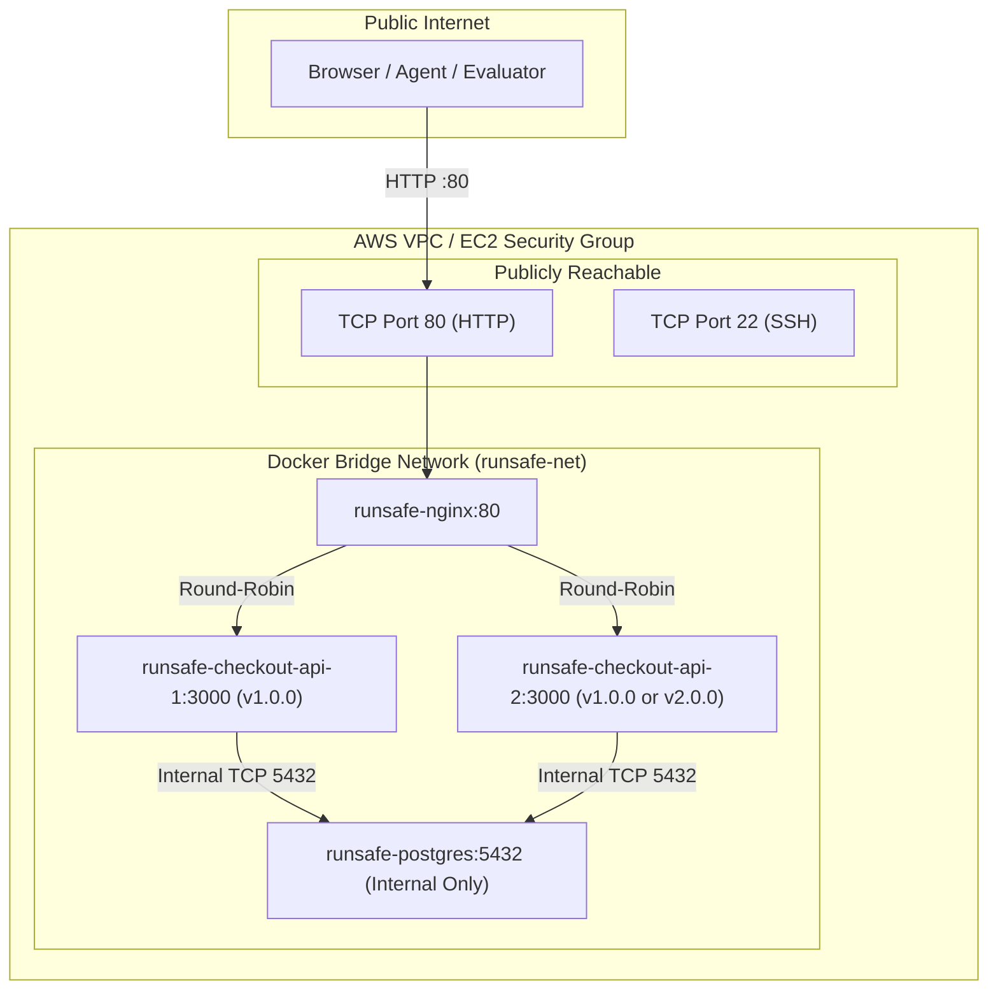

# RunSafe Controlled Infrastructure — AWS Deployment

This directory contains the production-grade deployment configuration and runbooks for running the RunSafe Controlled Infrastructure target on AWS (e.g., an EC2 instance in the organizer-provided AWS account).

---

## 1. Architecture on AWS



### Security Guarantees
1. **No Public Database Exposure**: PostgreSQL port 5432 is strictly bound to internal bridge network `runsafe-net`. It is neither published to the EC2 host nor exposed in the AWS Security Group.
2. **Deterministic Blast Radius**: All operations are contained within the dedicated EC2 instance and Docker network.
3. **No Hardcoded Secrets**: DB passwords and credentials are read from environment variables (`POSTGRES_PASSWORD`).

---

## 2. Deployment Steps

### Step A: Provision EC2 Host
1. Launch an Ubuntu 22.04 or Amazon Linux 2023 EC2 instance (`t3.medium` recommended).
2. Configure Security Group:
   - Inbound: `TCP 80` (HTTP) from `0.0.0.0/0`
   - Inbound: `TCP 22` (SSH) from administrator IP only
   - Outbound: All traffic (`0.0.0.0/0`)
3. SSH into the instance and run:
   ```bash
   chmod +x infrastructure/aws/setup_ec2.sh
   ./infrastructure/aws/setup_ec2.sh
   ```

### Step B: Launch Workload
```bash
docker compose -f infrastructure/aws/docker-compose.yml up -d --build
```

### Step C: Verify Baseline
```bash
npm run env:verify
```

---

## 3. Remote Operations & Fault Injection

- **Verify Baseline**:
  ```bash
  WORKLOAD_URL=http://<EC2-PUBLIC-IP> npm run env:verify
  ```
- **Inject Bad Deployment**:
  ```bash
  ssh <EC2-HOST> "cd /opt/runsafe && CHECKOUT_API_2_VERSION=v2.0.0 CHECKOUT_API_2_FAULT=bad_deployment docker compose -f infrastructure/aws/docker-compose.yml up -d --no-deps checkout-api-2"
  ```
- **Reset Baseline**:
  ```bash
  ssh <EC2-HOST> "cd /opt/runsafe && npm run env:reset"
  ```

---

## 4. Current Stage Status

- **Local Docker Environment**: `PASS` (100% verified with Docker Compose, Nginx, PostgreSQL, multi-replica, and traffic generator).
- **AWS Target**: `BLOCKED` (Awaiting organizer-provided AWS account credentials).
- Once organizer credentials are provided, running `infrastructure/aws/setup_ec2.sh` and `npm run stage2:verify` against the AWS instance will complete the live cloud verification.
