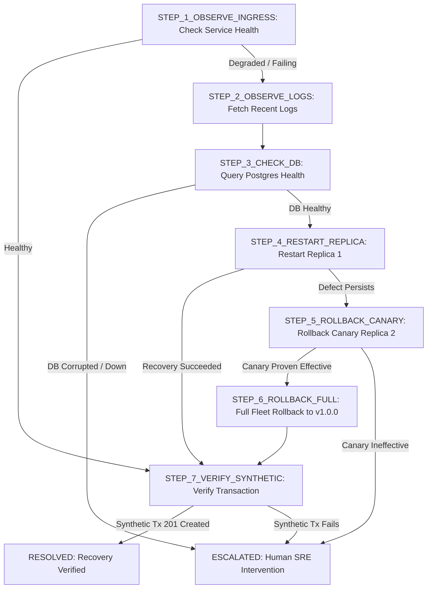

# Runbook: Checkout Service Autonomous Recovery

## Description
Production incident recovery procedure for the multi-replica Checkout Service (`checkout-service`).
This runbook covers progressive triage and remediation for process failures, error spikes, and bad version deployments across replicas (`checkout-api-1`, `checkout-api-2`) behind the Nginx load balancer.

## Target Service
checkout-service

## Operational Flow Chart


---

### Step 1: Ingress & Fleet Health Observation (STEP_1_OBSERVE_INGRESS)
- Tool: get_service_health
- Target: checkout-service
- Risk: READ_ONLY
- Reversible: true
- Approval: false
- On Success: STEP_2_OBSERVE_LOGS
- On Failure: STEP_2_OBSERVE_LOGS
- Description: Probe Nginx and all running API replicas to determine fleet status.

### Step 2: Recent Log Telemetry Extraction (STEP_2_OBSERVE_LOGS)
- Tool: get_recent_logs
- Target: checkout-service
- Risk: READ_ONLY
- Reversible: true
- Approval: false
- On Success: STEP_3_CHECK_DB
- On Failure: ESCALATED
- Description: Extract bounded and secret-sanitized recent logs to locate exceptions or stack traces.

### Step 3: Database Persistence Health Check (STEP_3_CHECK_DB)
- Tool: get_database_health
- Target: postgres
- Risk: READ_ONLY
- Reversible: true
- Approval: false
- On Success: STEP_4_RESTART_REPLICA
- On Failure: ESCALATED
- Description: Execute harmless read probe against PostgreSQL to rule out database crash or deadlock.

### Step 4: Transient Process Crash Restart (STEP_4_RESTART_REPLICA)
- Tool: restart_service
- Target: checkout-api-1
- Risk: LOW_RISK_REVERSIBLE
- Reversible: true
- Approval: true
- On Success: STEP_7_VERIFY_SYNTHETIC
- On Failure: STEP_5_ROLLBACK_CANARY
- Description: Attempt low-risk container restart for replica 1 if the process crashed or hung.

### Step 5: Isolated Canary Rollback (STEP_5_ROLLBACK_CANARY)
- Tool: rollback_canary
- Target: checkout-api-2
- Risk: HIGH_RISK
- Reversible: true
- Approval: true
- On Success: STEP_6_ROLLBACK_FULL
- On Failure: ESCALATED
- Description: Roll back single canary replica 2 to known-good version v1.0.0 while preserving replica 1 as control baseline.

### Step 6: Full Fleet Rollback (STEP_6_ROLLBACK_FULL)
- Tool: rollback_full
- Target: checkout-service
- Risk: HIGH_RISK
- Reversible: true
- Approval: true
- On Success: STEP_7_VERIFY_SYNTHETIC
- On Failure: ESCALATED
- Description: Expand rollback to all replicas across checkout-service to eliminate faulty v2.0.0 image fleet-wide.

### Step 7: Objective Synthetic Verification (STEP_7_VERIFY_SYNTHETIC)
- Tool: run_synthetic_checkout
- Target: checkout-service
- Risk: READ_ONLY
- Reversible: true
- Approval: false
- On Success: RESOLVED
- On Failure: ESCALATED
- Description: Execute a real ACID synthetic checkout order against PostgreSQL to prove business-level recovery.

---

## Machine-Enforceable Recovery Contract Payload
```json
{
  "id": "contract_checkout_recovery_v1",
  "runbookId": "rb_checkout_recovery",
  "runbookVersionId": "ver_rb_checkout_recovery_v1_0",
  "targetService": "checkout-service",
  "schemaVersion": "1.0.0",
  "contractVersion": "v1.0.0",
  "title": "Checkout Service Autonomous Recovery",
  "description": "Standard SRE incident recovery procedure for multi-replica checkout service.",
  "entryStepId": "STEP_1_OBSERVE_INGRESS",
  "steps": [
    {
      "id": "STEP_1_OBSERVE_INGRESS",
      "title": "Ingress & Fleet Health Observation",
      "description": "Probe Nginx and all running API replicas to determine fleet status.",
      "toolName": "get_service_health",
      "defaultArguments": { "environment": "LOCAL", "serviceId": "checkout-service" },
      "targetResource": "checkout-service",
      "riskLevel": "READ_ONLY",
      "isReversible": true,
      "requiresApproval": false,
      "preconditions": [],
      "successCriteria": [
        {
          "probeType": "INGRESS_HEALTH",
          "targetResource": "checkout-service",
          "expected": "200",
          "description": "Ingress returns HTTP 200"
        }
      ],
      "evidenceRequirements": [
        { "evidenceType": "SERVICE_HEALTH", "minFreshnessSeconds": 120, "mandatory": true }
      ],
      "onSuccess": "STEP_2_OBSERVE_LOGS",
      "onFailure": "STEP_2_OBSERVE_LOGS"
    },
    {
      "id": "STEP_2_OBSERVE_LOGS",
      "title": "Recent Log Telemetry Extraction",
      "description": "Extract bounded and secret-sanitized recent logs to locate exceptions.",
      "toolName": "get_recent_logs",
      "defaultArguments": { "environment": "LOCAL", "serviceId": "checkout-service", "limit": 50 },
      "targetResource": "checkout-service",
      "riskLevel": "READ_ONLY",
      "isReversible": true,
      "requiresApproval": false,
      "preconditions": [],
      "successCriteria": [],
      "evidenceRequirements": [
        { "evidenceType": "RECENT_LOGS", "minFreshnessSeconds": 120, "mandatory": true }
      ],
      "onSuccess": "STEP_3_CHECK_DB",
      "onFailure": "ESCALATED"
    },
    {
      "id": "STEP_3_CHECK_DB",
      "title": "Database Persistence Health Check",
      "description": "Execute harmless read probe against PostgreSQL to rule out database crash.",
      "toolName": "get_database_health",
      "defaultArguments": { "environment": "LOCAL", "databaseId": "postgres" },
      "targetResource": "postgres",
      "riskLevel": "READ_ONLY",
      "isReversible": true,
      "requiresApproval": false,
      "preconditions": [],
      "successCriteria": [
        {
          "probeType": "DB_LATENCY",
          "targetResource": "postgres",
          "expected": "healthy",
          "description": "PostgreSQL responds to query in < 100ms"
        }
      ],
      "evidenceRequirements": [
        { "evidenceType": "DATABASE_HEALTH", "minFreshnessSeconds": 120, "mandatory": true }
      ],
      "onSuccess": "STEP_4_RESTART_REPLICA",
      "onFailure": "ESCALATED"
    },
    {
      "id": "STEP_4_RESTART_REPLICA",
      "title": "Transient Process Crash Restart",
      "description": "Attempt low-risk container restart for replica 1.",
      "toolName": "restart_service",
      "defaultArguments": { "environment": "LOCAL", "target": "checkout-api-1" },
      "targetResource": "checkout-api-1",
      "riskLevel": "LOW_RISK_REVERSIBLE",
      "isReversible": true,
      "requiresApproval": true,
      "preconditions": [
        {
          "id": "PRE_REPLICA_CRASHED",
          "description": "Replica status degraded or unhealthy",
          "evidenceType": "SERVICE_HEALTH",
          "assertion": "STATUS_DEGRADED"
        }
      ],
      "successCriteria": [
        {
          "probeType": "REPLICA_HEALTH",
          "targetResource": "checkout-api-1",
          "expected": "200",
          "description": "Replica 1 returns 200 OK after restart"
        }
      ],
      "evidenceRequirements": [
        { "evidenceType": "SERVICE_HEALTH", "minFreshnessSeconds": 60, "mandatory": true }
      ],
      "onSuccess": "STEP_7_VERIFY_SYNTHETIC",
      "onFailure": "STEP_5_ROLLBACK_CANARY"
    },
    {
      "id": "STEP_5_ROLLBACK_CANARY",
      "title": "Isolated Canary Rollback",
      "description": "Roll back single canary replica 2 to known-good version v1.0.0.",
      "toolName": "rollback_canary",
      "defaultArguments": { "environment": "LOCAL", "serviceId": "checkout-service", "replicaId": "checkout-api-2", "targetVersion": "v1.0.0" },
      "targetResource": "checkout-api-2",
      "riskLevel": "HIGH_RISK",
      "isReversible": true,
      "requiresApproval": true,
      "preconditions": [
        {
          "id": "PRE_REGRESSION_DETECTED",
          "description": "v2.0.0 image anomaly detected in logs or checkout failure",
          "evidenceType": "RECENT_LOGS",
          "assertion": "REGRESSION_CONFIRMED"
        }
      ],
      "successCriteria": [
        {
          "probeType": "ERROR_RATE_DELTA",
          "targetResource": "checkout-api-2",
          "expected": "0",
          "description": "Canary error rate drops to 0%"
        }
      ],
      "evidenceRequirements": [
        { "evidenceType": "DEPLOYMENT_STATE", "minFreshnessSeconds": 120, "mandatory": true }
      ],
      "onSuccess": "STEP_6_ROLLBACK_FULL",
      "onFailure": "ESCALATED"
    },
    {
      "id": "STEP_6_ROLLBACK_FULL",
      "title": "Full Fleet Rollback",
      "description": "Expand rollback to all replicas across checkout-service to eliminate faulty v2.0.0 image.",
      "toolName": "rollback_full",
      "defaultArguments": { "environment": "LOCAL", "serviceId": "checkout-service", "targetVersion": "v1.0.0" },
      "targetResource": "checkout-service",
      "riskLevel": "HIGH_RISK",
      "isReversible": true,
      "requiresApproval": true,
      "preconditions": [
        {
          "id": "PRE_CANARY_PROVEN",
          "description": "Canary rollback verified effective",
          "evidenceType": "SERVICE_HEALTH",
          "assertion": "CANARY_EFFECTIVE"
        }
      ],
      "successCriteria": [
        {
          "probeType": "INGRESS_HEALTH",
          "targetResource": "checkout-service",
          "expected": "200",
          "description": "Ingress healthy across all replicas"
        }
      ],
      "evidenceRequirements": [],
      "onSuccess": "STEP_7_VERIFY_SYNTHETIC",
      "onFailure": "ESCALATED"
    },
    {
      "id": "STEP_7_VERIFY_SYNTHETIC",
      "title": "Objective Synthetic Verification",
      "description": "Execute a real ACID synthetic checkout order against PostgreSQL to prove recovery.",
      "toolName": "run_synthetic_checkout",
      "defaultArguments": { "environment": "LOCAL", "productId": "prod-001", "quantity": 1 },
      "targetResource": "checkout-service",
      "riskLevel": "READ_ONLY",
      "isReversible": true,
      "requiresApproval": false,
      "preconditions": [],
      "successCriteria": [
        {
          "probeType": "SYNTHETIC_ORDER",
          "targetResource": "checkout-service",
          "expected": "200",
          "description": "Synthetic order committed to PostgreSQL"
        }
      ],
      "evidenceRequirements": [
        { "evidenceType": "SYNTHETIC_CHECKOUT", "minFreshnessSeconds": 60, "mandatory": true }
      ],
      "onSuccess": "RESOLVED",
      "onFailure": "ESCALATED"
    }
  ],
  "terminalStates": ["RESOLVED", "ESCALATED", "ABSTAINED"],
  "createdAt": "2026-09-26T12:00:00.000Z"
}
```
